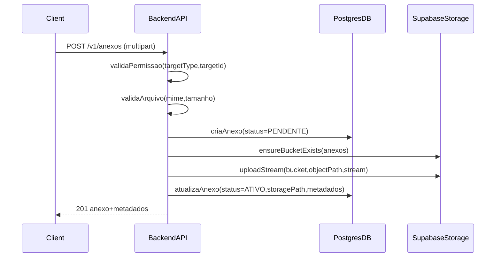
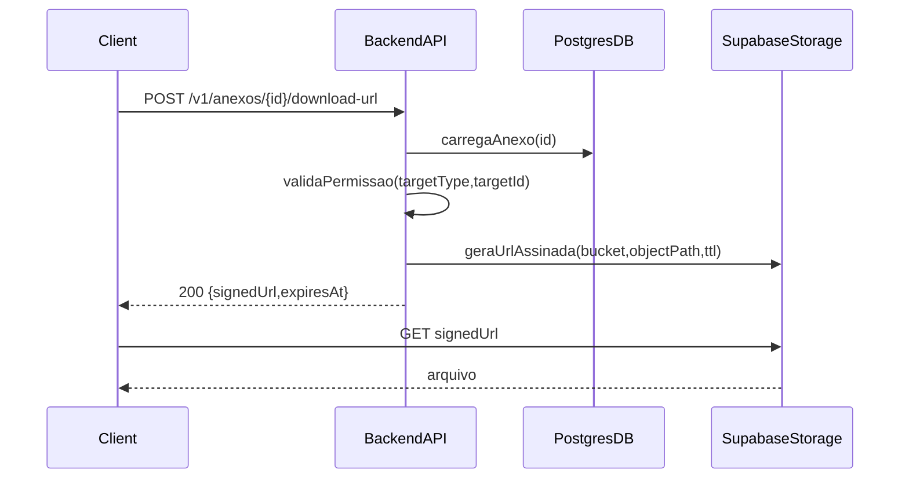

# Plano: Anexos centralizados (Supabase Storage)

## Contexto e decisão técnica

- **Situação atual (levantado)**: não existe anexos para paciente/agendamento/consulta/atendimento/prontuário; existe upload para **importações** e **foto de usuário**, com integração ao **Supabase Storage**.
- **Escolha confirmada**: usar **Supabase Storage** com **bucket privado** e **download via URL assinada gerada pelo backend**.
- **Objetivo**: criar uma funcionalidade **centralizada e independente do serviço** (consulta/atendimento/agendamento/cadastro/etc), reaproveitando o padrão existente (upload streaming/garantia de bucket) e adicionando governança (auditoria, visibilidade ao paciente, multitenancy).

## Escopo do MVP (confirmado)

- **Alvos suportados**:
  - Paciente
  - Agendamento
  - Atendimento
  - Consulta
  - Evento do Prontuário (timeline)
  - Profissional de Saúde
  - Usuário do Sistema (além da foto)
  - Financeiro/Faturamento

## Arquitetura proposta (conceito)

### 1) Modelo “Anexo” genérico

- Criar um registro de metadados de anexo com vínculo genérico:
  - **tenant_id** (obrigatório)
  - **target_type** (ENUM ou string controlada) e **target_id** (UUID)
  - **storage_bucket** e **storage_object_path** (ou storage_key)
  - **file_name_original**, **mime_type**, **size_bytes**, **checksum** (opcional/recomendado)
  - **categoria** (ex.: LAUDO, EXAME, DOCUMENTO, IMAGEM, OUTROS)
  - **visivel_para_paciente** (flag — confirmado)
  - **status** (ATIVO/INATIVO/EXCLUIDO)
  - **created_by**, **created_at**, (opcional: **deleted_by**, **deleted_at**)

### 2) Storage (Supabase)

- Criar um bucket privado dedicado, por exemplo:
  - `anexos` (privado)
- Definir padrão de caminho (object path) com isolamento e organização:
  - `tenant/{tenantId}/{targetType}/{targetId}/{anexoId-or-uuid}/{nomeSeguro}`
- Reaproveitar o padrão existente:
  - `SupabaseStorageService.ensureBucketExists(...)`
  - `SupabaseStorageService.uploadStream(...)`
  - (Adicionar suporte a **URL assinada** para download)

### 3) Permissões e segurança

- Regras mínimas (sempre validar no backend):
  - Usuário precisa ter acesso ao **registro alvo** (ex.: atendimento daquele tenant).
  - Para anexos marcados como **visível para paciente**, aplicar regra de visibilidade no endpoint que o portal/app do paciente consumirá.
- Restrições:
  - Limites de tamanho por categoria (ex.: imagens vs PDFs) e tipos MIME permitidos.
  - Auditoria de ações (upload/listar/gerar link/remoção).

## Endpoints (API) — desenho detalhado

> A ideia é ter um **módulo único** e também rotas “convenientes” por recurso.

### 1) Upload de anexo

- **POST** `/v1/anexos`
  - `multipart/form-data`
  - Campos:
    - `file` (obrigatório)
    - `targetType` (obrigatório)
    - `targetId` (obrigatório)
    - `categoria` (opcional)
    - `visivelParaPaciente` (opcional)
    - `descricao/tags` (opcional)
  - Fluxo:
    - validar permissão no alvo
    - validar arquivo (MIME/tamanho)
    - criar registro de anexo (metadados)
    - fazer upload no Supabase Storage (stream)
    - retornar metadados do anexo

### 2) Listagem/consulta de anexos

- **GET** `/v1/anexos?targetType=...&targetId=...`
  - filtros adicionais: `categoria`, `status`, `visivelParaPaciente`, período, paginação
- Rotas “convenientes” (opcionais, mas boas para padronizar consumo):
  - **GET** `/v1/pacientes/{pacienteId}/anexos`
  - **GET** `/v1/agendamentos/{agendamentoId}/anexos`
  - **GET** `/v1/atendimentos/{atendimentoId}/anexos`
  - **GET** `/v1/consultas/{consultaId}/anexos`

### 3) Download (URL assinada)

- **POST** `/v1/anexos/{anexoId}/download-url`
  - Retorna uma URL assinada com TTL (ex.: 60s/5min) e metadados (`mimeType`, `fileName`, `size`).
  - Regras:
    - validar permissão no alvo
    - se `visivelParaPaciente=true`, permitir para o perfil “paciente” (se aplicável)

### 4) Remoção / inativação

- **DELETE** `/v1/anexos/{anexoId}` (soft delete)
  - (Opcional) parâmetro `deleteFromStorage=true/false`
  - Por padrão: marcar como excluído no banco e manter arquivo (política de retenção)

### 5) Atualização de metadados

- **PATCH** `/v1/anexos/{anexoId}`
  - Atualizar: `categoria`, `visivelParaPaciente`, `descricao`, `tags`, `status`

## Integração com Prontuário (timeline)

- Estratégia recomendada:
  - Manter anexos vinculados a **evento do prontuário** (targetType=PRONTUARIO_EVENTO) quando o anexo for “de um evento”.
  - Também permitir anexos diretamente no paciente (targetType=PACIENTE) para documentos gerais.
- Ajustar `ProntuarioQueryService` para (quando solicitado) incluir um bloco “anexos” no evento, consultando por `targetType/targetId`.

## Fluxos (diagramas)

### Upload

### Download por URL assinada

## Multitenancy e consistência

- Garantir que **toda consulta e gravação** de anexo respeita `tenant_id`.
- `object_path` sempre prefixado por `tenant/{tenantId}/...`.

## Migração e dados

- Criar migração SQL para tabela de anexos + índices:
  - índice composto: `(tenant_id, target_type, target_id)`
  - índice por `created_at`
  - (opcional) índice por `checksum`

## Observabilidade e auditoria

- Logs com:
  - `anexoId`, `targetType`, `targetId`, `tenantId`, `userId`, `fileName`, `size`
- (Opcional, recomendado) tabela de auditoria de anexos:
  - ações: UPLOAD, LIST, SIGN_URL, DELETE, UPDATE_META

## Arquivos/pontos do código a reaproveitar (referência)

- Integração Supabase Storage: [`src/main/java/com/upsaude/integration/supabase/SupabaseStorageService.java`](/Users/wagnergrilo/Desktop/WGB/sistemas/UPSaude/code_cursor/UPSaude-final-back/src/main/java/com/upsaude/integration/supabase/SupabaseStorageService.java)
- Padrão de uploads via multipart (importações): controllers em `src/main/java/com/upsaude/controller/job/`
- Exemplo de upload e endpoints (foto do usuário): `UsuariosSistemaController` e `UsuariosSistemaServiceImpl`

## Critérios de aceite (o que comprova que ficou pronto)

- Conseguir:
  - anexar arquivo a **Paciente/Agendamento/Atendimento/Consulta/Evento do Prontuário**
  - listar anexos por alvo com paginação
  - gerar URL assinada e baixar do Supabase
  - marcar `visivelParaPaciente` e filtrar corretamente
  - inativar/excluir anexo (sem quebrar histórico)
- Garantir:
  - isolamento por tenant
  - validação de permissão por alvo
  - bucket privado

## Entregas em fases (para reduzir risco)

- **Fase 1 (núcleo)**: tabela de anexos + endpoints genéricos (`/v1/anexos`) + bucket privado + URL assinada.
- **Fase 2 (integrações)**: rotas convenientes por recurso + integração com timeline do prontuário.
- **Fase 3 (governança)**: auditoria detalhada, retenção, limites por categoria, deduplicação por checksum.