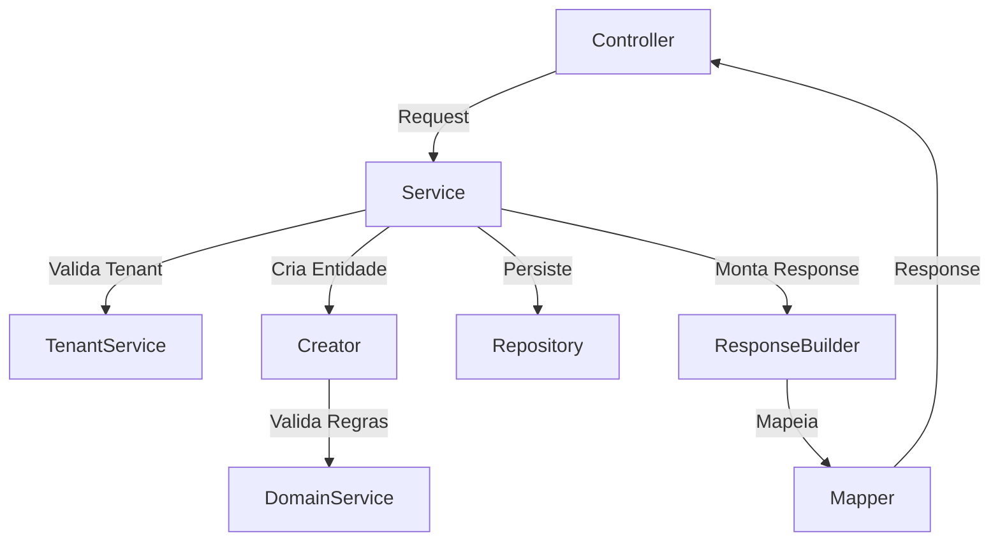

#Plano: Camada Completa do Módulo de Farmácia

## 1. Estrutura de Pacotes

```javascript
src/main/java/com/upsaude/
├── controller/api/farmacia/
│   ├── ReceitaController.java
│   └── FarmaciaController.java
├── service/api/farmacia/
│   ├── ReceitaService.java
│   └── DispensacaoService.java
├── service/impl/api/farmacia/
│   ├── ReceitaServiceImpl.java
│   └── DispensacaoServiceImpl.java
├── service/api/support/farmacia/
│   ├── ReceitaCreator.java
│   ├── ReceitaDomainService.java
│   ├── ReceitaResponseBuilder.java
│   ├── ReceitaTenantEnforcer.java
│   ├── DispensacaoCreator.java
│   ├── DispensacaoDomainService.java
│   ├── DispensacaoResponseBuilder.java
│   └── DispensacaoTenantEnforcer.java
├── repository/farmacia/
│   ├── ReceitaRepository.java
│   └── DispensacaoRepository.java
├── api/request/farmacia/
│   ├── ReceitaRequest.java
│   ├── ReceitaItemRequest.java
│   ├── DispensacaoRequest.java
│   └── DispensacaoItemRequest.java
├── api/response/farmacia/
│   ├── ReceitaResponse.java
│   ├── ReceitaItemResponse.java
│   ├── DispensacaoResponse.java
│   └── DispensacaoItemResponse.java
└── mapper/farmacia/
    ├── ReceitaMapper.java
    └── DispensacaoMapper.java
```


## 2. Controllers (Casos de Uso)

### 2.1 ReceitaController

**Arquivo**: `src/main/java/com/upsaude/controller/api/farmacia/ReceitaController.java`**Endpoints**:

- `POST /v1/receitas` - Criar receita com itens
- `GET /v1/pacientes/{pacienteId}/receitas` - Listar receitas do paciente
- `GET /v1/receitas/{id}` - Buscar receita completa por ID

**Padrão**: Seguir estrutura de `PacienteController`:

- `@RestController`, `@RequestMapping("/v1/receitas")`
- `@Tag` para Swagger
- `@RequiredArgsConstructor` para injeção
- `@Slf4j` para logs
- Tratamento de exceções com try-catch e logs
- Validação com `@Valid` nos requests

### 2.2 FarmaciaController

**Arquivo**: `src/main/java/com/upsaude/controller/api/farmacia/FarmaciaController.java`**Endpoints**:

- `GET /v1/farmacias/{farmaciaId}/receitas-pendentes` - Listar receitas pendentes
- `POST /v1/farmacias/{farmaciaId}/dispensacoes` - Registrar dispensação
- `GET /v1/farmacias/{farmaciaId}/dispensacoes` - Histórico de dispensações

**Padrão**: Mesmo padrão do ReceitaController

## 3. Services

### 3.1 ReceitaService (Interface)

**Arquivo**: `src/main/java/com/upsaude/service/api/farmacia/ReceitaService.java`**Métodos**:

- `ReceitaResponse criar(ReceitaRequest request)`
- `ReceitaResponse obterPorId(UUID id)`
- `Page<ReceitaResponse> listarPorPaciente(UUID pacienteId, Pageable pageable)`

### 3.2 ReceitaServiceImpl

**Arquivo**: `src/main/java/com/upsaude/service/impl/api/farmacia/ReceitaServiceImpl.java`**Responsabilidades**:

- Validar tenant via `TenantService`
- Usar `ReceitaCreator` para criar receita e itens
- Usar `ReceitaResponseBuilder` para montar response
- Usar `ReceitaTenantEnforcer` para validação de tenant
- `@Transactional` em métodos de escrita
- `@Transactional(readOnly = true)` em métodos de leitura
- Tratamento de exceções (BadRequestException, NotFoundException, DataAccessException)

### 3.3 DispensacaoService (Interface)

**Arquivo**: `src/main/java/com/upsaude/service/api/farmacia/DispensacaoService.java`**Métodos**:

- `Page<ReceitaResponse> listarReceitasPendentes(UUID farmaciaId, Pageable pageable)`
- `DispensacaoResponse registrarDispensacao(UUID farmaciaId, DispensacaoRequest request)`
- `Page<DispensacaoResponse> listarDispensacoes(UUID farmaciaId, Pageable pageable)`

### 3.4 DispensacaoServiceImpl

**Arquivo**: `src/main/java/com/upsaude/service/impl/api/farmacia/DispensacaoServiceImpl.java`**Regras de Negócio**:

- Validar que farmácia existe e pertence ao tenant
- Validar que receita existe e está válida (dataValidade >= hoje)
- Permitir dispensação parcial (quantidadeDispensada <= quantidadePrescrita)
- Calcular quantidade já dispensada de cada ReceitaItem
- Validar que quantidade total não ultrapassa prescrita
- Preparar estrutura para futura IntegracaoGov (sem enviar)

## 4. Services de Suporte

### 4.1 ReceitaCreator

**Arquivo**: `src/main/java/com/upsaude/service/api/support/farmacia/ReceitaCreator.java`**Responsabilidades**:

- Criar entidade `Receita` a partir de `ReceitaRequest`
- Criar entidades `ReceitaItem` a partir de `ReceitaItemRequest`
- Validar relacionamentos (Paciente, Consulta, Medico)
- Validar SigtapProcedimento existe
- Associar itens à receita

### 4.2 ReceitaDomainService

**Arquivo**: `src/main/java/com/upsaude/service/api/support/farmacia/ReceitaDomainService.java`**Métodos**:

- `void validarPodeInativar(Receita receita)`
- `void validarPodeDeletar(Receita receita)`
- `void validarReceitaValida(Receita receita)` - verificar dataValidade

### 4.3 ReceitaResponseBuilder

**Arquivo**: `src/main/java/com/upsaude/service/api/support/farmacia/ReceitaResponseBuilder.java`**Responsabilidades**:

- Construir `ReceitaResponse` completo com itens
- Carregar dados do SIGTAP via FK (não copiar)
- Usar `ReceitaMapper` para mapeamento básico
- Adicionar dados resumidos do SigtapProcedimento nos itens

### 4.4 ReceitaTenantEnforcer

**Arquivo**: `src/main/java/com/upsaude/service/api/support/farmacia/ReceitaTenantEnforcer.java`**Responsabilidades**:

- Validar que receita pertence ao tenant atual
- Validar que paciente pertence ao tenant atual

### 4.5 DispensacaoCreator

**Arquivo**: `src/main/java/com/upsaude/service/api/support/farmacia/DispensacaoCreator.java`**Responsabilidades**:

- Criar entidade `Dispensacao` a partir de `DispensacaoRequest`
- Criar entidades `DispensacaoItem` a partir de `DispensacaoItemRequest`
- Validar relacionamentos (Paciente, Farmacia, Receita, ProfissionaisSaude)
- Validar SigtapProcedimento existe
- Associar itens à dispensação
- Validar quantidade dispensada vs prescrita

### 4.6 DispensacaoDomainService

**Arquivo**: `src/main/java/com/upsaude/service/api/support/farmacia/DispensacaoDomainService.java`**Métodos**:

- `void validarQuantidadeDispensada(ReceitaItem receitaItem, BigDecimal quantidadeDispensada)`
- `BigDecimal calcularQuantidadeJaDispensada(ReceitaItem receitaItem)`
- `void validarPodeInativar(Dispensacao dispensacao)`
- `void validarPodeDeletar(Dispensacao dispensacao)`

### 4.7 DispensacaoResponseBuilder

**Arquivo**: `src/main/java/com/upsaude/service/api/support/farmacia/DispensacaoResponseBuilder.java`**Responsabilidades**:

- Construir `DispensacaoResponse` completo com itens
- Carregar dados do SIGTAP via FK
- Usar `DispensacaoMapper` para mapeamento básico

### 4.8 DispensacaoTenantEnforcer

**Arquivo**: `src/main/java/com/upsaude/service/api/support/farmacia/DispensacaoTenantEnforcer.java`**Responsabilidades**:

- Validar que dispensação pertence ao tenant atual
- Validar que farmácia pertence ao tenant atual

## 5. Repositories

### 5.1 ReceitaRepository

**Arquivo**: `src/main/java/com/upsaude/repository/farmacia/ReceitaRepository.java`**Métodos**:

- `Page<Receita> findByPacienteId(UUID pacienteId, Pageable pageable)`
- `@EntityGraph` para carregar itens em `findById`
- `Optional<Receita> findByIdCompleto(UUID id)` - com EntityGraph

### 5.2 DispensacaoRepository

**Arquivo**: `src/main/java/com/upsaude/repository/farmacia/DispensacaoRepository.java`**Métodos**:

- `Page<Dispensacao> findByFarmaciaId(UUID farmaciaId, Pageable pageable)`
- `@Query` para buscar receitas pendentes (não totalmente dispensadas)
- `@EntityGraph` para carregar itens em `findById`

**Query Receitas Pendentes**:

```java
@Query("SELECT r FROM Receita r " +
       "WHERE r.paciente.tenant.id = :tenantId " +
       "AND r.dataValidade >= CURRENT_DATE " +
       "AND EXISTS (SELECT 1 FROM ReceitaItem ri WHERE ri.receita = r " +
       "AND (SELECT COALESCE(SUM(di.quantidadeDispensada), 0) FROM DispensacaoItem di " +
       "WHERE di.receitaItem = ri) < ri.quantidadePrescrita)")
Page<Receita> findReceitasPendentes(@Param("tenantId") UUID tenantId, Pageable pageable);
```


## 6. DTOs Request

### 6.1 ReceitaRequest

**Arquivo**: `src/main/java/com/upsaude/api/request/farmacia/ReceitaRequest.java`**Campos**:

- `UUID pacienteId` (obrigatório)
- `UUID consultaId` (opcional)
- `UUID medicoId` (opcional)
- `String numeroReceita`
- `LocalDate dataPrescricao` (obrigatório)
- `LocalDate dataValidade`
- `TipoControleMedicamentoEnum tipoReceita`
- `String observacoes`
- `List<ReceitaItemRequest> itens` (obrigatório, não vazio)

**Validações**: `@NotNull`, `@NotEmpty`, `@Valid` para lista de itens

### 6.2 ReceitaItemRequest

**Arquivo**: `src/main/java/com/upsaude/api/request/farmacia/ReceitaItemRequest.java`**Campos**:

- `UUID sigtapProcedimentoId` (obrigatório)
- `Integer posicao` (obrigatório)
- `BigDecimal quantidadePrescrita`
- `UnidadeMedidaEnum unidadeMedida`
- `String posologia`
- `Integer duracaoTratamento`
- `String observacoes`

**Validações**: `@NotNull`, `@Min(1)` para posicao

### 6.3 DispensacaoRequest

**Arquivo**: `src/main/java/com/upsaude/api/request/farmacia/DispensacaoRequest.java`**Campos**:

- `UUID pacienteId` (obrigatório)
- `UUID receitaId` (opcional - permite dispensação direta)
- `UUID profissionalSaudeId` (opcional)
- `String numeroDispensacao`
- `LocalDateTime dataDispensacao` (obrigatório)
- `String tipoDispensacao`
- `String observacoes`
- `List<DispensacaoItemRequest> itens` (obrigatório, não vazio)

### 6.4 DispensacaoItemRequest

**Arquivo**: `src/main/java/com/upsaude/api/request/farmacia/DispensacaoItemRequest.java`**Campos**:

- `UUID receitaItemId` (opcional - se veio de receita)
- `UUID sigtapProcedimentoId` (obrigatório)
- `BigDecimal quantidadeDispensada` (obrigatório, > 0)
- `UnidadeMedidaEnum unidadeMedida`
- `String lote`
- `LocalDate validadeLote`
- `String observacoes`

## 7. DTOs Response

### 7.1 ReceitaResponse

**Arquivo**: `src/main/java/com/upsaude/api/response/farmacia/ReceitaResponse.java`**Campos**:

- Campos de `BaseEntity` (id, createdAt, updatedAt, active)
- `UUID pacienteId`
- `String pacienteNome` (resumo)
- `UUID consultaId` (opcional)
- `UUID medicoId` (opcional)
- `String medicoNome` (resumo, opcional)
- `String numeroReceita`
- `LocalDate dataPrescricao`
- `LocalDate dataValidade`
- `TipoControleMedicamentoEnum tipoReceita`
- `String observacoes`
- `List<ReceitaItemResponse> itens`

**Serializers**: Usar serializers para enums conforme padrão do projeto

### 7.2 ReceitaItemResponse

**Arquivo**: `src/main/java/com/upsaude/api/response/farmacia/ReceitaItemResponse.java`**Campos**:

- Campos de `BaseEntity`
- `UUID receitaId`
- `UUID sigtapProcedimentoId`
- `String procedimentoCodigo` (do SIGTAP)
- `String procedimentoNome` (do SIGTAP - resumo)
- `Integer posicao`
- `BigDecimal quantidadePrescrita`
- `BigDecimal quantidadeJaDispensada` (calculado)
- `UnidadeMedidaEnum unidadeMedida`
- `String posologia`
- `Integer duracaoTratamento`
- `String observacoes`

### 7.3 DispensacaoResponse

**Arquivo**: `src/main/java/com/upsaude/api/response/farmacia/DispensacaoResponse.java`**Campos**:

- Campos de `BaseEntity`
- `UUID pacienteId`
- `String pacienteNome` (resumo)
- `UUID farmaciaId`
- `String farmaciaNome` (resumo)
- `UUID receitaId` (opcional)
- `String numeroReceita` (opcional)
- `UUID profissionalSaudeId` (opcional)
- `String profissionalNome` (resumo, opcional)
- `String numeroDispensacao`
- `LocalDateTime dataDispensacao`
- `String tipoDispensacao`
- `String observacoes`
- `List<DispensacaoItemResponse> itens`

### 7.4 DispensacaoItemResponse

**Arquivo**: `src/main/java/com/upsaude/api/response/farmacia/DispensacaoItemResponse.java`**Campos**:

- Campos de `BaseEntity`
- `UUID dispensacaoId`
- `UUID receitaItemId` (opcional)
- `UUID sigtapProcedimentoId`
- `String procedimentoCodigo` (do SIGTAP)
- `String procedimentoNome` (do SIGTAP - resumo)
- `BigDecimal quantidadeDispensada`
- `UnidadeMedidaEnum unidadeMedida`
- `String lote`
- `LocalDate validadeLote`
- `String observacoes`

## 8. Mappers MapStruct

### 8.1 ReceitaMapper

**Arquivo**: `src/main/java/com/upsaude/mapper/farmacia/ReceitaMapper.java`**Configuração**:

- `@Mapper(config = MappingConfig.class, uses = {ReceitaItemMapper.class})`
- Usar `MappingConfig` existente

**Métodos**:

- `Receita fromRequest(ReceitaRequest request)` - ignorar id, createdAt, updatedAt, active, itens
- `void updateFromRequest(ReceitaRequest request, @MappingTarget Receita entity)`
- `ReceitaResponse toResponse(Receita entity)` - mapear básico, itens via método separado
- `default ReceitaResponse toResponseCompleto(Receita receita)` - método customizado para carregar dados resumidos

**Mapeamento Customizado**:

- `pacienteNome`: extrair de `receita.getPaciente().getNomeCompleto()`
- `medicoNome`: extrair de `receita.getMedico().getDadosPessoaisBasicos().getNomeCompleto()` (se existir)
- `itens`: usar `ReceitaItemMapper.toResponseList()`

### 8.2 ReceitaItemMapper

**Arquivo**: `src/main/java/com/upsaude/mapper/farmacia/ReceitaItemMapper.java`**Métodos**:

- `ReceitaItem fromRequest(ReceitaItemRequest request, Receita receita)` - receber receita como parâmetro
- `ReceitaItemResponse toResponse(ReceitaItem receitaItem)` - mapear básico
- `default ReceitaItemResponse toResponseCompleto(ReceitaItem item)` - incluir dados SIGTAP e quantidade já dispensada
- `List<ReceitaItemResponse> toResponseList(List<ReceitaItem> itens)`

**Mapeamento SIGTAP**:

- `procedimentoCodigo`: `item.getSigtapProcedimento().getCodigo()`
- `procedimentoNome`: `item.getSigtapProcedimento().getNome()` (resumo)

### 8.3 DispensacaoMapper

**Arquivo**: `src/main/java/com/upsaude/mapper/farmacia/DispensacaoMapper.java`**Configuração**:

- `@Mapper(config = MappingConfig.class, uses = {DispensacaoItemMapper.class})`

**Métodos**:

- `Dispensacao fromRequest(DispensacaoRequest request)` - ignorar id, createdAt, updatedAt, active, itens
- `DispensacaoResponse toResponse(Dispensacao dispensacao)` - mapear básico
- `default DispensacaoResponse toResponseCompleto(Dispensacao dispensacao)` - método customizado

**Mapeamento Customizado**:

- `pacienteNome`: extrair de `dispensacao.getPaciente().getNomeCompleto()`
- `farmaciaNome`: extrair de `dispensacao.getFarmacia().getNome()`
- `profissionalNome`: extrair de `dispensacao.getProfissionalSaude().getDadosPessoaisBasicos().getNomeCompleto()` (se existir)

### 8.4 DispensacaoItemMapper

**Arquivo**: `src/main/java/com/upsaude/mapper/farmacia/DispensacaoItemMapper.java`**Métodos**:

- `DispensacaoItem fromRequest(DispensacaoItemRequest request, Dispensacao dispensacao)` - receber dispensacao como parâmetro
- `DispensacaoItemResponse toResponse(DispensacaoItem item)` - mapear básico
- `default DispensacaoItemResponse toResponseCompleto(DispensacaoItem item)` - incluir dados SIGTAP
- `List<DispensacaoItemResponse> toResponseList(List<DispensacaoItem> itens)`

## 9. Regras de Negócio Críticas

### 9.1 Validação de Quantidade

- Quantidade dispensada não pode ultrapassar quantidade prescrita
- Permitir múltiplas dispensações parciais
- Calcular quantidade já dispensada somando todas as `DispensacaoItem` vinculadas ao `ReceitaItem`

### 9.2 Validação de Receita

- Receita deve estar válida (dataValidade >= hoje) para dispensação
- Receita pode ser opcional em Dispensacao (permite dispensação direta)

### 9.3 Integração Futura

- Preparar estrutura para `IntegracaoGov` sem implementar envio
- `Dispensacao` pode gerar registro de `IntegracaoGov` no futuro
- Manter campos necessários (lote, validadeLote) para rastreabilidade

## 10. Observações de Implementação

1. **Lazy Loading**: Manter relacionamentos LAZY, usar `@EntityGraph` quando necessário
2. **Transações**: `@Transactional` em métodos de escrita, `@Transactional(readOnly = true)` em leitura
3. **Validações**: Usar Bean Validation (`@NotNull`, `@NotEmpty`, `@Valid`)
4. **Exceções**: Usar exceções customizadas do projeto (BadRequestException, NotFoundException)
5. **Logs**: Usar `@Slf4j` e logar operações importantes
6. **Swagger**: Documentar todos os endpoints com `@Operation` e `@ApiResponses`
7. **Tenant**: Sempre validar tenant via `TenantService`
8. **SIGTAP**: Nunca copiar dados, sempre referenciar via FK

## 11. Fluxo de Dados




## 12. Checklist de Implementação

- [ ] Criar estrutura de pacotes
- [ ] Implementar DTOs Request/Response
- [ ] Implementar Mappers MapStruct
- [ ] Implementar Repositories
- [ ] Implementar Services de Suporte
- [ ] Implementar Services principais
- [ ] Implementar Controllers
- [ ] Adicionar validações Bean Validation