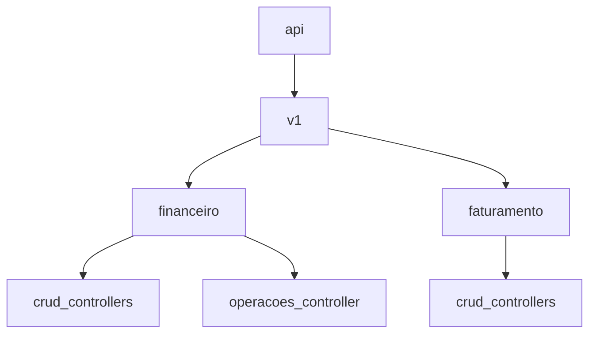

# Plano — Controllers (Financeiro + Faturamento)

## Objetivo

- Expor **CRUD completo** via REST para **todas as entidades novas** dos módulos `financeiro` e `faturamento`.
- Expor endpoints de **operações explícitas** (ações) para orquestração do financeiro (reserva/estorno/consumo/fechamento) via `FinanceiroIntegrationService`.
- Manter **padrão idêntico** aos controllers existentes (ex.: `AgendamentoController`, `AtendimentoController`, `TenantController`):
  - `@RestController`, `@RequestMapping("/v1/..." )`, `@Tag`, `@Operation/@ApiResponses`, `ResponseEntity`, logs `log.debug/info/warn/error`.
  - Paginação com `Pageable` e retorno `Page<...Response>`.
  - Endpoint `PUT /{id}/inativar` retornando `204`.

## Padrão de endpoints (template)

Para cada entidade **X** (request `XRequest`, response `XResponse`, service `XService`):

- `POST /v1/<base>` → `201` → `service.criar(request)`
- `GET /v1/<base>` → `200` → `service.listar(pageable)`
- `GET /v1/<base>/{id}` → `200` → `service.obterPorId(id)`
- `PUT /v1/<base>/{id}` → `200` → `service.atualizar(id, request)`
- `DELETE /v1/<base>/{id}` → `204` → `service.excluir(id)`
- `PUT /v1/<base>/{id}/inativar` → `204` → `service.inativar(id)`

**Tratamento de erros** (igual aos controllers atuais):

- Capturar e relançar `BadRequestException`, `NotFoundException`, `ConflictException` quando fizer sentido.
- Logar contexto no `warn` para erros esperados e `error` para inesperados.

## Estrutura de pacotes e rotas

Criar novos pacotes seguindo o padrão já existente em `com.upsaude.controller.api.*`:

- `com.upsaude.controller.api.financeiro.*`
- `com.upsaude.controller.api.faturamento.*`

Rotas base sugeridas:

- Financeiro: `/v1/financeiro/...`
- Faturamento: `/v1/faturamento/...`

## Lista de controllers a criar (CRUD)

### Financeiro — Core

Criar em `com.upsaude.controller.api.financeiro`:

- `CompetenciaFinanceiraController` → `/v1/financeiro/competencias`
- `CompetenciaFinanceiraTenantController` → `/v1/financeiro/competencias-tenant`
- `PlanoContasController` → `/v1/financeiro/planos-contas`
- `ContaContabilController` → `/v1/financeiro/contas-contabeis`
- `CentroCustoController` → `/v1/financeiro/centros-custo`
- `ContaFinanceiraController` → `/v1/financeiro/contas-financeiras`

### Financeiro — Orçamento & Assistencial

- `OrcamentoCompetenciaController` → `/v1/financeiro/orcamentos-competencia`
- `CreditoOrcamentarioController` → `/v1/financeiro/creditos-orcamentarios`
- `ReservaOrcamentariaAssistencialController` → `/v1/financeiro/reservas-orcamentarias`
- `GuiaAtendimentoAmbulatorialController` → `/v1/financeiro/guias-ambulatoriais`
- `EstornoFinanceiroController` → `/v1/financeiro/estornos`

### Financeiro — Lançamentos

- `LancamentoFinanceiroController` → `/v1/financeiro/lancamentos`
- `LancamentoFinanceiroItemController` → `/v1/financeiro/lancamentos-itens`

### Financeiro — Contas a Receber / Pagar

- `ParteFinanceiraController` → `/v1/financeiro/partes-financeiras`
- `TituloReceberController` → `/v1/financeiro/titulos-receber`
- `BaixaReceberController` → `/v1/financeiro/baixas-receber`
- `RenegociacaoReceberController` → `/v1/financeiro/renegociacoes-receber`
- `RecorrenciaFinanceiraController` → `/v1/financeiro/recorrencias`
- `TituloPagarController` → `/v1/financeiro/titulos-pagar`
- `PagamentoPagarController` → `/v1/financeiro/pagamentos-pagar`

### Financeiro — Movimentações & Conciliação

- `MovimentacaoContaController` → `/v1/financeiro/movimentacoes`
- `TransferenciaEntreContasController` → `/v1/financeiro/transferencias`
- `ExtratoBancarioImportadoController` → `/v1/financeiro/extratos-importados`
- `ConciliacaoBancariaController` → `/v1/financeiro/conciliacoes`
- `ConciliacaoItemController` → `/v1/financeiro/conciliacoes-itens`

### Financeiro — Classificação & Auditoria

- `RegraClassificacaoContabilController` → `/v1/financeiro/regras-classificacao`
- `LogFinanceiroController` → `/v1/financeiro/logs`

### Faturamento

Criar em `com.upsaude.controller.api.faturamento`:

- `DocumentoFaturamentoController` → `/v1/faturamento/documentos`
- `DocumentoFaturamentoItemController` → `/v1/faturamento/documentos-itens`
- `GlosaController` → `/v1/faturamento/glosas`

## Controller de Operações (ações explícitas)

Criar `FinanceiroOperacoesController` em `com.upsaude.controller.api.financeiro` com base `/v1/financeiro/operacoes`, chamando `FinanceiroIntegrationService`:

- `POST /v1/financeiro/operacoes/agendamentos/{agendamentoId}/reservar`
  - chama `financeiroIntegrationService.reservarOrcamento(agendamentoId)`
- `POST /v1/financeiro/operacoes/agendamentos/{agendamentoId}/estornar-reserva`
  - aceita body opcional com `motivo` (criar DTO simples `MotivoOperacaoRequest`)
  - chama `financeiroIntegrationService.estornarReserva(agendamentoId, motivo)`
- `POST /v1/financeiro/operacoes/atendimentos/{atendimentoId}/consumir`
  - chama `financeiroIntegrationService.consumirReserva(atendimentoId)`
- `POST /v1/financeiro/operacoes/atendimentos/{atendimentoId}/estornar-consumo`
  - body opcional com `motivo`
  - chama `financeiroIntegrationService.estornarConsumo(atendimentoId, motivo)`
- `POST /v1/financeiro/operacoes/competencias/{competenciaId}/fechar`
  - chama `financeiroIntegrationService.fecharCompetencia(competenciaId)`

Retornos sugeridos (padrão simples):

- `204 No Content` para ações idempotentes que não retornam payload.

## Diagrama rápido de organização das rotas

## Arquivos que serão criados

- Controllers (novos):
  - `src/main/java/com/upsaude/controller/api/financeiro/*.java`
  - `src/main/java/com/upsaude/controller/api/faturamento/*.java`
- DTO de operação (novo, simples, se necessário para motivo):
  - `src/main/java/com/upsaude/api/request/financeiro/MotivoOperacaoRequest.java`

## Critérios de aceite

- Cada nova entidade (`entity/financeiro/*`, `entity/faturamento/*`) tem um controller com CRUD + `inativar`.
- `FinanceiroOperacoesController` expõe as ações explícitas e delega para `FinanceiroIntegrationService`.
- Controllers seguem o mesmo padrão de logging, swagger e assinatura já usado em `AgendamentoController` e `AtendimentoController`.