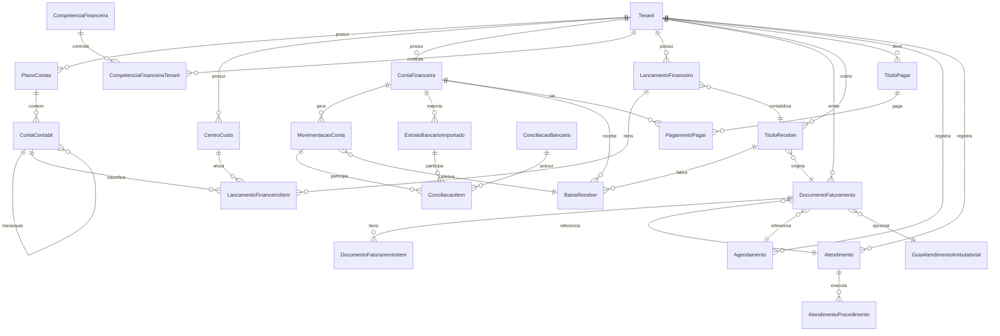

# Plano (Somente Entidades) — Financeiro + Faturamento COMPLETOS

## Premissas confirmadas

- **Município = Tenant** (cada município é um `Tenant`).
- Fluxo híbrido assistencial: **reserva** no agendamento e **consolidação/ajuste** no atendimento/guia.

## Objetivo deste plano

Definir um **modelo de dados vendável e genérico** (público/privado/convênio/SaaS), separando claramente:

- **Evento assistencial** (Agendamento/Atendimento/etc.)
- **Documento de faturamento** (BPA/APAC/TISS/Fatura/Guia) 
- **Título financeiro** (contas a receber/pagar)
- **Movimentação de caixa/banco** (dinheiro)

> Escopo: **apenas entidades JPA + relacionamentos + constraints/índices + regras de imutabilidade no modelo**.

---

## 0) Estado atual (o que já existe e como reaproveitar)

### Entidades já existentes e úteis

- Multi-tenant por município: `Tenant` + `BaseEntity`.
- Fluxo assistencial: `Agendamento`, `Atendimento`.
- Referência SUS: `SigtapProcedimento` (já tem valores, financiamento e rubrica).
- Auditoria genérica: `LogsAuditoria`.

### Gaps atuais que o modelo novo resolve

- Não existem entidades de **saldo/crédito/débito/estorno** por competência.
- `Atendimento` não tem procedimentos estruturados (hoje é texto), o que trava BPA/faturamento e cálculo.

---

## 1) “Camada Contábil/Gerencial”: Plano de Contas (fundamental)

### 1.1 `PlanoContas`

**Novo**: `entity/financeiro/PlanoContas.java` (por tenant)

- Motivo: permitir **parametrização por cliente**.
- Campos:
  - `tenant` (FK)
  - `nome`, `versao`, `ativo`, `padrao` (flag)

### 1.2 `ContaContabil` (hierárquica)

**Novo**: `entity/financeiro/ContaContabil.java`

- Relacionamentos:
  - `planoContas` (FK)
  - `contaPai` (self-FK)
- Campos:
  - `codigo` (ex.: 1, 1.01, 3.02.001), `nome`
  - `tipoNatureza` (RECEITA | DESPESA | ATIVO | PASSIVO | PATRIMONIO_LIQUIDO)
  - `aceitaLancamento` (bool)
  - `nivel` (int) opcional
- Constraints/índices:
  - Unique `(plano_contas_id, codigo)`
  - Índices por `(plano_contas_id, conta_pai_id)`

### 1.3 `RegraClassificacaoContabil`

**Novo**: `entity/financeiro/RegraClassificacaoContabil.java`

- Objetivo: “classificação automática das movimentações”, configurável.
- Campos:
  - `tenant`
  - `escopo` (ASSISTENCIAL | FATURAMENTO | FINANCEIRO)
  - `condicaoJson` (JSONB) ou campos explícitos (ex.: tipo documento, convênio, procedimento, rubrica)
  - `contaContabilDestino` (FK)
  - `prioridade`, `ativo`

> A regra será aplicada por serviço depois, mas precisa existir como dado.

---

## 2) Lançamentos formais (desacoplados do evento): Ledger/Journals

### 2.1 `CompetenciaFinanceira` e `CompetenciaFinanceiraTenant`

**Mantém e expande** o plano anterior:

- `CompetenciaFinanceira` (global)
- `CompetenciaFinanceiraTenant` (por tenant) com status ABERTA/FECHADA e carimbo.

### 2.2 `LancamentoFinanceiro` (cabeçalho do lançamento)

**Novo**: `entity/financeiro/LancamentoFinanceiro.java`

- Conceito: cada evento gera um ou mais lançamentos.
- Campos:
  - `tenant`, `estabelecimento` (opcional)
  - `competencia`
  - `origemTipo` (AGENDAMENTO | ATENDIMENTO | GUIA | DOCUMENTO_FATURAMENTO | TITULO | CONCILIACAO | MANUAL)
  - `origemId` (UUID)
  - `status` (PREVISTO | REALIZADO | ESTORNADO | AJUSTADO | CANCELADO_POR_REVERSAO)
  - `dataEvento`, `descricao`
  - `idempotencyKey` (unique por tenant)
  - `grupoLancamento` (UUID) para encadear reversões/ajustes
- Índices/constraints:
  - Unique `(tenant_id, idempotency_key)`
  - Índice `(tenant_id, competencia_id, data_evento)`
  - Índice `(tenant_id, origem_tipo, origem_id)`

### 2.3 `LancamentoFinanceiroItem` (partidas/linhas)

**Novo**: `entity/financeiro/LancamentoFinanceiroItem.java`

- Relacionamentos:
  - `lancamento` (FK)
  - `contaContabil` (FK)
  - `centroCusto` (FK opcional)
- Campos:
  - `tipoPartida` (DEBITO | CREDITO)
  - `valor` (positivo)
  - `historico`

> Isso habilita DRE/fluxo de caixa gerencial e auditoria real.

### 2.4 `ReservaOrcamentariaAssistencial` (específica do TR SUS)

**Novo**: `entity/financeiro/ReservaOrcamentariaAssistencial.java`

- Motivo: o TR pede saldo por município e proibição de saldo negativo.
- Relacionamentos:
  - `tenant`, `competencia`
  - `agendamento` (FK opcional)
- Campos:
  - `valorReservadoTotal`, `status` (ATIVA | CONSUMIDA | LIBERADA | PARCIAL)
  - `grupoReserva` (UUID) para vincular consumos/estornos

> Alternativa: representar reserva apenas como `LancamentoFinanceiro` do tipo PREVISTO. Eu recomendo **entidade própria** porque a reserva tem vida operacional específica.

---

## 3) Contas financeiras (caixa e bancos) — dinheiro “real”

### 3.1 `ContaFinanceira`

**Novo**: `entity/financeiro/ContaFinanceira.java`

- Objetivo: saldo por conta (caixa/bancos), transferências.
- Campos:
  - `tenant`
  - `tipo` (CAIXA | BANCO)
  - `nome`, `bancoCodigo`, `agencia`, `numeroConta`, `pixChave` (opcional)
  - `moeda` (default BRL)
  - `ativo`
- Unique/índices:
  - Unique por `(tenant_id, tipo, nome)` (ou por agência+conta)

### 3.2 `MovimentacaoConta` (extrato interno da conta)

**Novo**: `entity/financeiro/MovimentacaoConta.java`

- Relacionamentos:
  - `contaFinanceira` (FK)
  - `tituloReceberBaixa` / `tituloPagarPagamento` / `transferencia` (FKs opcionais)
  - `lancamentoFinanceiro` (FK opcional para rastrear contabilidade)
- Campos:
  - `tipo` (ENTRADA | SAIDA)
  - `valor` (positivo)
  - `dataMovimento`
  - `status` (PENDENTE | EFETIVADO | CANCELADO_POR_REVERSAO)
  - `idempotencyKey` (unique por conta)
- Índices:
  - `(conta_id, data_movimento)`

### 3.3 `TransferenciaEntreContas`

**Novo**: `entity/financeiro/TransferenciaEntreContas.java`

- Relacionamentos:
  - `contaOrigem`, `contaDestino`
- Campos:
  - `valor`, `data`, `status`
- Gera 2 `MovimentacaoConta` (saída/entrada) — depois via serviço.

---

## 4) Conciliação bancária e maturidade financeira

### 4.1 `ExtratoBancarioImportado`

**Novo**: `entity/financeiro/ExtratoBancarioImportado.java`

- Objetivo: representar linhas importadas (OFX/CSV/API) sem “misturar” com dinheiro interno.
- Relacionamentos:
  - `contaFinanceira`
- Campos:
  - `hashLinha` (unique), `descricao`, `valor`, `data`, `documento`, `saldoApos` (opcional)
  - `statusConciliacao` (NAO_CONCILIADO | CONCILIADO | IGNORADO)

### 4.2 `ConciliacaoBancaria`

**Novo**: `entity/financeiro/ConciliacaoBancaria.java`

- Relacionamentos:
  - `contaFinanceira`
- Campos:
  - `periodoInicio`, `periodoFim`, `status` (ABERTA | FECHADA)

### 4.3 `ConciliacaoItem`

**Novo**: `entity/financeiro/ConciliacaoItem.java`

- Relacionamentos:
  - `conciliacao`
  - `extratoImportado` (FK)
  - `movimentacaoConta` (FK)
- Campos:
  - `tipoMatch` (AUTO | MANUAL)
  - `diferenca` (para ajustes)

---

## 5) Faturamento (separado do financeiro)

## 5.1 Documento de faturamento (cabeçalho genérico)

### 5.1.1 `DocumentoFaturamento`

**Novo**: `entity/faturamento/DocumentoFaturamento.java`

- Objetivo: suportar guias/faturas/notas e layouts SUS/convênio.
- Campos:
  - `tenant`, `estabelecimento` (opcional)
  - `competencia`
  - `tipo` (BPA | APAC | TISS | FATURA | GUIA_AMBULATORIAL | NOTA)
  - `numero`, `serie` (opcional)
  - `status` (ABERTO | FATURADO | ENVIADO | PARCIALMENTE_PAGO | PAGO | CANCELADO)
  - `emitidoEm`, `canceladoEm`, `canceladoPor`
  - `pagadorTipo` (SUS | CONVENIO | PARTICULAR)
  - `convenio` (FK opcional)
- Constraints:
  - Unique `(tenant_id, tipo, competencia_id, numero, serie)`

### 5.1.2 `DocumentoFaturamentoItem`

**Novo**: `entity/faturamento/DocumentoFaturamentoItem.java`

- Relacionamentos:
  - `documento`
  - `sigtapProcedimento` (FK opcional: para SUS)
- Campos:
  - `quantidade`, `valorUnitario`, `valorTotal`
  - `cidPrincipal`, `cbo`, `cnes`, etc. (campos necessários para layout)
  - `origemTipo/origemId` (Atendimento/Agendamento/Guia) para rastreabilidade

### 5.1.3 Especialização SUS (opcional por herança ou por campos)

- Se necessário, criar entidades específicas:
  - `DocumentoBpa` / `DocumentoApac` com campos de layout
  - ou usar `DocumentoFaturamento` + `payloadLayout` JSONB.

> Para acelerar e manter flexível, recomendo `payloadLayout JSONB` + campos indexáveis essenciais.

## 5.2 Glosas e auditoria de faturamento

### 5.2.1 `Glosa`

**Novo**: `entity/faturamento/Glosa.java`

- Relacionamentos:
  - `documento`
  - `item` (opcional)
- Campos:
  - `tipo` (TOTAL | PARCIAL)
  - `valorGlosado`, `motivoCodigo`, `motivoDescricao`
  - `status` (ABERTA | CONTESTADA | ACEITA | REVERTIDA)

---

## 6) Contas a Receber (títulos) — faturamento gera títulos; financeiro baixa

### 6.1 `TituloReceber`

**Novo**: `entity/financeiro/TituloReceber.java`

- Relacionamentos:
  - `tenant`
  - `documentoFaturamento` (FK opcional)
  - `pagador` (pode ser `Convenio`/`Paciente`/`Tenant` SUS)
  - `contaContabilReceita` (FK)
  - `centroCusto` (FK opcional)
- Campos:
  - `numero`, `parcela`, `totalParcelas`
  - `valorOriginal`, `desconto`, `juros`, `multa`, `valorAberto`
  - `dataEmissao`, `dataVencimento`
  - `status` (ABERTO | PARCIAL | PAGO | CANCELADO_POR_REVERSAO | RENEGOCIADO)
  - `idempotencyKey` (unique)

### 6.2 `BaixaReceber`

**Novo**: `entity/financeiro/BaixaReceber.java`

- Relacionamentos:
  - `tituloReceber`
  - `contaFinanceira` (onde entrou o dinheiro)
  - `movimentacaoConta` (FK)
  - `lancamentoFinanceiro` (FK)
- Campos:
  - `valorPago`, `dataPagamento`, `meioPagamento` (PIX/BOLETO/TED)
  - `observacao`

### 6.3 `RenegociacaoReceber` (opcional, mas muito vendável)

**Novo**: `entity/financeiro/RenegociacaoReceber.java`

- Relacionamentos:
  - `titulosOriginais` (N..N via tabela associativa)
  - gera novos `TituloReceber`.

---

## 7) Contas a Pagar (títulos) — despesas fixas/variáveis/recorrentes

### 7.1 `TituloPagar`

**Novo**: `entity/financeiro/TituloPagar.java`

- Relacionamentos:
  - `tenant`
  - `fornecedor` (entidade nova `PessoaJuridica`/`Fornecedor` ou reutilizar se existir)
  - `contaContabilDespesa` (FK)
  - `centroCusto` (FK)
- Campos:
  - `numeroDocumento`, `valorOriginal`, `valorAberto`
  - `dataEmissao`, `dataVencimento`
  - `status` (ABERTO | PARCIAL | PAGO | CANCELADO_POR_REVERSAO)
  - `recorrenciaId` (FK opcional)

### 7.2 `PagamentoPagar`

**Novo**: `entity/financeiro/PagamentoPagar.java`

- Relacionamentos:
  - `tituloPagar`
  - `contaFinanceira` (de onde sai)
  - `movimentacaoConta` e `lancamentoFinanceiro`
- Campos:
  - `valorPago`, `dataPagamento`, `meioPagamento`

### 7.3 `RecorrenciaFinanceira`

**Novo**: `entity/financeiro/RecorrenciaFinanceira.java`

- Campos:
  - `tipo` (PAGAR | RECEBER)
  - `periodicidade` (MENSAL/SEMANAL)
  - `diaMes`, `proximaGeracaoEm`.

---

## 8) Centro de custo (para DRE gerencial e rateios)

### 8.1 `CentroCusto`

**Novo**: `entity/financeiro/CentroCusto.java`

- Relacionamentos:
  - `tenant`
  - `pai` (hierárquico)
- Campos:
  - `codigo`, `nome`, `ativo`
- Unique `(tenant_id, codigo)`.

---

## 9) Integração com o TR (saldo municipal por competência, sem saldo negativo)

### 9.1 `SaldoOrcamentarioCompetencia`

**Novo**: `entity/financeiro/SaldoOrcamentarioCompetencia.java`

- Objetivo: representar o “orçamento/caixa SUS” do município, por competência.
- Relacionamentos:
  - `tenant`, `competencia`
- Campos:
  - `saldoAnterior`, `creditos`, `reservas`, `consumos`, `estornos`, `despesaAdmin`, `saldoFinal`
  - `atualizadoEm`
- Unique `(tenant_id, competencia_id)`.

### 9.2 `CreditoOrcamentario`

**Novo**: `entity/financeiro/CreditoOrcamentario.java`

- Relacionamentos:
  - `tenant`, `competencia`
- Campos:
  - `valor`, `fonte` (TESOURO/PORTARIA/OUTRO), `documentoReferencia`
  - `dataCredito`

### 9.3 Vínculo com reserva/consumo

- `ReservaOrcamentariaAssistencial` referencia `Agendamento` e é consolidada por `LancamentoFinanceiro`.
- `DocumentoFaturamento` (BPA/APAC) referencia `Atendimento`/`AtendimentoProcedimento` para consistência.

---

## 10) Procedimentos estruturados (pré-requisito para faturamento/BPA)

### 10.1 `AtendimentoProcedimento`

**Novo**: `entity/clinica/atendimento/AtendimentoProcedimento.java`

- Referencia `SigtapProcedimento` (como `CirurgiaProcedimento` já faz).
- Guarda `quantidade`, `valorUnitario`, `valorTotal` (snapshot) e campos de layout.

### 10.2 Ajuste em `Atendimento`

- Adicionar `List<AtendimentoProcedimento>`.
- Manter `ProcedimentosRealizadosAtendimento` texto como narrativo/legado.

### 10.3 (Opcional) `AgendamentoProcedimentoEstimado`

- Para reserva correta antes da execução.

---

## 11) Governança, auditoria e compliance (imutabilidade real)

### 11.1 `LogFinanceiro`

**Novo**: `entity/financeiro/LogFinanceiro.java`

- Objetivo: log específico para operações financeiras (mais valorizado em licitação).
- Campos:
  - `tenant`
  - `entidadeTipo`, `entidadeId`
  - `acao` (CRIAR | REVERSAO | AJUSTE | CONCILIAR)
  - `payloadAntes`/`payloadDepois` (JSONB)
  - `usuarioId`, `ip`, `userAgent`, `timestamp`

### 11.2 Política de “cancelamento por reversão”

No modelo:

- evitar `DELETE` em títulos, baixas, movimentações.
- usar status `CANCELADO_POR_REVERSAO` + vínculo `grupoLancamento`.

---

## 12) Relações (visão macro)

---

## 13) Lista objetiva de novas entidades (por pacote)

### `com.upsaude.entity.financeiro`

- `PlanoContas`
- `ContaContabil`
- `RegraClassificacaoContabil`
- `CompetenciaFinanceira`
- `CompetenciaFinanceiraTenant`
- `LancamentoFinanceiro`
- `LancamentoFinanceiroItem`
- `ReservaOrcamentariaAssistencial`
- `SaldoOrcamentarioCompetencia`
- `CreditoOrcamentario`
- `ContaFinanceira`
- `MovimentacaoConta`
- `TransferenciaEntreContas`
- `ExtratoBancarioImportado`
- `ConciliacaoBancaria`
- `ConciliacaoItem`
- `TituloReceber`
- `BaixaReceber`
- `RenegociacaoReceber` (opcional)
- `TituloPagar`
- `PagamentoPagar`
- `RecorrenciaFinanceira`
- `CentroCusto`
- `LogFinanceiro`

### `com.upsaude.entity.faturamento`

- `DocumentoFaturamento`
- `DocumentoFaturamentoItem`
- `Glosa`

### `com.upsaude.entity.clinica.atendimento`

- `AtendimentoProcedimento`

### Ajustes em existentes

- `Agendamento`: vincular competência e (opcional) itens estimados/reserva.
- `Atendimento`: vincular competência e lista estruturada de procedimentos.
- `Tenant`: embeddable/config financeira (plano de contas padrão, etc.).

---

## 14) Pontos críticos (erros comuns) e como o modelo evita

- **Misturar faturamento com dinheiro**: separado por `DocumentoFaturamento` (fatura/guia/layout) e `ContaFinanceira/MovimentacaoConta` (dinheiro).
- **Somar valores direto no evento**: valores ficam em `LancamentoFinanceiro`/`TituloReceber