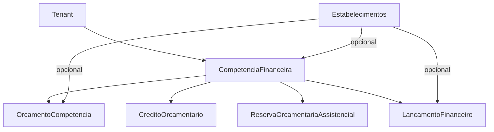

# Plano: Financeiro 100% por tenant (foco em entidades)

## Objetivo e premissas

- **Objetivo**: deixar **todo o Financeiro** estritamente por **tenant (prefeitura)**, eliminando qualquer entidade/tabela “global/aberta”.
- **Premissas confirmadas**:
  - **Competência financeira** será **tenant-scoped** (cada prefeitura tem suas competências).
  - **Estabelecimento** (UBS/UPA/Posto) será **opcional** no Financeiro (permitir visão consolidada da prefeitura).
- **Escopo desta etapa**: apenas **classes de entidades** (modelagem JPA), suas relações, constraints e impactos diretos nas tabelas.

## Diagnóstico rápido do estado atual (ponto de partida)

- Hoje existe uma exceção importante: `CompetenciaFinanceira` em [`src/main/java/com/upsaude/entity/financeiro/CompetenciaFinanceira.java`](/Users/wagnergrilo/Desktop/WGB/sistemas/UPSaude/code_cursor/UPSaude-final-back/src/main/java/com/upsaude/entity/financeiro/CompetenciaFinanceira.java) herda `BaseEntityWithoutTenant`, o que implica **sem `tenant_id`**.
- O restante das entidades financeiras, em geral, herda `BaseEntity` e já possui `tenant_id` e `estabelecimento_id` (opcional).

## Estratégia de modelagem (entidades) para “nada aberto”

### 1) Tenantizar Competência Financeira (mudança central)

- **Alterar o modelo** de `CompetenciaFinanceira` para herdar `BaseEntity` (passa a ter `tenant` e `estabelecimento` opcional via base).
- **Rever constraints e chaves naturais**:
  - O `codigo` (AAAAMM) hoje é unique global. No novo modelo, o correto é **unique por tenant**.
  - Definir se `codigo` pode repetir em diferentes estabelecimentos do mesmo tenant (recomendação: sim, porque competência costuma ser municipal; estabelecimento opcional não deve “particionar” competência por padrão).
- **Campos de status/fechamento**:
  - Como a competência será por tenant, o status ABERTA/FECHADA e metadados de fechamento podem morar:
    - **Opção preferida**: **na própria `CompetenciaFinanceira`** (simplifica e elimina “competencia_financeira_tenant”).
    - Alternativa: manter uma entidade de “estado/fechamento” separada (útil se no futuro houver múltiplos fechamentos por estabelecimento).
  - Nesta etapa, o plano assume **opção preferida**: incorporar status/fechamento na entidade `CompetenciaFinanceira` e **planejar a descontinuação** de `CompetenciaFinanceiraTenant`.

### 2) Revisar TODAS as entidades financeiras (padronização multi-tenant)

Para cada entidade em [`src/main/java/com/upsaude/entity/financeiro/`](/Users/wagnergrilo/Desktop/WGB/sistemas/UPSaude/code_cursor/UPSaude-final-back/src/main/java/com/upsaude/entity/financeiro):

- **Confirmar herança**: deve ser `BaseEntity` (tenant obrigatório, estabelecimento opcional). Nenhuma entidade financeira deve herdar `BaseEntityWithoutTenant`.
- **Confirmar relacionamentos**:
  - Relações para entidades “assistenciais” (ex.: agendamento/atendimento) devem ser sempre compatíveis com tenant.
  - Relações para entidades “referenciais globais” (ex.: SIGTAP/CID) podem permanecer sem tenant.
- **Ajustar constraints por tenant**:
  - Qualquer `@UniqueConstraint` que hoje não inclua `tenant_id` deve ser revisado para incluir `tenant_id` (e eventualmente outras chaves naturais).
- **Indexação** (ainda no nível de entidades/DDL gerado): garantir índices com `tenant_id` como primeiro componente (padrão do sistema).

### 3) Normalização: “prestadorId/prestadorTipo” vs estabelecimento

Em entidades como `ReservaOrcamentariaAssistencial` e `LancamentoFinanceiro`, existe modelagem de prestador por `prestadorId/prestadorTipo`.

- **Revisão de entidade**:
  - Definir se “prestador” é sempre um `Estabelecimentos` (UBS/UPA/Posto) ou se pode ser profissional.
  - Se o estabelecimento é opcional, mas prestador é obrigatório em certas operações, isso deve estar claro no modelo (ex.: `prestadorTipo` enum + validações em domínio/serviços, a serem tratadas em etapa posterior).

## Entregáveis desta etapa (entidades)

1) Documento interno (no próprio PR/issue) listando:

   - Todas as entidades do pacote financeiro
   - Herança atual vs desejada
   - Constraints atuais vs desejadas (principalmente uniques)
   - Relações que precisam ser atualizadas por causa da competência tenant-scoped

2) Definição final de entidade para competência:

   - `CompetenciaFinanceira` tenant-scoped
   - Decisão de eliminar ou refatorar `CompetenciaFinanceiraTenant`

## Próximas etapas (fora desta fase, mas já previstas no plano completo)

- **Serviços e endpoints**: garantir que nenhum fluxo use `findById()` sem tenant; aplicar também filtros por estabelecimento quando fizer sentido.
- **Banco de dados**: criar migração para:
  - transformar `competencia_financeira` em tenant-scoped (ou criar nova tabela e migrar)
  - atualizar todas as FKs que apontam para competência
  - backfill/estratégia para dados existentes
- **Cobertura de domínio para órgãos públicos (Brasil)**: avaliar lacunas de entidades/processos típicos:
  - **Orçamento público**: PPA/LDO/LOA, programas/ações, unidade orçamentária/gestora
  - **Execução da despesa**: dotação, empenho, liquidação, pagamento, restos a pagar
  - **Classificação**: natureza da despesa, fonte/destinação de recursos, elemento, modalidade de aplicação
  - **Contabilidade**: mapeamento PCASP, eventos contábeis

## Diagrama (alto nível) — proposta de competência tenant-scoped

