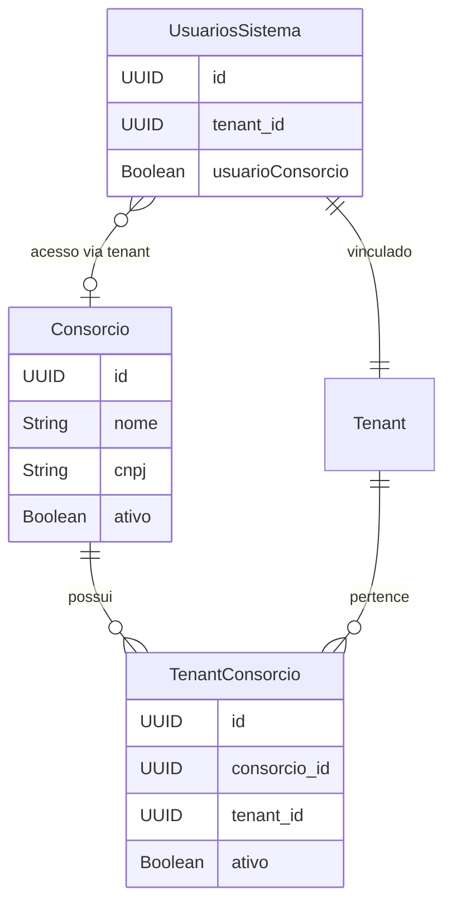

# Plano de Implementação: Sistema de Consórcio

## Visão Geral

Implementação completa do sistema de Consórcio que permite que usuários com `usuarioConsorcio=true` tenham acesso total a todos os tenants do mesmo consórcio. O sistema será implementado de forma backward compatible, mantendo toda funcionalidade existente intacta.

## Arquitetura



## Fase 1: Entidades e Estrutura de Dados

### 1.1 Criar Entidade Consorcio

**Arquivo**: `src/main/java/com/upsaude/entity/sistema/multitenancy/Consorcio.java`

- Estender estrutura similar a `Tenant.java`
- Embeddables: `DadosIdentificacaoTenant` (reutilizar), `ContatoTenant` (reutilizar)
- Campos: `id`, `nome`, `cnpj`, `ativo`, `createdAt`, `updatedAt`
- Relação `@OneToMany` com `TenantConsorcio`
- `@PrePersist` e `@PreUpdate` para inicializar embeddables
- Índices: `idx_consorcios_cnpj`, `idx_consorcios_ativo`
- Unique constraint: `uk_consorcios_cnpj`

### 1.2 Criar Entidade TenantConsorcio

**Arquivo**: `src/main/java/com/upsaude/entity/sistema/multitenancy/TenantConsorcio.java`

- Relação `@ManyToOne` com `Consorcio`
- Relação `@ManyToOne` com `Tenant`
- Campos: `id`, `consorcio`, `tenant`, `dataVinculacao`, `dataDesvinculacao`, `ativo`, `createdAt`, `updatedAt`
- Unique constraint: `uk_tenant_consorcios_consorcio_tenant`
- Índices: `idx_tenant_consorcios_consorcio`, `idx_tenant_consorcios_tenant`, `idx_tenant_consorcios_ativo`

### 1.3 Modificar UsuariosSistema

**Arquivo**: `src/main/java/com/upsaude/entity/sistema/usuario/UsuariosSistema.java`

- Adicionar campo: `@Column(name = "usuario_consorcio", nullable = false, columnDefinition = "boolean default false") private Boolean usuarioConsorcio = false;`
- Inicializar no `@PrePersist` se null
- Índice: `idx_usuarios_sistema_consorcio` (WHERE usuario_consorcio = true)

## Fase 2: Migrations SQL

### 2.1 Migration: Criar Tabelas Consórcio

**Arquivo**: `src/main/resources/assets/db/migration/V050__create_consorcio_tables.sql`

```sql
-- Tabela consorcios
CREATE TABLE consorcios (
    id UUID PRIMARY KEY DEFAULT gen_random_uuid(),
    nome VARCHAR(255) NOT NULL,
    cnpj VARCHAR(14) UNIQUE,
    razao_social VARCHAR(255),
    ativo BOOLEAN DEFAULT true,
    criado_em TIMESTAMP NOT NULL DEFAULT CURRENT_TIMESTAMP,
    atualizado_em TIMESTAMP,
    -- campos embeddables (contato, etc)
);

-- Tabela tenant_consorcios
CREATE TABLE tenant_consorcios (
    id UUID PRIMARY KEY DEFAULT gen_random_uuid(),
    consorcio_id UUID NOT NULL REFERENCES consorcios(id) ON DELETE CASCADE,
    tenant_id UUID NOT NULL REFERENCES tenants(id) ON DELETE CASCADE,
    data_vinculacao TIMESTAMP NOT NULL DEFAULT CURRENT_TIMESTAMP,
    data_desvinculacao TIMESTAMP,
    ativo BOOLEAN DEFAULT true,
    criado_em TIMESTAMP NOT NULL DEFAULT CURRENT_TIMESTAMP,
    atualizado_em TIMESTAMP,
    UNIQUE(consorcio_id, tenant_id)
);

-- Adicionar coluna em usuarios_sistema
ALTER TABLE usuarios_sistema 
ADD COLUMN usuario_consorcio BOOLEAN NOT NULL DEFAULT false;

-- Índices
CREATE INDEX idx_consorcios_cnpj ON consorcios(cnpj);
CREATE INDEX idx_consorcios_ativo ON consorcios(ativo) WHERE ativo = true;
CREATE INDEX idx_tenant_consorcios_consorcio ON tenant_consorcios(consorcio_id);
CREATE INDEX idx_tenant_consorcios_tenant ON tenant_consorcios(tenant_id);
CREATE INDEX idx_tenant_consorcios_ativo ON tenant_consorcios(consorcio_id, ativo) WHERE ativo = true;
CREATE INDEX idx_usuarios_sistema_consorcio ON usuarios_sistema(usuario_consorcio) WHERE usuario_consorcio = true;
```

### 2.2 Conexão MCP Supabase

- Usar `mcp_supabase_apply_migration` para aplicar a migration V050
- Verificar criação das tabelas com `mcp_supabase_list_tables`
- Validar índices e constraints criados

## Fase 3: Request e Response Classes

### 3.1 ConsorcioRequest

**Arquivo**: `src/main/java/com/upsaude/api/request/sistema/multitenancy/ConsorcioRequest.java`

- Campos: `nome` (NotNull, NotBlank), `cnpj` (Pattern), `razaoSocial`, embeddables de contato
- Validações Bean Validation
- Seguir padrão de `TenantRequest.java`

### 3.2 ConsorcioResponse

**Arquivo**: `src/main/java/com/upsaude/api/response/sistema/multitenancy/ConsorcioResponse.java`

- Campos: `id`, `nome`, `cnpj`, `razaoSocial`, `ativo`, `createdAt`, `updatedAt`
- Embeddables response
- Lista de `TenantResponse` simplificados (apenas id e nome)

### 3.3 TenantConsorcioRequest

**Arquivo**: `src/main/java/com/upsaude/api/request/sistema/multitenancy/TenantConsorcioRequest.java`

- Campos: `consorcioId` (NotNull), `tenantId` (NotNull), `dataDesvinculacao` (opcional)

### 3.4 TenantConsorcioResponse

**Arquivo**: `src/main/java/com/upsaude/api/response/sistema/multitenancy/TenantConsorcioResponse.java`

- Campos: `id`, `consorcio` (ConsorcioResponse simplificado), `tenant` (TenantResponse simplificado), `dataVinculacao`, `dataDesvinculacao`, `ativo`

### 3.5 Modificar UsuariosSistemaRequest

**Arquivo**: `src/main/java/com/upsaude/api/request/sistema/usuario/UsuariosSistemaRequest.java`

- Adicionar campo: `usuarioConsorcio` (Boolean, opcional, default false)

### 3.6 Modificar UsuariosSistemaResponse

**Arquivo**: `src/main/java/com/upsaude/api/response/sistema/usuario/UsuariosSistemaResponse.java`

- Adicionar campo: `usuarioConsorcio` (Boolean)

## Fase 4: Mappers

### 4.1 ConsorcioMapper

**Arquivo**: `src/main/java/com/upsaude/mapper/sistema/multitenancy/ConsorcioMapper.java`

- `@Mapper(config = MappingConfig.class, uses = {DadosIdentificacaoTenantMapper.class, ContatoTenantMapper.class})`
- Métodos: `fromRequest`, `updateFromRequest`, `toResponse`
- Ignorar campos de sistema em updates
- Mapear lista de tenants do consórcio no `toResponse`

### 4.2 TenantConsorcioMapper

**Arquivo**: `src/main/java/com/upsaude/mapper/sistema/multitenancy/TenantConsorcioMapper.java`

- `@Mapper(config = MappingConfig.class, uses = {ConsorcioMapper.class, TenantMapper.class})`
- Métodos: `fromRequest`, `updateFromRequest`, `toResponse`
- Mapear relacionamentos com Consorcio e Tenant

### 4.3 Modificar UsuariosSistemaMapper

**Arquivo**: `src/main/java/com/upsaude/mapper/sistema/usuario/UsuariosSistemaMapper.java`

- Adicionar mapeamento do campo `usuarioConsorcio` em todos os métodos

## Fase 5: Repositories

### 5.1 ConsorcioRepository

**Arquivo**: `src/main/java/com/upsaude/repository/sistema/multitenancy/ConsorcioRepository.java`

- Estender `JpaRepository<Consorcio, UUID>`
- Métodos: `existsByCnpj`, `existsByCnpjAndIdNot`
- Query customizada: `findByTenantId` (buscar consórcio por tenant)

### 5.2 TenantConsorcioRepository

**Arquivo**: `src/main/java/com/upsaude/repository/sistema/multitenancy/TenantConsorcioRepository.java`

- Estender `JpaRepository<TenantConsorcio, UUID>`
- Métodos: `findByConsorcioId`, `findByTenantId`, `findByConsorcioIdAndTenantId`
- Query: `findTenantIdsByConsorcioId` (retornar List<UUID> de tenantIds)
- Query: `findConsorcioIdByTenantId` (buscar consórcio de um tenant)

### 5.3 Modificar Repositories Existentes

Adicionar métodos `findByIdAndTenantIn` em todos os repositories que têm `findByIdAndTenant`:

- `EstabelecimentosRepository`
- `PacienteRepository`
- `ProfissionaisSaudeRepository`
- `MedicosRepository`
- `AtendimentoRepository`
- `AgendamentoRepository`
- `ConvenioRepository`
- Todos os outros repositories que filtram por tenant

**Padrão do método**:

```java
@Query("SELECT e FROM Entity e WHERE e.id = :id AND e.tenant.id IN :tenantIds")
Optional<Entity> findByIdAndTenantIn(@Param("id") UUID id, @Param("tenantIds") List<UUID> tenantIds);
```

## Fase 6: Services

### 6.1 ConsorcioService (Interface)

**Arquivo**: `src/main/java/com/upsaude/service/api/sistema/multitenancy/ConsorcioService.java`

- Métodos padrão: `criar`, `obterPorId`, `listar`, `atualizar`, `excluir`
- Métodos específicos: `vincularTenant`, `desvincularTenant`, `listarTenantsDoConsorcio`

### 6.2 ConsorcioServiceImpl

**Arquivo**: `src/main/java/com/upsaude/service/impl/api/sistema/multitenancy/ConsorcioServiceImpl.java`

- Implementar interface `ConsorcioService`
- Validações: duplicidade de CNPJ, tenant já vinculado
- Soft delete
- Logs padronizados
- Transações `@Transactional`

### 6.3 TenantConsorcioService (Interface)

**Arquivo**: `src/main/java/com/upsaude/service/api/sistema/multitenancy/TenantConsorcioService.java`

- Métodos: `vincular`, `desvincular`, `listarPorConsorcio`, `listarPorTenant`

### 6.4 TenantConsorcioServiceImpl

**Arquivo**: `src/main/java/com/upsaude/service/impl/api/sistema/multitenancy/TenantConsorcioServiceImpl.java`

- Implementar interface `TenantConsorcioService`
- Validações: tenant já vinculado, consórcio ativo
- Logs padronizados

### 6.5 Estender TenantService

**Arquivo**: `src/main/java/com/upsaude/service/api/sistema/multitenancy/TenantService.java`

Adicionar métodos:

- `List<UUID> obterTenantIdsDoUsuario()` - retorna lista de tenantIds (singleton se não for consórcio)
- `boolean isUsuarioConsorcio()` - verifica se usuário é de consórcio
- `Consorcio obterConsorcioDoTenant(UUID tenantId)` - busca consórcio de um tenant

### 6.6 Estender TenantServiceImpl

**Arquivo**: `src/main/java/com/upsaude/service/impl/api/sistema/multitenancy/TenantServiceImpl.java`

Implementar novos métodos:

- `obterTenantIdsDoUsuario()`: Se `usuarioConsorcio=true`, buscar consórcio e retornar lista de tenantIds. Senão, retornar lista com único tenantId.
- `isUsuarioConsorcio()`: Verificar flag no `UsuariosSistema`
- `obterConsorcioDoTenant()`: Usar `TenantConsorcioRepository.findConsorcioIdByTenantId`

### 6.7 Modificar UsuariosSistemaService

**Arquivo**: `src/main/java/com/upsaude/service/api/sistema/usuario/UsuariosSistemaService.java`

- Adicionar validação: se `usuarioConsorcio=true`, verificar se tenant do usuário pertence a um consórcio

### 6.8 Modificar UsuariosSistemaServiceImpl

**Arquivo**: `src/main/java/com/upsaude/service/impl/api/sistema/usuario/UsuariosSistemaServiceImpl.java`

- Implementar validação no método `criar` e `atualizar`
- Se `usuarioConsorcio=true` e tenant não pertence a consórcio, lançar `BadRequestException`

## Fase 7: TenantEnforcers - Extensão

### 7.1 Criar Métodos de Consórcio

Adicionar método `validarAcessoConsorcio` em todos os TenantEnforcers:

**Arquivos a modificar**:

- `EstabelecimentosTenantEnforcer.java`
- `PacienteTenantEnforcer.java`
- `ProfissionaisSaudeTenantEnforcer.java`
- `MedicoTenantEnforcer.java`
- `AtendimentoTenantEnforcer.java`
- `AgendamentoTenantEnforcer.java`
- `ConvenioTenantEnforcer.java`
- Todos os outros TenantEnforcers

**Padrão do método**:

```java
public Entity validarAcessoConsorcio(UUID id, List<UUID> tenantIds) {
    return repository.findByIdAndTenantIn(id, tenantIds)
        .orElseThrow(() -> new NotFoundException("Entity não encontrado"));
}
```

### 7.2 Modificar Services para Usar Lógica Condicional

Em todos os Services que usam TenantEnforcer, adicionar lógica:

```java
if (tenantService.isUsuarioConsorcio()) {
    List<UUID> tenantIds = tenantService.obterTenantIdsDoUsuario();
    entity = enforcer.validarAcessoConsorcio(id, tenantIds);
} else {
    UUID tenantId = tenantService.validarTenantAtual();
    entity = enforcer.validarAcesso(id, tenantId);
}
```

**Services a modificar**:

- `EstabelecimentosServiceImpl`
- `PacienteServiceImpl`
- `ProfissionaisSaudeServiceImpl`
- `MedicoServiceImpl`
- `AtendimentoServiceImpl`
- `AgendamentoServiceImpl`
- `ConvenioServiceImpl`
- Todos os outros services que usam TenantEnforcer

## Fase 8: Controllers

### 8.1 ConsorcioController

**Arquivo**: `src/main/java/com/upsaude/controller/api/sistema/multitenancy/ConsorcioController.java`

- Endpoints padrão: POST, GET, GET/{id}, PUT/{id}, DELETE/{id}
- Endpoint específico: POST `/consorcios/{id}/tenants` (vincular tenant)
- Endpoint específico: DELETE `/consorcios/{id}/tenants/{tenantId}` (desvincular tenant)
- Endpoint específico: GET `/consorcios/{id}/tenants` (listar tenants do consórcio)
- Swagger/OpenAPI annotations
- Logs padronizados

### 8.2 TenantConsorcioController (Opcional)

**Arquivo**: `src/main/java/com/upsaude/controller/api/sistema/multitenancy/TenantConsorcioController.java`

- Endpoints para gerenciar vínculos diretamente
- Alternativa ao uso via ConsorcioController

## Fase 9: Testes

### 9.1 Testes Unitários

- `ConsorcioServiceTest`
- `TenantConsorcioServiceTest`
- `TenantServiceTest` (novos métodos)

### 9.2 Testes de Integração

- Testes de criação de consórcio
- Testes de vinculação de tenants
- Testes de acesso multi-tenant para usuários de consórcio
- Testes de compatibilidade (usuários não-consórcio)

### 9.3 Testes de Regressão

- Validar que todos os testes existentes continuam passando
- Garantir backward compatibility

## Fase 10: Validações e Ajustes Finais

### 10.1 Validações de Negócio

- Um tenant pode pertencer a apenas um consórcio ativo
- Um consórcio deve ter pelo menos um tenant
- Usuário de consórcio só pode ser criado se tenant pertencer a consórcio
- Validações de CNPJ único

### 10.2 Performance

- Cache para lista de tenantIds do consórcio
- Índices otimizados nas queries
- Lazy loading adequado

### 10.3 Documentação

- Atualizar documentação da API (Swagger)
- Documentar novos endpoints
- Documentar comportamento de acesso multi-tenant

## Ordem de Implementação Recomendada

1. **Fase 1**: Entidades (Consorcio, TenantConsorcio, modificação UsuariosSistema)
2. **Fase 2**: Migration SQL e aplicação via MCP Supabase
3. **Fase 3**: Request/Response classes
4. **Fase 4**: Mappers
5. **Fase 5**: Repositories
6. **Fase 6**: Services (ConsorcioService, TenantConsorcioService, extensão TenantService)
7. **Fase 7**: Extensão TenantEnforcers e modificação Services existentes
8. **Fase 8**: Controllers
9. **Fase 9**: Testes
10. **Fase 10**: Validações finais e documentação

## Pontos de Atenção

1. **Backward Compatibility**: Todos os métodos existentes devem continuar funcionando
2. **Performance**: Queries com `IN` clause podem ser mais lentas - considerar cache
3. **Segurança**: Validar sempre que usuário de consórcio só acessa tenants do seu consórcio
4. **Transações**: Operações de vinculação/desvinculação devem ser transacionais
5. **Logs**: Logar todas as operações de consórcio para auditoria
6. **Validações**: Não permitir criar usuário de consórcio sem consórcio válido

## Arquivos Principais a Criar/Modificar

### Novos Arquivos (15+)

- `Consorcio.java`
- `TenantConsorcio.java`
- `ConsorcioRequest.java`
- `ConsorcioResponse.java`
- `TenantConsorcioRequest.java`
- `TenantConsorcioResponse.java`
- `ConsorcioMapper.java`
- `TenantConsorcioMapper.java`
- `ConsorcioRepository.java`
- `TenantConsorcioRepository.java`
- `ConsorcioService.java`
- `ConsorcioServiceImpl.java`
- `TenantConsorcioService.java`
- `TenantConsorcioServiceImpl.java`
- `ConsorcioController.java`
- `V050__create_consorcio_tables.sql`

### Arquivos a Modificar (20+)

- `UsuariosSistema.java` (adicionar campo)
- `UsuariosSistemaRequest.java` (adicionar campo)
- `UsuariosSistemaResponse.java` (adicionar campo)
- `UsuariosSistemaMapper.java` (mapear novo campo)
- `TenantService.java` (adicionar métodos)
- `TenantServiceImpl.java` (implementar métodos)
- Todos os Repositories com `findByIdAndTenant` (adicionar `findByIdAndTenantIn`)
- Todos os TenantEnforcers (adicionar `validarAcessoConsorcio`)
- Todos os Services que usam TenantEnforcer (lógica condicional)
- `UsuariosSistemaService` e `UsuariosSistemaServiceImpl` (validações)