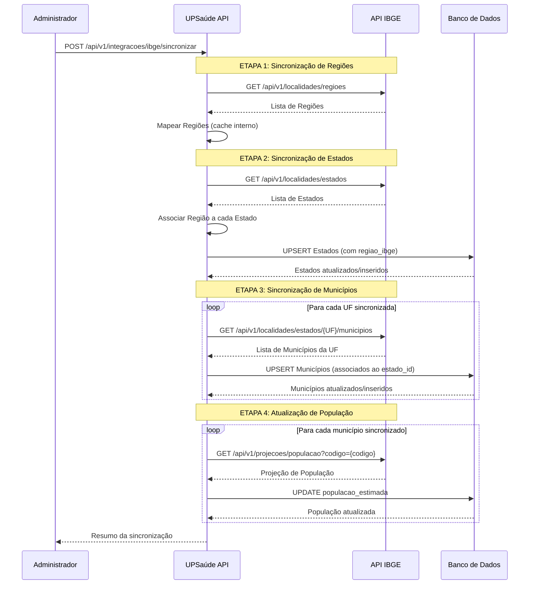

# Plano de Integração IBGE - Estados e Cidades

## 1. Estrutura Atual Identificada

### Tabela `estados`

- **Colunas existentes:** id, sigla (UNIQUE), nome, codigo_ibge (nullable), ativo, criado_em, atualizado_em
- **Constraints:** PK em id, UNIQUE em sigla, FK de cidades.estado_id

### Tabela `cidades`

- **Colunas existentes:** id, nome, codigo_ibge (nullable), estado_id (FK), latitude, longitude, ativo, criado_em, atualizado_em
- **Constraints:** PK em id, FK para estados.id

### Endpoints Existentes

- **Estados:** `POST /v1/estados`, `GET /v1/estados`, `GET /v1/estados/{id}`, `PUT /v1/estados/{id}`, `DELETE /v1/estados/{id}`, `PATCH /v1/estados/{id}/inativar`
- **Cidades:** `POST /v1/cidades`, `GET /v1/cidades`, `GET /v1/cidades/por-estado/{estadoId}`, `GET /v1/cidades/{id}`, `PUT /v1/cidades/{id}`, `DELETE /v1/cidades/{id}`, `PATCH /v1/cidades/{id}/inativar`

### Contratos Atuais

- `EstadosRequest/Response` já incluem `codigoIbge`
- `CidadesRequest/Response` já incluem `codigoIbge`

## 2. Alterações no Banco de Dados

### Tabela `estados` - Colunas a Adicionar

Todas as colunas serão **NULLABLE** para garantir retrocompatibilidade:

```sql
ALTER TABLE estados ADD COLUMN nome_oficial_ibge VARCHAR(200);
ALTER TABLE estados ADD COLUMN sigla_ibge VARCHAR(2);
ALTER TABLE estados ADD COLUMN regiao_ibge VARCHAR(50);
ALTER TABLE estados ADD COLUMN ativo_ibge BOOLEAN DEFAULT TRUE;
ALTER TABLE estados ADD COLUMN data_ultima_sincronizacao_ibge TIMESTAMPTZ;

-- Índice único para codigo_ibge (se ainda não existir)
CREATE UNIQUE INDEX IF NOT EXISTS idx_estados_codigo_ibge_unique 
ON estados(codigo_ibge) WHERE codigo_ibge IS NOT NULL;
```


### Tabela `cidades` - Colunas a Adicionar

Todas as colunas serão **NULLABLE** para garantir retrocompatibilidade:

```sql
ALTER TABLE cidades ADD COLUMN nome_oficial_ibge VARCHAR(200);
ALTER TABLE cidades ADD COLUMN uf_ibge VARCHAR(2);
ALTER TABLE cidades ADD COLUMN populacao_estimada INTEGER;
ALTER TABLE cidades ADD COLUMN ativo_ibge BOOLEAN DEFAULT TRUE;
ALTER TABLE cidades ADD COLUMN data_ultima_sincronizacao_ibge TIMESTAMPTZ;

-- Índice único para codigo_ibge (se ainda não existir)
CREATE UNIQUE INDEX IF NOT EXISTS idx_cidades_codigo_ibge_unique 
ON cidades(codigo_ibge) WHERE codigo_ibge IS NOT NULL;
```


## 3. Estrutura de Pacotes - Camada de Integração IBGE

Criar pacote isolado para integração IBGE:

```javascript
src/main/java/com/upsaude/
├── integration/
│   └── ibge/
│       ├── client/
│       │   ├── IbgeClient.java              # Cliente HTTP para API IBGE
│       │   └── IbgeClientConfig.java        # Configuração (timeout, retry)
│       ├── dto/
│       │   ├── IbgeEstadoDTO.java          # DTO específico do IBGE para Estado
│       │   ├── IbgeMunicipioDTO.java       # DTO específico do IBGE para Município
│       │   └── IbgeRegiaoDTO.java          # DTO para Região (se necessário)
│       ├── service/
│       │   ├── IbgeService.java            # Interface do serviço
│       │   └── IbgeServiceImpl.java        # Implementação com lógica de sincronização
│       └── exception/
│           ├── IbgeIntegrationException.java
│           └── IbgeTimeoutException.java
```


## 4. Arquivos a Criar/Modificar

### 4.1 Entidades JPA

- **Modificar:** [src/main/java/com/upsaude/entity/referencia/geogra
- **Modificar:** [src/main/java/com/upsaude/entity/referencia/geograficfico/Estados.java](src/main/java/com/upsaude/entity/referencia/geografico/Estados.java)
- Adicionar campos: `nomeOficialIbge`, `siglaIbge`, `regiaoIbge`, `ativoIbge`, `dataUltimaSincronizacaoIbge`
- **Modificar:** [src/main/java/com/upsaude/entity/referencia/geografico/Cidades.java](src/main/java/com/upsaude/entity/referencia/geografico/Cidades.java)
- Adicionar campos: `nomeOficialIbge`, `ufIbge`, `populacaoEstimada`, `ativoIbge`, `dataUltimaSincronizacaoIbge`

### 4.2 Camada de Integração IBGE

- **Criar:** `src/main/java/com/upsaude/integration/ibge/client/IbgeClient.java`
- Cliente HTTP usando RestTemplate ou WebClient
- Métodos obrigatórios:
- `List<IbgeEstadoDTO> buscarEstados()` - Endpoint 5.1
- `List<IbgeMunicipioDTO> buscarMunicipiosPorUf(String uf)` - Endpoint 5.2
- `IbgeMunicipioDTO buscarMunicipioPorCodigoIbge(String codigoIbge)` - Endpoint 5.3
- `IbgeProjecaoPopulacaoDTO buscarProjecaoPopulacao(String codigoMunicipio)` - Endpoint 5.4
- `List<IbgeRegiaoDTO> buscarRegioes()` - Endpoint 5.5
- Timeout configurável (30s para sincronização, 10s para validação pontual)
- Retry simples (3 tentativas para sincronização, 2 para validação)
- **Criar:** `src/main/java/com/upsaude/integration/ibge/client/IbgeClientConfig.java`
- Configuração de timeout, retry, base URL
- **Criar:** `src/main/java/com/upsaude/integration/ibge/dto/IbgeEstadoDTO.java`
- Mapeamento do JSON retornado pela API IBGE (Endpoint 5.1)
- Campos: id (codigo_ibge), sigla, nome, regiao (objeto com id e nome)
- **Criar:** `src/main/java/com/upsaude/integration/ibge/dto/IbgeMunicipioDTO.java`
- Mapeamento do JSON retornado pela API IBGE (Endpoints 5.2 e 5.3)
- Campos: id (codigo_ibge), nome, microrregiao (com mesorregiao, UF, região)
- **Criar:** `src/main/java/com/upsaude/integration/ibge/dto/IbgeRegiaoDTO.java`
- Mapeamento do JSON retornado pela API IBGE (Endpoint 5.5)
- Campos: id, sigla, nome
- **Criar:** `src/main/java/com/upsaude/integration/ibge/dto/IbgeProjecaoPopulacaoDTO.java`
- Mapeamento do JSON retornado pela API IBGE (Endpoint 5.4)
- Campos: projecao (valor numérico), ano, codigoMunicipio
- Nota: Estrutura exata a ser validada na documentação oficial do IBGE
- **Criar:** `src/main/java/com/upsaude/integration/ibge/service/IbgeService.java`
- Interface com métodos:
- `IbgeSincronizacaoResponse sincronizarTudo()` - Executa todas as etapas na ordem correta
- `IbgeSincronizacaoResponse sincronizarRegioes()` - Endpoint 5.5
- `IbgeSincronizacaoResponse sincronizarEstados()` - Endpoint 5.1 (usa regiões)
- `IbgeSincronizacaoResponse sincronizarMunicipios()` - Endpoint 5.2 (requer estados)
- `IbgeSincronizacaoResponse atualizarPopulacao()` - Endpoint 5.4 (requer municípios)
- `IbgeMunicipioDTO validarMunicipioPorCodigoIbge(String codigoIbge)` - Endpoint 5.3 (validação pontual)
- **Criar:** `src/main/java/com/upsaude/integration/ibge/service/IbgeServiceImpl.java`
- Implementação com lógica de UPSERT
- Busca por `codigo_ibge` para atualizar ou inserir
- Transações gerenciadas
- **Criar:** `src/main/java/com/upsaude/integration/ibge/exception/IbgeIntegrationException.java`
- Exceção customizada para erros de integração

### 4.3 Controller de Sincronização

- **Criar:** `src/main/java/com/upsaude/controller/api/integracoes/IbgeSincronizacaoController.java`
- Endpoints:
- `POST /api/v1/integracoes/ibge/sincronizar` - Sincronização completa (todas as etapas)
    - Parâmetros opcionais: `?regioes=true&estados=true&municipios=true&populacao=true`
    - Todos os parâmetros default `true` para sincronização completa
- `POST /api/v1/integracoes/ibge/sincronizar/regioes` - Apenas regiões
- `POST /api/v1/integracoes/ibge/sincronizar/estados` - Apenas estados (requer regiões)
- `POST /api/v1/integracoes/ibge/sincronizar/municipios` - Apenas municípios (requer estados)
- `POST /api/v1/integracoes/ibge/sincronizar/populacao` - Apenas população (requer municípios)
- `GET /api/v1/integracoes/ibge/validar-municipio/{codigoIbge}` - Validação pontual (Endpoint 5.3)
- Retorna resumo: regiões sincronizadas, estados sincronizados, municípios sincronizados, população atualizada, erros por etapa

### 4.4 DTOs de Resposta de Sincronização

- **Criar:** `src/main/java/com/upsaude/api/response/integracoes/IbgeSincronizacaoResponse.java`
- Campos:
- `regioesSincronizadas` (Integer)
- `estadosSincronizados` (Integer)
- `municipiosSincronizados` (Integer)
- `populacaoAtualizada` (Integer)
- `regioesErros` (List<String>)
- `estadosErros` (List<String>)
- `municipiosErros` (List<String>)
- `populacaoErros` (List<String>)
- `tempoExecucao` (Duration)
- `etapasExecutadas` (List<String>)

## 5. Mapeamento de Endpoints IBGE Utilizados

Esta seção documenta **TODOS** os endpoints da API IBGE que serão utilizados na integração, com finalidade clara e estratégia de implementação.

### 5.1 Listar Estados

**Endpoint:** `GET https://servicodados.ibge.gov.br/api/v1/localidades/estados`**Método HTTP:** GET**Finalidade no UPSaúde:**

- Sincronização inicial e periódica de todos os estados brasileiros
- Validação de UF em cadastros e formulários
- Base obrigatória para sincronização de municípios (necessário obter lista de UFs)

**Entidades Impactadas:**

- `Estados` (tabela `estados`)

**Estratégia de Persistência:**

- UPSERT por `codigo_ibge` (campo `id` do IBGE)
- Se `codigo_ibge` não existir, busca por `sigla` como fallback
- Atualiza campos: `nome_oficial_ibge`, `sigla_ibge`, `regiao_ibge`, `codigo_ibge`, `ativo_ibge`, `data_ultima_sincronizacao_ibge`
- Preserva campos locais: `nome`, `sigla`, `ativo` (se já existirem)

**Periodicidade de Sincronização:**

- Manual via endpoint administrativo
- Recomendado: mensalmente ou quando houver necessidade

**Tratamento de Erro:**

- Timeout: 30 segundos
- Retry: 3 tentativas com backoff exponencial
- Se falhar: registra erro no resumo, não interrompe sincronização completa

**Método no IbgeClient:**

```java
List<IbgeEstadoDTO> buscarEstados()
```

---

### 5.2 Listar Municípios por UF

**Endpoint:** `GET https://servicodados.ibge.gov.br/api/v1/localidades/estados/{UF}/municipios`**Método HTTP:** GET**Parâmetros:**

- `{UF}`: Sigla do estado (ex: "SP", "RJ", "MG")

**Finalidade no UPSaúde:**

- Sincronização de municípios por estado
- Associação correta Município → Estado via `estado_id`
- Atualização de nomes oficiais dos municípios
- Validação de municípios em cadastros de endereços

**Entidades Impactadas:**

- `Cidades` (tabela `cidades`)
- Relacionamento com `Estados` via `estado_id`

**Estratégia de Persistência:**

- Executado **após** sincronização de estados
- Para cada UF obtida na sincronização de estados, busca seus municípios
- UPSERT por `codigo_ibge` (campo `id` do IBGE)
- Se `codigo_ibge` não existir, busca por `nome + estado_id` como fallback
- Atualiza campos: `nome_oficial_ibge`, `uf_ibge`, `codigo_ibge`, `ativo_ibge`, `data_ultima_sincronizacao_ibge`
- Preserva campos locais: `nome`, `latitude`, `longitude`, `ativo` (se já existirem)
- Associa ao `estado_id` correto baseado na UF

**Periodicidade de Sincronização:**

- Manual via endpoint administrativo
- Executado após sincronização de estados
- Recomendado: mensalmente ou quando houver necessidade

**Tratamento de Erro:**

- Timeout: 30 segundos por UF
- Retry: 3 tentativas com backoff exponencial
- Se falhar para uma UF: registra erro no resumo, continua com próximas UFs
- Erros não bloqueiam sincronização de outras UFs

**Método no IbgeClient:**

```java
List<IbgeMunicipioDTO> buscarMunicipiosPorUf(String uf)
```

---

### 5.3 Buscar Município por Código IBGE

**Endpoint:** `GET https://servicodados.ibge.gov.br/api/v1/localidades/municipios/{codigo_ibge}`**Método HTTP:** GET**Parâmetros:**

- `{codigo_ibge}`: Código IBGE do município (ex: "3550308" para São Paulo)

**Finalidade no UPSaúde:**

- Validação pontual de município específico
- Correção de inconsistências em dados existentes
- Uso futuro em integrações governamentais (CADSUS, e-SUS, RNDS)
- Validação de código IBGE em formulários de cadastro

**Entidades Impactadas:**

- `Cidades` (tabela `cidades`)

**Estratégia de Persistência:**

- Busca pontual por código IBGE
- Se município existir no banco: atualiza campos IBGE
- Se não existir: pode criar novo registro ou apenas retornar dados para validação
- Atualiza campos: `nome_oficial_ibge`, `uf_ibge`, `codigo_ibge`, `ativo_ibge`, `data_ultima_sincronizacao_ibge`

**Periodicidade de Sincronização:**

- Sob demanda (não faz parte da sincronização completa)
- Pode ser chamado via endpoint específico ou internamente em validações

**Tratamento de Erro:**

- Timeout: 10 segundos (validação pontual)
- Retry: 2 tentativas
- Se código IBGE inválido: retorna erro específico

**Método no IbgeClient:**

```java
IbgeMunicipioDTO buscarMunicipioPorCodigoIbge(String codigoIbge)
```

**Endpoint no Controller (opcional):**

```java
GET /api/v1/integracoes/ibge/validar-municipio/{codigoIbge}
```

---

### 5.4 Projeção de População

**Endpoint:** `GET https://servicodados.ibge.gov.br/api/v1/projecoes/populacao`**Método HTTP:** GET**Finalidade no UPSaúde:**

- Atualização de população estimada dos municípios
- Cálculo de indicadores epidemiológicos (taxa de incidência, prevalência)
- Geração de relatórios e Business Intelligence
- Planejamento de ações de saúde pública baseado em população

**Entidades Impactadas:**

- `Cidades` (tabela `cidades`) - campo `populacao_estimada`

**Estratégia de Persistência:**

- Executado **após** sincronização de municípios
- Para cada município sincronizado, busca projeção de população
- Atualiza campo `populacao_estimada` na tabela `cidades`
- Se projeção não disponível: mantém valor existente ou deixa NULL

**Periodicidade de Sincronização:**

- Manual via endpoint administrativo
- Executado após sincronização de municípios
- Recomendado: trimestralmente (população muda menos frequentemente)

**Tratamento de Erro:**

- Timeout: 30 segundos
- Retry: 2 tentativas
- Se falhar para um município: registra erro, continua com próximos
- Erros não bloqueiam atualização de outros municípios

**Método no IbgeClient:**

```java
IbgeProjecaoPopulacaoDTO buscarProjecaoPopulacao(String codigoMunicipio)
```

**Observação:** A API de projeção pode ter estrutura diferente. Será necessário verificar a documentação oficial do IBGE para o formato exato da resposta.---

### 5.5 Regiões do Brasil

**Endpoint:** `GET https://servicodados.ibge.gov.br/api/v1/localidades/regioes`**Método HTTP:** GET**Finalidade no UPSaúde:**

- Associação Estado → Região IBGE
- Preenchimento do campo `regiao_ibge` na tabela `estados`
- Geração de relatórios regionais (Norte, Nordeste, Centro-Oeste, Sudeste, Sul)
- Agrupamentos estatísticos para análises epidemiológicas
- Dashboards e indicadores por região

**Entidades Impactadas:**

- `Estados` (tabela `estados`) - campo `regiao_ibge`

**Estratégia de Persistência:**

- Executado **antes** ou **durante** sincronização de estados
- Mapeia cada estado para sua região IBGE
- Atualiza campo `regiao_ibge` na tabela `estados` durante sincronização
- Mapeamento: Estado.codigo_ibge → Região IBGE

**Periodicidade de Sincronização:**

- Manual via endpoint administrativo
- Executado junto com sincronização de estados
- Recomendado: mensalmente (regiões são estáveis)

**Tratamento de Erro:**

- Timeout: 30 segundos
- Retry: 3 tentativas com backoff exponencial
- Se falhar: registra erro, mas não bloqueia sincronização de estados (região pode ser preenchida manualmente)

**Método no IbgeClient:**

```java
List<IbgeRegiaoDTO> buscarRegioes()
```

**Método auxiliar no IbgeService:**

```java
String obterRegiaoPorEstado(String codigoIbgeEstado)
```

---

## 6. Fluxo de Sincronização Completo

O fluxo de sincronização seguirá a ordem abaixo, garantindo que todas as dependências sejam respeitadas:




### 6.1 Ordem de Execução Obrigatória

1. **Sincronização de Regiões** (opcional, mas recomendado)

- Busca todas as regiões do IBGE
- Armazena em cache interno para uso posterior

2. **Sincronização de Estados**

- Busca todos os estados
- Associa cada estado à sua região (usando cache de regiões)
- Persiste estados com `regiao_ibge` preenchido

3. **Sincronização de Municípios**

- Para cada UF obtida na etapa anterior, busca seus municípios
- Associa cada município ao `estado_id` correto
- Persiste municípios

4. **Atualização de População** (opcional, pode ser executado separadamente)

- Para cada município sincronizado, busca projeção de população
- Atualiza campo `populacao_estimada`

5. **Validação Pontual** (sob demanda, não faz parte da sincronização completa)

- Endpoint específico para validar município por código IBGE

## 7. Regras de Negócio

### 7.1 UPSERT Lógico

- **Busca:** Por `codigo_ibge` (se existir) ou por `sigla` (estados) / `nome + estado_id` (cidades)
- **Se encontrado:** Atualiza campos IBGE, mantém dados locais existentes
- **Se não encontrado:** Insere novo registro com dados do IBGE
- **Não duplica:** Garantir que não haja duplicação por `codigo_ibge`

### 7.2 Compatibilidade

- **Endpoints existentes:** Continuam funcionando normalmente
- **Campos novos:** Opcionais, não quebram contratos existentes
- **Dados existentes:** Preservados, apenas campos IBGE são atualizados

### 7.3 Tratamento de Erros

- **Timeout:** 30 segundos por requisição
- **Retry:** 3 tentativas com backoff exponencial
- **Erros de rede:** Logados, não interrompem sincronização completa
- **Erros de validação:** Registrados no resumo, não bloqueiam outros registros

## 8. Configuração

### 7.1 application.yml

```yaml
ibge:
  api:
    base-url: https://servicodados.ibge.gov.br/api/v1
    timeout-seconds: 30
    retry:
      max-attempts: 3
      backoff-millis: 1000
```


## 9. Testes e Validação

### 9.1 Testes Unitários

- `IbgeClientTest`: Mock da API IBGE
- `IbgeServiceImplTest`: Lógica de UPSERT
- `IbgeSincronizacaoControllerTest`: Endpoint de sincronização

### 9.2 Validação de Compatibilidade

- Testar que endpoints existentes continuam funcionando
- Testar que dados existentes não são perdidos
- Testar que campos novos são opcionais

## 10. Documentação

- Adicionar documentação Swagger no endpoint de sincronização
- Documentar campos novos nas entidades (JavaDoc)
- Criar README na pasta `integration/ibge` explicando a integração

## 11. Ordem de Implementação

1. **Migração do banco de dados** (adicionar colunas)
2. **Atualizar entidades JPA** (adicionar campos)
3. **Criar camada de integração IBGE** (client, DTOs, service)
4. **Criar endpoint de sincronização**
5. **Testes e validação**
6. **Documentação**

## 12. Resumo dos Endpoints IBGE Utilizados

Esta seção consolida **TODOS** os endpoints do IBGE que serão implementados, garantindo que nenhum seja omitido:| # | Endpoint IBGE | Método | Finalidade | Status ||---|---------------|--------|------------|--------|| 1 | `/api/v1/localidades/estados` | GET | Sincronização inicial de Estados, validação de UF, base para municípios | ✅ Obrigatório || 2 | `/api/v1/localidades/estados/{UF}/municipios` | GET | Sincronização de Municípios, associação Município → Estado | ✅ Obrigatório || 3 | `/api/v1/localidades/municipios/{codigo_ibge}` | GET | Validação pontual, correção de inconsistências, integrações governamentais | ✅ Obrigatório || 4 | `/api/v1/projecoes/populacao` | GET | Atualização de população estimada, indicadores epidemiológicos, relatórios | ✅ Obrigatório || 5 | `/api/v1/localidades/regioes` | GET | Associação Estado → Região, relatórios regionais, agrupamentos estatísticos | ✅ Obrigatório |

### Garantias de Implementação

- ✅ **Todos os 5 endpoints estão documentados** na seção 5 (Mapeamento de Endpoints IBGE)
- ✅ **Todos os endpoints têm finalidade clara** e justificativa funcional
- ✅ **Todos os endpoints têm estratégia de persistência** definida
- ✅ **Todos os endpoints têm tratamento de erro** especificado
- ✅ **Todos os endpoints estão no fluxo de sincronização** (seção 6)
- ✅ **Todos os endpoints terão métodos no IbgeClient** (seção 4.2)
- ✅ **Todos os endpoints terão DTOs correspondentes** (seção 4.2)
- ✅ **Nenhum endpoint foi simplificado ou omitido**

## Observações Importantes

- **Nenhum campo existente será modificado ou removido**
- **Todos os campos novos são opcionais (nullable)**
- **Endpoints existentes permanecem intactos**
- **A sincronização é manual (endpoint administrativo)**
- **Todos os 5 endpoints IBGE obrigatórios estão contemplados no plano**