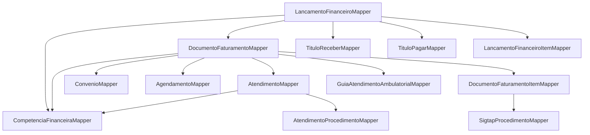

# Plano detalhado — criação de Mappers (MapStruct)

## Objetivo

Criar **mappers MapStruct** para todas as entidades novas de **Financeiro** e **Faturamento** (e `AtendimentoProcedimento`), além de **ajustar** mappers existentes (`AgendamentoMapper`, `AtendimentoMapper`) para suportar os novos campos (`competenciaFinanceira`, procedimentos, etc.) e evitar erros de compilação por conflito de tipos (UUID ↔ entidade).

## Padrão do projeto (confirmado no código)

- **MapStruct + Spring** via `@Mapper(config = MappingConfig.class)`.
- Config global em [`src/main/java/com/upsaude/mapper/config/MappingConfig.java`](src/main/java/com/upsaude/mapper/config/MappingConfig.java):
  - `componentModel = "spring"`
  - `unmappedTargetPolicy = IGNORE`
  - `nullValuePropertyMappingStrategy = IGNORE`
- Convenção recorrente:
  - Métodos **Entity ← Request**:
    - `fromRequest(Request)`
    - `updateFromRequest(Request, @MappingTarget Entity)`
    - Sempre `@Mapping(target = "id|createdAt|updatedAt|active", ignore = true)`
    - **Relacionamentos** (ManyToOne/OneToMany) normalmente são `ignore = true` e preenchidos no service (porque o Request carrega UUID).
  - Método **Entity → Response**: `toResponse(Entity)`
  - Para “simplificados”: criar método adicional `toSimplifiedResponse(Entity)` quando existir `*SimplificadoResponse`.

## Pontos críticos (para não quebrar o build)

- Você adicionou `competenciaFinanceira` (UUID) em `AgendamentoRequest`/`AtendimentoRequest`, mas nas entidades o campo é `CompetenciaFinanceira` (entidade). Isso **vai quebrar a geração do mapper** se não tiver `@Mapping(target = "competenciaFinanceira", ignore = true)` nos métodos `fromRequest/updateFromRequest`.
- Você adicionou `procedimentos` (List<Request/Response)) em `AtendimentoRequest/Response`, mas a entidade usa `List<AtendimentoProcedimento>`.
  - Em `fromRequest/updateFromRequest`: **ignorar** `procedimentos` (pois envolve criação/atualização de filhos e amarração com atendimento).
  - Em `toResponse`: mapear a lista com um mapper dedicado `AtendimentoProcedimentoMapper`.
- Evitar recursão/ciclos: onde Response já usa `*SimplificadoResponse`, garantir que o mapper utilize esses tipos (MapStruct escolhe pelo tipo de destino se existirem métodos).

## Estrutura de pastas a criar

- Criar pacote **Financeiro**: [`src/main/java/com/upsaude/mapper/financeiro/`](src/main/java/com/upsaude/mapper/financeiro/)
- Criar pacote **Faturamento**: [`src/main/java/com/upsaude/mapper/faturamento/`](src/main/java/com/upsaude/mapper/faturamento/)
- Criar mapper no pacote existente: [`src/main/java/com/upsaude/mapper/clinica/atendimento/`](src/main/java/com/upsaude/mapper/clinica/atendimento/)

## Lista de mappers a criar (1:1 com as entidades novas)

### Financeiro (27 entidades)

Criar mappers (interface, salvo exceções) em `com.upsaude.mapper.financeiro`:

- **Período/competência**
  - [`src/main/java/com/upsaude/mapper/financeiro/CompetenciaFinanceiraMapper.java`](src/main/java/com/upsaude/mapper/financeiro/CompetenciaFinanceiraMapper.java)
  - [`src/main/java/com/upsaude/mapper/financeiro/CompetenciaFinanceiraTenantMapper.java`](src/main/java/com/upsaude/mapper/financeiro/CompetenciaFinanceiraTenantMapper.java)
- **Plano de contas / classificação**
  - [`src/main/java/com/upsaude/mapper/financeiro/PlanoContasMapper.java`](src/main/java/com/upsaude/mapper/financeiro/PlanoContasMapper.java)
  - [`src/main/java/com/upsaude/mapper/financeiro/ContaContabilMapper.java`](src/main/java/com/upsaude/mapper/financeiro/ContaContabilMapper.java)
  - [`src/main/java/com/upsaude/mapper/financeiro/RegraClassificacaoContabilMapper.java`](src/main/java/com/upsaude/mapper/financeiro/RegraClassificacaoContabilMapper.java)
  - [`src/main/java/com/upsaude/mapper/financeiro/CentroCustoMapper.java`](src/main/java/com/upsaude/mapper/financeiro/CentroCustoMapper.java)
- **Contas/Movimentações/Conciliação**
  - [`src/main/java/com/upsaude/mapper/financeiro/ContaFinanceiraMapper.java`](src/main/java/com/upsaude/mapper/financeiro/ContaFinanceiraMapper.java)
  - [`src/main/java/com/upsaude/mapper/financeiro/TransferenciaEntreContasMapper.java`](src/main/java/com/upsaude/mapper/financeiro/TransferenciaEntreContasMapper.java)
  - [`src/main/java/com/upsaude/mapper/financeiro/MovimentacaoContaMapper.java`](src/main/java/com/upsaude/mapper/financeiro/MovimentacaoContaMapper.java)
  - [`src/main/java/com/upsaude/mapper/financeiro/ExtratoBancarioImportadoMapper.java`](src/main/java/com/upsaude/mapper/financeiro/ExtratoBancarioImportadoMapper.java)
  - [`src/main/java/com/upsaude/mapper/financeiro/ConciliacaoBancariaMapper.java`](src/main/java/com/upsaude/mapper/financeiro/ConciliacaoBancariaMapper.java)
  - [`src/main/java/com/upsaude/mapper/financeiro/ConciliacaoItemMapper.java`](src/main/java/com/upsaude/mapper/financeiro/ConciliacaoItemMapper.java)
- **Contas a receber / pagar**
  - [`src/main/java/com/upsaude/mapper/financeiro/ParteFinanceiraMapper.java`](src/main/java/com/upsaude/mapper/financeiro/ParteFinanceiraMapper.java)
  - [`src/main/java/com/upsaude/mapper/financeiro/TituloReceberMapper.java`](src/main/java/com/upsaude/mapper/financeiro/TituloReceberMapper.java)
  - [`src/main/java/com/upsaude/mapper/financeiro/BaixaReceberMapper.java`](src/main/java/com/upsaude/mapper/financeiro/BaixaReceberMapper.java)
  - [`src/main/java/com/upsaude/mapper/financeiro/RenegociacaoReceberMapper.java`](src/main/java/com/upsaude/mapper/financeiro/RenegociacaoReceberMapper.java)
  - [`src/main/java/com/upsaude/mapper/financeiro/TituloPagarMapper.java`](src/main/java/com/upsaude/mapper/financeiro/TituloPagarMapper.java)
  - [`src/main/java/com/upsaude/mapper/financeiro/PagamentoPagarMapper.java`](src/main/java/com/upsaude/mapper/financeiro/PagamentoPagarMapper.java)
  - [`src/main/java/com/upsaude/mapper/financeiro/RecorrenciaFinanceiraMapper.java`](src/main/java/com/upsaude/mapper/financeiro/RecorrenciaFinanceiraMapper.java)
- **Lançamentos contábeis (partidas)**
  - [`src/main/java/com/upsaude/mapper/financeiro/LancamentoFinanceiroMapper.java`](src/main/java/com/upsaude/mapper/financeiro/LancamentoFinanceiroMapper.java)
  - [`src/main/java/com/upsaude/mapper/financeiro/LancamentoFinanceiroItemMapper.java`](src/main/java/com/upsaude/mapper/financeiro/LancamentoFinanceiroItemMapper.java)
- **Orçamento municipal / GAA / estornos**
  - [`src/main/java/com/upsaude/mapper/financeiro/OrcamentoCompetenciaMapper.java`](src/main/java/com/upsaude/mapper/financeiro/OrcamentoCompetenciaMapper.java)
  - [`src/main/java/com/upsaude/mapper/financeiro/CreditoOrcamentarioMapper.java`](src/main/java/com/upsaude/mapper/financeiro/CreditoOrcamentarioMapper.java)
  - [`src/main/java/com/upsaude/mapper/financeiro/ReservaOrcamentariaAssistencialMapper.java`](src/main/java/com/upsaude/mapper/financeiro/ReservaOrcamentariaAssistencialMapper.java)
  - [`src/main/java/com/upsaude/mapper/financeiro/GuiaAtendimentoAmbulatorialMapper.java`](src/main/java/com/upsaude/mapper/financeiro/GuiaAtendimentoAmbulatorialMapper.java)
  - [`src/main/java/com/upsaude/mapper/financeiro/EstornoFinanceiroMapper.java`](src/main/java/com/upsaude/mapper/financeiro/EstornoFinanceiroMapper.java)
- **Auditoria**
  - [`src/main/java/com/upsaude/mapper/financeiro/LogFinanceiroMapper.java`](src/main/java/com/upsaude/mapper/financeiro/LogFinanceiroMapper.java)

### Faturamento (3 entidades)

Criar mappers em `com.upsaude.mapper.faturamento`:

- [`src/main/java/com/upsaude/mapper/faturamento/DocumentoFaturamentoMapper.java`](src/main/java/com/upsaude/mapper/faturamento/DocumentoFaturamentoMapper.java)
- [`src/main/java/com/upsaude/mapper/faturamento/DocumentoFaturamentoItemMapper.java`](src/main/java/com/upsaude/mapper/faturamento/DocumentoFaturamentoItemMapper.java)
- [`src/main/java/com/upsaude/mapper/faturamento/GlosaMapper.java`](src/main/java/com/upsaude/mapper/faturamento/GlosaMapper.java)

### Clínica (entidade nova)

Criar mapper em `com.upsaude.mapper.clinica.atendimento`:

- [`src/main/java/com/upsaude/mapper/clinica/atendimento/AtendimentoProcedimentoMapper.java`](src/main/java/com/upsaude/mapper/clinica/atendimento/AtendimentoProcedimentoMapper.java)

## Ajustes obrigatórios em mappers existentes

### 1) `AgendamentoMapper`

Arquivo: [`src/main/java/com/upsaude/mapper/agendamento/AgendamentoMapper.java`](src/main/java/com/upsaude/mapper/agendamento/AgendamentoMapper.java)

- **fromRequest/updateFromRequest**
  - Adicionar `@Mapping(target = "competenciaFinanceira", ignore = true)` (Request tem UUID; entidade é relação)
  - Garantir mapeamento de `valorEstimadoTotal` e `statusFinanceiro` (tipos compatíveis → MapStruct mapeia automaticamente; manter explícito se preferir)
- **toResponse**
  - Mapear `competenciaFinanceira` para `CompetenciaFinanceiraResponse` usando `CompetenciaFinanceiraMapper` (adicionar em `uses = { ... }`).
- **Método novo sugerido**
  - `AgendamentoSimplificadoResponse toSimplifiedResponse(Agendamento entity)` para reuso em faturamento/financeiro.

### 2) `AtendimentoMapper`

Arquivo: [`src/main/java/com/upsaude/mapper/clinica/atendimento/AtendimentoMapper.java`](src/main/java/com/upsaude/mapper/clinica/atendimento/AtendimentoMapper.java)

- **fromRequest/updateFromRequest**
  - Adicionar `@Mapping(target = "competenciaFinanceira", ignore = true)`
  - Adicionar `@Mapping(target = "procedimentos", ignore = true)` (criação/atualização dos filhos deve ser no service)
- **toResponse**
  - Mapear `competenciaFinanceira` (entity) → `CompetenciaFinanceiraResponse` via `CompetenciaFinanceiraMapper`.
  - Mapear `procedimentos` (entity list) → `List<AtendimentoProcedimentoResponse>` via `AtendimentoProcedimentoMapper`.
- **Método novo sugerido**
  - `AtendimentoSimplificadoResponse toSimplifiedResponse(Atendimento entity)` mapeando:
    - `dataHora` ← `entity.informacoes.dataHora`
    - `statusAtendimento` ← `entity.informacoes.statusAtendimento`

## Reusos/Helpers recomendados (evitar duplicação)

### 1) Simplificado de SIGTAP Procedimento

Arquivo existente: [`src/main/java/com/upsaude/mapper/sigtap/SigtapProcedimentoMapper.java`](src/main/java/com/upsaude/mapper/sigtap/SigtapProcedimentoMapper.java)

- Adicionar método: `ProcedimentoSigtapSimplificadoResponse toSimplifiedResponse(SigtapProcedimento entity)`.
- Assim, `DocumentoFaturamentoItemMapper` e `AtendimentoProcedimentoMapper` podem usar o método automaticamente.

### 2) Simplificado de Convênio

Opções (preferível centralizar):

- Adicionar em [`src/main/java/com/upsaude/mapper/convenio/ConvenioMapper.java`](src/main/java/com/upsaude/mapper/convenio/ConvenioMapper.java) um método `ConvenioSimplificadoResponse toSimplifiedResponse(Convenio entity)` reaproveitando a lógica de `tenantId/estabelecimentoId`.

## Diagrama de dependências (alto nível)

## Validação

- Rodar compilação para garantir geração do MapStruct e ausência de erros de tipos:
  - `mvn -DskipTests compile`