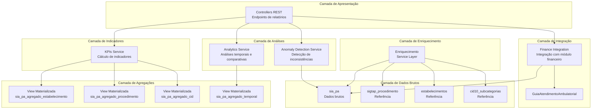

# Plano de Implementação - Melhorias ETL SIA-PA (Fases 1 e 2)

## Visão Geral

Este plano implementa melhorias no ETL do SIA-PA para transformar dados brutos em informações de negócio que agregam valor. O plano está dividido em duas fases principais, com implementação incremental e testes contínuos.

## Arquitetura Proposta



## FASE 1: Enriquecimento e Agregações Básicas

### 1.1 Enriquecimento de Dados

**Objetivo**: Adicionar campos descritivos aos dados do SIA-PA através de relacionamentos com tabelas de referência.

**Arquivos a criar**:

1. **`src/main/java/com/upsaude/entity/referencia/sia/SiaPaEnriquecido.java`**

   - Entidade JPA que representa dados enriquecidos (não persistida, apenas para consultas)
   - Campos adicionais: `procedimentoNome`, `procedimentoGrupo`, `estabelecimentoNome`, `cidDescricao`, etc.

2. **`src/main/java/com/upsaude/repository/referencia/sia/SiaPaEnriquecidoRepository.java`**

   - Repository com queries customizadas usando JOINs
   - Métodos para buscar dados enriquecidos com paginação

3. **`src/main/java/com/upsaude/service/api/sia/SiaPaEnriquecimentoService.java`**

   - Interface do serviço de enriquecimento

4. **`src/main/java/com/upsaude/service/impl/api/sia/SiaPaEnriquecimentoServiceImpl.java`**

   - Implementação do serviço
   - Métodos para enriquecer registros individuais ou em lote
   - Cache de dados de referência para performance

5. **`src/main/java/com/upsaude/api/response/sia/SiaPaEnriquecidoResponse.java`**

   - DTO de resposta com dados enriquecidos

**Queries SQL a criar** (em migrations):

- View SQL para dados enriquecidos: `sia_pa_enriquecido_view`
- JOINs com `sigtap_procedimento`, `estabelecimentos`, `cid10_subcategorias`

### 1.2 Agregações Pré-calculadas (Views Materializadas)

**Objetivo**: Criar views materializadas para consultas frequentes, melhorando performance.

**Migrations a criar**:

1. **`src/main/resources/db/migration/V20260114000000__create_sia_pa_aggregations.sql`**

   - View materializada: `sia_pa_agregado_estabelecimento`
     - Agrupa por: `codigo_cnes`, `competencia`, `uf`
     - Campos agregados: `total_procedimentos`, `valor_total_produzido`, `valor_total_aprovado`, `quantidade_total`, `procedimentos_unicos`, `taxa_aprovacao`

   - View materializada: `sia_pa_agregado_procedimento`
     - Agrupa por: `procedimento_codigo`, `competencia`, `uf`
     - Campos agregados: `total_execucoes`, `valor_medio`, `estabelecimentos_unicos`, `municipios_unicos`

   - View materializada: `sia_pa_agregado_cid`
     - Agrupa por: `cid_principal_codigo`, `competencia`, `uf`
     - Campos agregados: `total_atendimentos`, `procedimentos_mais_realizados`, `distribuicao_geografica`

   - View materializada: `sia_pa_agregado_temporal`
     - Agrupa por: `competencia`, `uf`, `mes_movimentacao`
     - Campos agregados: `producao_mensal`, `tendencia`, `comparacao_periodo_anterior`

   - Índices nas views materializadas para performance
   - Job de refresh automático das views (via scheduler)

**Arquivos Java a criar**:

1. **`src/main/java/com/upsaude/entity/referencia/sia/aggregation/SiaPaAgregadoEstabelecimento.java`**

   - Entidade JPA para view materializada

2. **`src/main/java/com/upsaude/entity/referencia/sia/aggregation/SiaPaAgregadoProcedimento.java`**

   - Entidade JPA para view materializada

3. **`src/main/java/com/upsaude/entity/referencia/sia/aggregation/SiaPaAgregadoCid.java`**

   - Entidade JPA para view materializada

4. **`src/main/java/com/upsaude/entity/referencia/sia/aggregation/SiaPaAgregadoTemporal.java`**

   - Entidade JPA para view materializada

5. **`src/main/java/com/upsaude/repository/referencia/sia/aggregation/SiaPaAgregadoEstabelecimentoRepository.java`**

   - Repository para consultas agregadas

6. **`src/main/java/com/upsaude/repository/referencia/sia/aggregation/SiaPaAgregadoProcedimentoRepository.java`**

   - Repository para consultas agregadas

7. **`src/main/java/com/upsaude/repository/referencia/sia/aggregation/SiaPaAgregadoCidRepository.java`**

   - Repository para consultas agregadas

8. **`src/main/java/com/upsaude/repository/referencia/sia/aggregation/SiaPaAgregadoTemporalRepository.java`**

   - Repository para consultas agregadas

9. **`src/main/java/com/upsaude/service/api/sia/SiaPaAggregationRefreshService.java`**

   - Interface para refresh de views materializadas

10. **`src/main/java/com/upsaude/service/impl/api/sia/SiaPaAggregationRefreshServiceImpl.java`**

    - Implementação com scheduler para refresh automático

### 1.3 Indicadores de Negócio (KPIs)

**Objetivo**: Criar serviço para cálculo de indicadores estratégicos.

**Arquivos a criar**:

1. **`src/main/java/com/upsaude/api/response/sia/kpi/SiaPaKpiResponse.java`**

   - DTO com todos os KPIs calculados

2. **`src/main/java/com/upsaude/service/api/sia/SiaPaKpiService.java`**

   - Interface do serviço de KPIs

3. **`src/main/java/com/upsaude/service/impl/api/sia/SiaPaKpiServiceImpl.java`**

   - Implementação com cálculo de:
     - Taxa de aprovação: `valor_aprovado / valor_produzido`
     - Taxa de erro: `quantidade com flag_erro / total`
     - Eficiência financeira
     - Produção per capita
     - Taxa de inconsistências
     - Valor médio por procedimento
     - Comparação com valores SIGTAP

4. **`src/main/java/com/upsaude/controller/api/sia/SiaPaKpiController.java`**

   - Controller REST para expor KPIs
   - Endpoints:
     - `GET /api/v1/sia/kpi/geral?competencia=202501&uf=MG`
     - `GET /api/v1/sia/kpi/estabelecimento/{cnes}?competencia=202501`
     - `GET /api/v1/sia/kpi/procedimento/{codigo}?competencia=202501`

### 1.4 Relatórios Gerenciais Básicos

**Objetivo**: Criar endpoints para relatórios pré-configurados.

**Arquivos a criar**:

1. **`src/main/java/com/upsaude/api/request/sia/relatorios/SiaPaRelatorioRequest.java`**

   - DTO de request para filtros de relatórios

2. **`src/main/java/com/upsaude/api/response/sia/relatorios/SiaPaRelatorioProducaoResponse.java`**

   - DTO de resposta para relatório de produção

3. **`src/main/java/com/upsaude/api/response/sia/relatorios/SiaPaRelatorioTopProcedimentosResponse.java`**

   - DTO para top procedimentos

4. **`src/main/java/com/upsaude/api/response/sia/relatorios/SiaPaRelatorioTopCidResponse.java`**

   - DTO para top CID

5. **`src/main/java/com/upsaude/service/api/sia/SiaPaRelatorioService.java`**

   - Interface do serviço de relatórios

6. **`src/main/java/com/upsaude/service/impl/api/sia/SiaPaRelatorioServiceImpl.java`**

   - Implementação com métodos:
     - `gerarRelatorioProducaoMensal()`
     - `gerarTop10Procedimentos()`
     - `gerarTop10Cid()`
     - `gerarRelatorioPorEstabelecimento()`
     - `gerarRelatorioPorRegiao()`

7. **`src/main/java/com/upsaude/controller/api/sia/SiaPaRelatorioController.java`**

   - Controller REST com endpoints:
     - `GET /api/v1/sia/relatorios/producao-mensal`
     - `GET /api/v1/sia/relatorios/top-procedimentos`
     - `GET /api/v1/sia/relatorios/top-cid`
     - `GET /api/v1/sia/relatorios/por-estabelecimento`
     - `GET /api/v1/sia/relatorios/por-regiao`

## FASE 2: Análises Avançadas e Integração

### 2.1 Análises Temporais e Comparativas

**Objetivo**: Implementar análises de tendências e comparações temporais.

**Arquivos a criar**:

1. **`src/main/java/com/upsaude/api/response/sia/analytics/SiaPaTendenciaResponse.java`**

   - DTO com dados de tendência temporal

2. **`src/main/java/com/upsaude/api/response/sia/analytics/SiaPaComparacaoResponse.java`**

   - DTO para comparações entre períodos

3. **`src/main/java/com/upsaude/service/api/sia/SiaPaAnalyticsService.java`**

   - Interface do serviço de análises

4. **`src/main/java/com/upsaude/service/impl/api/sia/SiaPaAnalyticsServiceImpl.java`**

   - Implementação com métodos:
     - `calcularTendenciaTemporal()`: Evolução mensal/trimestral/anual
     - `calcularSazonalidade()`: Padrões sazonais
     - `compararPeriodos()`: Comparação período atual vs anterior
     - `calcularCrescimento()`: Taxa de crescimento
     - `compararGeograficamente()`: Comparação entre municípios/UF
     - `gerarRanking()`: Rankings diversos

5. **`src/main/java/com/upsaude/controller/api/sia/SiaPaAnalyticsController.java`**

   - Controller REST com endpoints:
     - `GET /api/v1/sia/analytics/tendencia`
     - `GET /api/v1/sia/analytics/comparacao`
     - `GET /api/v1/sia/analytics/sazonalidade`
     - `GET /api/v1/sia/analytics/ranking`

### 2.2 Detecção de Anomalias

**Objetivo**: Identificar inconsistências e padrões suspeitos nos dados.

**Arquivos a criar**:

1. **`src/main/java/com/upsaude/entity/referencia/sia/anomalia/SiaPaAnomalia.java`**

   - Entidade para armazenar anomalias detectadas

2. **`src/main/resources/db/migration/V20260114000001__create_sia_pa_anomalias.sql`**

   - Tabela `sia_pa_anomalia` para registro de anomalias
   - Campos: `tipo_anomalia`, `severidade`, `descricao`, `registro_id`, `competencia`, etc.

3. **`src/main/java/com/upsaude/api/response/sia/anomalia/SiaPaAnomaliaResponse.java`**

   - DTO de resposta para anomalias

4. **`src/main/java/com/upsaude/repository/referencia/sia/anomalia/SiaPaAnomaliaRepository.java`**

   - Repository para anomalias

5. **`src/main/java/com/upsaude/service/api/sia/SiaPaAnomaliaDetectionService.java`**

   - Interface do serviço de detecção

6. **`src/main/java/com/upsaude/service/impl/api/sia/SiaPaAnomaliaDetectionServiceImpl.java`**

   - Implementação com validações:
     - Valores fora do esperado (comparação com SIGTAP)
     - Quantidades inconsistentes
     - Idades fora da faixa permitida
     - Sexo incompatível
     - Procedimentos sem autorização (se houver dados AQ)
     - Estabelecimentos com produção muito acima da média
     - Padrões suspeitos diversos

7. **`src/main/java/com/upsaude/service/impl/api/sia/SiaPaAnomaliaDetectionJob.java`**

   - Job agendado para detecção automática de anomalias
   - Executa periodicamente (ex: diariamente)

8. **`src/main/java/com/upsaude/controller/api/sia/SiaPaAnomaliaController.java`**

   - Controller REST com endpoints:
     - `GET /api/v1/sia/anomalias`
     - `GET /api/v1/sia/anomalias/{id}`
     - `POST /api/v1/sia/anomalias/detectar` (trigger manual)

### 2.3 Integração com Módulo Financeiro

**Objetivo**: Integrar dados SIA-PA com módulo financeiro para análises cruzadas.

**Arquivos a criar**:

1. **`src/main/java/com/upsaude/api/response/sia/financeiro/SiaPaFinanceiroIntegracaoResponse.java`**

   - DTO para dados de integração financeira

2. **`src/main/java/com/upsaude/service/api/sia/SiaPaFinanceiroIntegrationService.java`**

   - Interface do serviço de integração

3. **`src/main/java/com/upsaude/service/impl/api/sia/SiaPaFinanceiroIntegrationServiceImpl.java`**

   - Implementação com métodos:
     - `compararProducaoSiaComFaturamento()`: Compara produção SIA com guias faturadas
     - `validarValoresFaturados()`: Valida valores faturados vs valores aprovados no SIA
     - `identificarProcedimentosNaoFaturados()`: Encontra procedimentos executados mas não faturados
     - `analisarReceitaPorCompetencia()`: Análise de receita por competência financeira
     - `gerarRelatorioConciliacao()`: Relatório de conciliação entre SIA e faturamento

4. **`src/main/java/com/upsaude/controller/api/sia/SiaPaFinanceiroController.java`**

   - Controller REST com endpoints:
     - `GET /api/v1/sia/financeiro/conciliacao`
     - `GET /api/v1/sia/financeiro/receita-por-competencia`
     - `GET /api/v1/sia/financeiro/procedimentos-nao-faturados`

### 2.4 Dashboards Interativos

**Objetivo**: Criar endpoints para dados de dashboards com múltiplas métricas.

**Arquivos a criar**:

1. **`src/main/java/com/upsaude/api/response/sia/dashboard/SiaPaDashboardResponse.java`**

   - DTO agregado com todas as métricas do dashboard

2. **`src/main/java/com/upsaude/service/api/sia/SiaPaDashboardService.java`**

   - Interface do serviço de dashboard

3. **`src/main/java/com/upsaude/service/impl/api/sia/SiaPaDashboardServiceImpl.java`**

   - Implementação que agrega:
     - KPIs principais
     - Top 10 procedimentos
     - Top 10 CID
     - Produção por região
     - Tendências temporais
     - Alertas de anomalias

4. **`src/main/java/com/upsaude/controller/api/sia/SiaPaDashboardController.java`**

   - Controller REST com endpoint:
     - `GET /api/v1/sia/dashboard` (retorna todos os dados do dashboard)

## Configurações e Infraestrutura

### Configurações a adicionar

**`src/main/resources/config/common/application.properties`**:

```properties
# SIA-PA Aggregations
sia.aggregation.refresh.enabled=true
sia.aggregation.refresh.cron=0 0 2 * * ? # Diariamente às 2h
sia.aggregation.refresh.concurrent=false

# SIA-PA Anomaly Detection
sia.anomaly.detection.enabled=true
sia.anomaly.detection.cron=0 0 3 * * ? # Diariamente às 3h
sia.anomaly.detection.threshold.production-variance=2.0 # 2x desvio padrão
sia.anomaly.detection.threshold.value-difference=0.1 # 10% diferença

# SIA-PA Cache
sia.cache.reference-data.ttl-hours=24
sia.cache.aggregations.ttl-minutes=60
```

### Testes

**Arquivos de teste a criar**:

1. **`src/test/java/com/upsaude/service/impl/api/sia/SiaPaEnriquecimentoServiceImplTest.java`**
2. **`src/test/java/com/upsaude/service/impl/api/sia/SiaPaKpiServiceImplTest.java`**
3. **`src/test/java/com/upsaude/service/impl/api/sia/SiaPaRelatorioServiceImplTest.java`**
4. **`src/test/java/com/upsaude/service/impl/api/sia/SiaPaAnalyticsServiceImplTest.java`**
5. **`src/test/java/com/upsaude/service/impl/api/sia/SiaPaAnomaliaDetectionServiceImplTest.java`**
6. **`src/test/java/com/upsaude/service/impl/api/sia/SiaPaFinanceiroIntegrationServiceImplTest.java`**

## Ordem de Implementação Recomendada

1. **Semana 1-2**: Fase 1.1 - Enriquecimento de Dados
2. **Semana 2-3**: Fase 1.2 - Agregações Pré-calculadas
3. **Semana 3-4**: Fase 1.3 - Indicadores de Negócio
4. **Semana 4-5**: Fase 1.4 - Relatórios Gerenciais Básicos
5. **Semana 5-6**: Fase 2.1 - Análises Temporais
6. **Semana 6-7**: Fase 2.2 - Detecção de Anomalias
7. **Semana 7-8**: Fase 2.3 - Integração Financeira
8. **Semana 8**: Fase 2.4 - Dashboards Interativos

## Considerações Técnicas

- **Performance**: Views materializadas serão atualizadas via scheduler para evitar impacto em consultas
- **Cache**: Implementar cache para dados de referência (SIGTAP, CNES, CID) que mudam pouco
- **Transações**: Agregações e detecções de anomalias devem ser executadas em transações curtas
- **Escalabilidade**: Considerar particionamento da tabela `sia_pa` por competência se necessário
- **Monitoramento**: Adicionar métricas e logs para acompanhar performance das agregações

## Dependências

- Spring Data JPA (já existente)
- Spring Scheduler (já existente)
- PostgreSQL (já existente)
- Cache (Spring Cache com Caffeine ou Redis - a definir)

## Documentação

Criar documentação em `docs/SIA-SUS/`:

- `MELHORIAS_ETL.md`: Documentação das melhorias implementadas
- `API_RELATORIOS.md`: Documentação da API de relatórios
- `KPIS_E_INDICADORES.md`: Documentação dos KPIs disponíveis