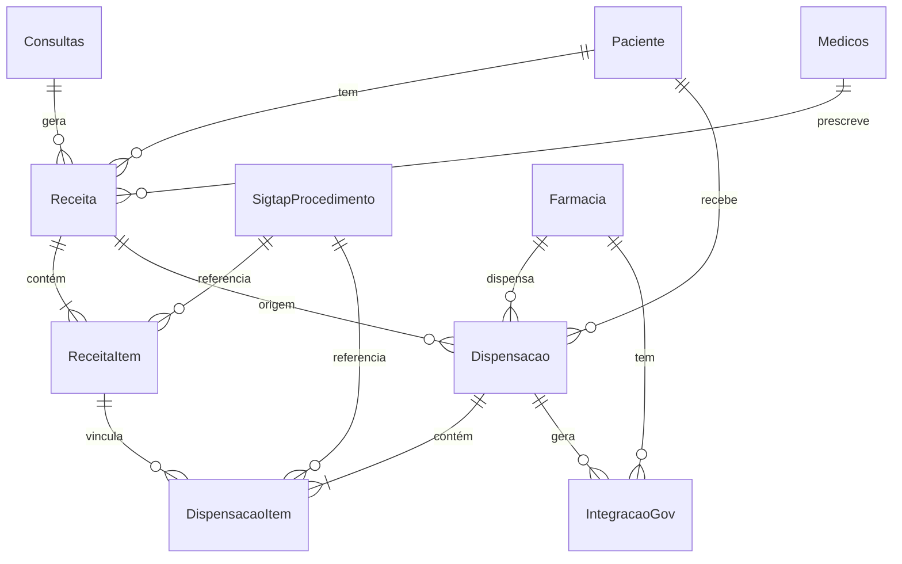

#Plano: Modelo Mínimo de Farmácia - Receita e Dispensação

## 1. Análise do Contexto Atual

### Entidades Existentes Relevantes:

- `Farmacia` (BaseEntityWithoutTenant) - farmácia básica criada
- `SigtapProcedimento` (BaseEntityWithoutTenant) - fonte oficial read-only
- `Paciente` (BaseEntityWithoutTenant) - paciente do sistema
- `IntegracaoGov` (BaseEntity) - entidade genérica para integrações
- `Consultas` (BaseEntity) - consultas que podem gerar receitas

### Padrões Identificados:

- Entidades operacionais usam `BaseEntity` (com tenant e estabelecimento)
- Entidades de referência usam `BaseEntityWithoutTenant`
- Relacionamentos: `@ManyToOne` com `FetchType.LAZY`
- Nomenclatura: tabelas no plural, colunas em snake_case
- Índices: FKs principais, campos de busca, status/ativo

## 2. Entidades Propostas

### 2.1 Receita

**Responsabilidade**: Representar uma prescrição médica (receita) que pode ser dispensada.**Base**: `BaseEntity` (tem tenant e estabelecimento)**Relacionamentos**:

- `@ManyToOne Paciente` (obrigatório)
- `@ManyToOne Consultas` (opcional - receita pode vir de consulta ou ser independente)
- `@ManyToOne Medicos` (opcional - médico prescritor)
- `@OneToMany ReceitaItem` (itens da receita)

**Campos Mínimos**:

- `numeroReceita` (String, length 50) - número da receita
- `dataPrescricao` (LocalDate) - data da prescrição
- `dataValidade` (LocalDate) - validade da receita
- `tipoReceita` (String, length 20) - tipo (ex: "A1", "A2", "B", "C", "CONTROLE_ESPECIAL")
- `observacoes` (String, TEXT) - observações gerais

**Índices**:

- `idx_receita_paciente` (paciente_id)
- `idx_receita_medico` (medico_id)
- `idx_receita_data_prescricao` (data_prescricao)
- `idx_receita_numero` (numero_receita)
- `idx_receita_estabelecimento` (estabelecimento_id)

**Tabela**: `receitas`

### 2.2 ReceitaItem

**Responsabilidade**: Representar um item (medicamento/procedimento) de uma receita.**Base**: `BaseEntity` (tem tenant e estabelecimento)**Relacionamentos**:

- `@ManyToOne Receita` (obrigatório)
- `@ManyToOne SigtapProcedimento` (obrigatório) - FK para procedimento SIGTAP
- `@OneToMany DispensacaoItem` (opcional - itens de dispensação vinculados)

**Campos Mínimos**:

- `posicao` (Integer) - posição do item na receita (ordem)
- `quantidadePrescrita` (BigDecimal, precision 10, scale 3) - quantidade prescrita
- `unidadeMedida` (String, length 20) - unidade (ex: "COMPRIMIDO", "ML", "FRASCO")
- `posologia` (String, length 500) - como tomar (ex: "1 comprimido 3x ao dia")
- `duracaoTratamento` (Integer) - duração em dias
- `observacoes` (String, TEXT) - observações do item

**Índices**:

- `idx_receita_item_receita` (receita_id)
- `idx_receita_item_procedimento` (sigtap_procedimento_id)
- `idx_receita_item_posicao` (receita_id, posicao) - composite para ordenação

**Tabela**: `receita_itens`**Constraint**: Unique constraint em (receita_id, posicao) para garantir ordem única

### 2.3 Dispensacao

**Responsabilidade**: Representar uma dispensação de medicamentos (ato de entregar ao paciente).**Base**: `BaseEntity` (tem tenant e estabelecimento)**Relacionamentos**:

- `@ManyToOne Paciente` (obrigatório)
- `@ManyToOne Farmacia` (obrigatório)
- `@ManyToOne Receita` (opcional - pode ser dispensação direta sem receita)
- `@ManyToOne ProfissionaisSaude` (opcional - farmacêutico que dispensou)
- `@OneToMany DispensacaoItem` (itens dispensados)

**Campos Mínimos**:

- `numeroDispensacao` (String, length 50) - número da dispensação
- `dataDispensacao` (LocalDateTime) - data/hora da dispensação
- `tipoDispensacao` (String, length 30) - tipo (ex: "RECEITA", "DISPENSA_DIRETA", "CONTINUIDADE")
- `observacoes` (String, TEXT) - observações da dispensação

**Índices**:

- `idx_dispensacao_paciente` (paciente_id)
- `idx_dispensacao_farmacia` (farmacia_id)
- `idx_dispensacao_receita` (receita_id)
- `idx_dispensacao_data` (data_dispensacao)
- `idx_dispensacao_numero` (numero_dispensacao)
- `idx_dispensacao_estabelecimento` (estabelecimento_id)

**Tabela**: `dispensacoes`

### 2.4 DispensacaoItem

**Responsabilidade**: Representar um item específico dispensado (medicamento entregue).**Base**: `BaseEntity` (tem tenant e estabelecimento)**Relacionamentos**:

- `@ManyToOne Dispensacao` (obrigatório)
- `@ManyToOne ReceitaItem` (opcional - se veio de receita)
- `@ManyToOne SigtapProcedimento` (obrigatório) - FK para procedimento SIGTAP

**Campos Mínimos**:

- `quantidadeDispensada` (BigDecimal, precision 10, scale 3) - quantidade entregue
- `unidadeMedida` (String, length 20) - unidade
- `lote` (String, length 50) - lote do medicamento (se aplicável)
- `validadeLote` (LocalDate) - validade do lote (se aplicável)
- `observacoes` (String, TEXT) - observações do item

**Índices**:

- `idx_dispensacao_item_dispensacao` (dispensacao_id)
- `idx_dispensacao_item_receita_item` (receita_item_id)
- `idx_dispensacao_item_procedimento` (sigtap_procedimento_id)

**Tabela**: `dispensacao_itens`

## 3. Diagrama de Relacionamentos




## 4. Validações de Relacionamentos

### 4.1 Sem Redundância

- ✅ `ReceitaItem` e `DispensacaoItem` referenciam `SigtapProcedimento` diretamente (não duplicam dados)
- ✅ `DispensacaoItem` pode referenciar `ReceitaItem` quando há vínculo, mas não é obrigatório
- ✅ `Dispensacao` pode referenciar `Receita` quando há vínculo, mas permite dispensação direta

### 4.2 Integração Governamental

- ✅ Integração sempre via `IntegracaoGov` (nenhuma entidade conhece gov direto)
- ✅ `Dispensacao` pode gerar `IntegracaoGov` no futuro (campo `farmacia_id` já existe)
- ✅ `Farmacia` já tem relação `@OneToMany` com `IntegracaoGov`

### 4.3 Evolução Futura

- ✅ Modelo permite adicionar estoque sem refatoração (apenas novas entidades)
- ✅ `DispensacaoItem` tem campos `lote` e `validadeLote` preparados para rastreabilidade
- ✅ Estrutura permite múltiplas dispensações de um mesmo `ReceitaItem` (parcial)

## 5. Estrutura de Arquivos

```javascript
src/main/java/com/upsaude/entity/
└── farmacia/
    ├── Receita.java
    ├── ReceitaItem.java
    ├── Dispensacao.java
    └── DispensacaoItem.java
```


## 6. Observações de Evolução Futura

### 6.1 Integração Hórus

- `Dispensacao` será a entidade principal para integração
- Campos adicionais podem ser adicionados sem quebrar estrutura atual
- `IntegracaoGov` já preparada com `farmacia_id`

### 6.2 Integração e-SUS APS

- Mesma estrutura serve para e-SUS
- `Receita` pode ser vinculada a `Consultas` (já existe no sistema)
- Dados do SIGTAP sempre via FK (não duplicados)

### 6.3 Evolução para Estoque

- Criar novas entidades: `Estoque`, `MovimentacaoEstoque`
- `DispensacaoItem` já tem `lote` e `validadeLote` preparados
- Não requer refatoração das entidades atuais

### 6.4 Rastreabilidade

- `DispensacaoItem.lote` e `validadeLote` permitem rastreamento
- Estrutura permite auditoria completa (quem, quando, o quê)

## 7. Checklist de Implementação

- [ ] Criar pacote `com.upsaude.entity.farmacia`
- [ ] Implementar `Receita` com relacionamentos e índices
- [ ] Implementar `ReceitaItem` com FK para `SigtapProcedimento`
- [ ] Implementar `Dispensacao` com relacionamento com `Farmacia`
- [ ] Implementar `DispensacaoItem` com FK para `SigtapProcedimento`
- [ ] Validar que todas usam `BaseEntity` (tenant-aware)
- [ ] Validar que relacionamentos com SIGTAP são apenas FK (read-only)
- [ ] Validar que não há duplicação de dados do SIGTAP
- [ ] Validar que integração futura será via `IntegracaoGov`

## 8. Decisões de Design

1. **Receita opcional em Dispensacao**: Permite dispensação direta sem receita (casos de continuidade, emergência)
2. **ReceitaItem opcional em DispensacaoItem**: Permite dispensação parcial ou múltiplas dispensações