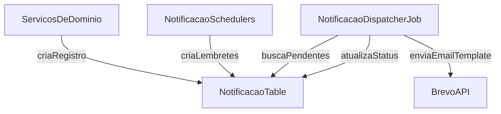

# Serviço de notificações (E-mail via Brevo)

## Objetivo

Criar um **serviço de notificação por e-mail** que:

- Dispare automaticamente nos eventos listados.
- Permita também **chamadas manuais** (um método de service) nos pontos do código.
- Use **Brevo (API HTTP)** com **templates no Brevo**.
- Registre cada envio no módulo existente (`Notificacao`/`TemplateNotificacao`) para auditoria, reprocessamento e futuro WhatsApp.

> Observação de segurança: a chave de API do Brevo foi compartilhada no chat. A recomendação é **rotacionar essa chave** no Brevo e usar sempre via variável de ambiente/secret (nunca hardcode no repo).

## Achados no código (pontos de encaixe)

- **Usuário criado / senha definida / troca de senha** acontece em:
  - `UsuariosSistemaServiceImpl.criar(...)` e `UsuariosSistemaServiceImpl.atualizar(...)` e `UsuariosSistemaServiceImpl.trocarSenha(...)`.
- **Dados pessoais** (escopo confirmado: **usuário do sistema e paciente**) acontecem em:
  - `UsuariosSistemaServiceImpl.atualizar(...)`
  - `PacienteServiceImpl.atualizar(...)` (via `PacienteUpdater`).
- **Agendamentos** (criar/confirmar/cancelar/reagendar) passam por:
  - `AgendamentoCreator.criar(...)`
  - `AgendamentoUpdater.atualizar(...)` (já captura `statusAnterior`/`statusNovo`).
- Já existe um módulo completo de templates/notificações:
  - `TemplateNotificacao` (campos como `enviaAutomaticamente`, `horarioEnvioPrevistoHoras`, `condicoesEnvioJson`)
  - `Notificacao` (campos `statusEnvio`, `dataEnvioPrevista`, `tentativasEnvio`, `idExterno`)
  - enums `TipoNotificacaoEnum` e `CanalNotificacaoEnum`.
- Já existe configuração por estabelecimento para ligar/desligar:
  - `ConfiguracaoEstabelecimento.enviaNotificacaoEmail`, `enviaLembrete24h`, `enviaLembrete1h`, etc.

## Arquitetura proposta

Usar o módulo existente como **fila/auditoria** e adicionar uma camada de **disparo** (Brevo) + **jobs**.

### Componentes

- **`NotificacaoOrchestrator` (novo)**: API interna simples para o resto do sistema, ex:
  - `notificarUsuarioCriado(...)`
  - `notificarSenhaAlterada(...)`
  - `notificarDadosPessoaisAtualizados(...)`
  - `notificarAgendamentoConfirmado(...)`
  - `agendarLembretesAgendamento(...)`

- **`BrevoEmailClient` (novo)**: integração com endpoint de e-mail transacional do Brevo usando template.

- **`NotificacaoDispatcherJob` (novo)**: job que pega notificações pendentes com `dataEnvioPrevista <= agora` e envia (com retry).

- **`AgendamentoReminderScheduler` (novo)**: job que cria notificações do tipo `LEMBRETE_24H` e `LEMBRETE_1H` para agendamentos futuros, respeitando flags (`notificacaoEnviada24h/1h`) + `ConfiguracaoEstabelecimento.enviaLembrete24h/1h`.

## Modelagem de templates (Brevo)

Você escolheu: **templates no Brevo**.

### Como o backend vai mapear template

Hoje `TemplateNotificacao` guarda `assunto` e `mensagem` (texto). Para integrar com Brevo templates, recomendo adicionar **um campo explícito**:

- `brevoTemplateId` (Integer) em `templates_notificacao`.

Alternativa sem migration (menos ideal): guardar no `condicoesEnvioJson` algo como `{ "brevoTemplateId": 123 }`.

### Variáveis (params) enviadas ao Brevo

Definir um padrão de payload por evento. Exemplo para agendamento:

- `pacienteNome`
- `dataHora`
- `estabelecimentoNome`
- `profissionalNome`/`medicoNome`
- `statusAgendamento`

Para senha/usuário:

- `nome`
- `email`
- `dataHora`
- `ip` (se existir)

## Eventos e quando disparar

### 1) Criação de novo usuário

- Hook: após sucesso em `UsuariosSistemaServiceImpl.criar(...)`.
- Tipo proposto: `USUARIO_CRIADO` (novo em `TipoNotificacaoEnum`).

### 2) Mudança de senha + Confirmação de alteração de senha

No seu código há dois caminhos:

- `UsuariosSistemaServiceImpl.trocarSenha(...)` (endpoint dedicado)
- `UsuariosSistemaServiceImpl.atualizar(...)` quando `request.getSenha()` vem preenchido

- Tipo proposto: `SENHA_ALTERADA` (novo em `TipoNotificacaoEnum`).
- O e-mail enviado é a “confirmação” (pós-alteração). Se você quiser dois modelos diferentes (ex: “solicitada” vs “confirmada”), a gente separa em 2 tipos.

### 3) Atualização de dados pessoais (usuário e paciente)

- Hooks:
  - `UsuariosSistemaServiceImpl.atualizar(...)` quando houver alteração de dados pessoais.
  - `PacienteServiceImpl.atualizar(...)` sempre que paciente for atualizado.
- Tipo proposto: `DADOS_PESSOAIS_ATUALIZADOS` (novo em `TipoNotificacaoEnum`).

### 4) Confirmação de agendamento

- Hooks:
  - `AgendamentoCreator.criar(...)` se já nascer com `status=CONFIRMADO`
  - `AgendamentoUpdater.atualizar(...)` quando `statusAnterior != CONFIRMADO` e `statusNovo == CONFIRMADO`
- Tipo já existe: `AGENDAMENTO_CONFIRMADO`.

### 5) Cancelamento de agendamento

- Hook: `AgendamentoUpdater.atualizar(...)` quando `statusNovo == CANCELADO`
- Tipo já existe: `AGENDAMENTO_CANCELADO`.

### 6) Lembrete de agendamento

- Implementar job que cria/enfileira notificações:
  - `LEMBRETE_24H`
  - `LEMBRETE_1H`
- Respeitar:
  - `ConfiguracaoEstabelecimento.enviaNotificacaoEmail`
  - `ConfiguracaoEstabelecimento.enviaLembrete24h/1h`
  - flags do `Agendamento` (`notificacaoEnviada24h/1h`) para evitar duplicidade.

## Configuração (properties)

Adicionar um módulo de config (ex.: `config/common/integrations/application-brevo.properties`) e importar no bootstrap (`application.properties`).

Config sugerida:

- `brevo.enabled=true|false`
- `brevo.apiKey=${BREVO_API_KEY}`
- `brevo.baseUrl=https://api.brevo.com/v3`
- `brevo.sender.noreply.email=noreply@wgbsolucoes.com.br`
- `brevo.sender.notificacoes.email=notificacoes@wgbsolucoes.com.br`
- `brevo.sender.suporte.email=suporte@wgbsolucoes.com.br`

## Estratégia de envio (robusta)

- Criar `Notificacao` com:
  - `statusEnvio = "PENDENTE"`
  - `dataEnvioPrevista = now()` (ou o horário do lembrete)
  - `tentativasEnvio = 0`, `maximoTentativas` configurável
- `NotificacaoDispatcherJob` roda a cada X segundos/minutos:
  - pega pendentes vencidas
  - envia via Brevo
  - grava `dataEnvio`, `statusEnvio = "ENVIADO"`, `idExterno` (messageId)
  - em erro: incrementa tentativas, grava `erroEnvio`, aplica backoff (ex: +5min, +15min, +1h)

## Arquivos que serão tocados

### Enums

- Atualizar `[...]/src/main/java/com/upsaude/enums/TipoNotificacaoEnum.java` para incluir:
  - `USUARIO_CRIADO`
  - `SENHA_ALTERADA`
  - `DADOS_PESSOAIS_ATUALIZADOS`

### Templates de notificação

- Atualizar `[...]/src/main/java/com/upsaude/entity/sistema/notificacao/TemplateNotificacao.java `para adicionar `brevoTemplateId`.
- Atualizar DTOs/mappers/validation:
  - `[...]/src/main/java/com/upsaude/api/request/sistema/notificacao/TemplateNotificacaoRequest.java`
  - `[...]/src/main/java/com/upsaude/api/response/sistema/notificacao/TemplateNotificacaoResponse.java`
  - `[...]/src/main/java/com/upsaude/mapper/sistema/notificacao/TemplateNotificacaoMapper.java`
  - `[...]/src/main/java/com/upsaude/service/api/support/templatenotificacao/TemplateNotificacaoValidationService.java`

### Integração Brevo

- Criar pacote novo (exemplo):
  - `[...]/src/main/java/com/upsaude/integration/brevo/BrevoConfig.java`
  - `[...]/src/main/java/com/upsaude/integration/brevo/BrevoEmailClient.java`
  - `[...]/src/main/java/com/upsaude/integration/brevo/dto/... `(payload do `/v3/smtp/email`)

### Orquestração e jobs

- Criar:
  - `[...]/src/main/java/com/upsaude/service/sistema/notificacao/NotificacaoOrchestrator.java`
  - `[...]/src/main/java/com/upsaude/service/impl/job/NotificacaoDispatcherJob.java`
  - `[...]/src/main/java/com/upsaude/service/impl/job/AgendamentoReminderScheduler.java`
- Ajustar repositórios para buscar pendentes e agendamentos elegíveis (novos métodos em `AgendamentoRepository` e/ou `NotificacaoRepository`).

### Hooks nos pontos do domínio

- Agendamento:
  - `[...]/src/main/java/com/upsaude/service/api/support/agendamento/AgendamentoCreator.java`
  - `[...]/src/main/java/com/upsaude/service/api/support/agendamento/AgendamentoUpdater.java`
- Usuários:
  - `[...]/src/main/java/com/upsaude/service/impl/api/sistema/usuario/UsuariosSistemaServiceImpl.java`
- Paciente:
  - `[...]/src/main/java/com/upsaude/service/impl/api/paciente/PacienteServiceImpl.java`

### Migrations

- Criar migration SQL em `[...]/migrations/ `para adicionar a coluna `brevo_template_id` em `templates_notificacao`.

## Checklist de implementação (alto nível)

- Criar integração com Brevo + configuração.
- Estender modelo/DTOs para suportar `brevoTemplateId`.
- Implementar dispatcher (fila -> envio Brevo -> update status).
- Implementar criação automática de notificações para eventos (hooks) + lembretes (scheduler).
- Criar templates no Brevo e cadastrar `brevoTemplateId` no sistema (via API de TemplateNotificacao).

## Observações finais (importante)

- **Não recomendo enviar senha em texto no e-mail**. Melhor: e-mail de confirmação + orientação para troca (ou fluxo de reset). Hoje não achei endpoint de “esqueci a senha”; se você quiser, isso pode ser uma melhoria depois.