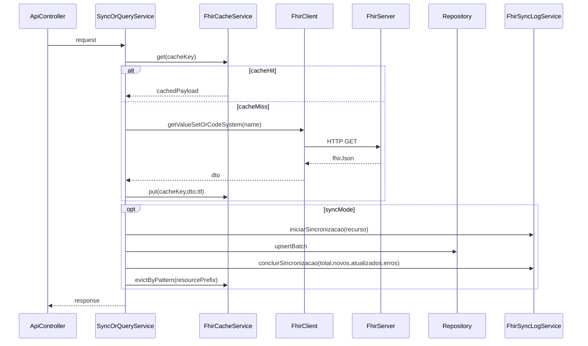

# Plano de melhoria FHIR (sem breaking changes)

## Objetivos

- **Ficar estritamente dentro do padrão definido em `docs/FHIR`** (arquitetura + endpoints), reduzindo risco de 404, inconsistência e regressão.
- **Eliminar divergências** entre documentação e implementação (principalmente rotas e nomes de recursos).
- **Fortalecer robustez operacional** (cache efetivo, log correto, sync escalável, observabilidade).

## Decisões já confirmadas

- **Rota oficial**: padronizar tudo em **`/api/fhir/*`**.
- **Compatibilidade**: **não-breaking** (manter endpoints antigos funcionando via alias/depreciação por um período).

## 1) Padronizar rotas e manter compatibilidade

- **Inventariar endpoints atuais** e definir mapa de migração:
  -  `/fhir/vacinacao/*` -> `/api/fhir/vacinacao/*`
  -  `/fhir/alergia/*` -> `/api/fhir/alergia/*`
  -  `/fhir/medicamento/*` -> `/api/fhir/medicamento/*`
  -  `/fhir/dados-referencia/*` -> `/api/fhir/dados-referencia/*`
  -  `/fhir/test/*` -> `/api/fhir/test/*`
  - manter  `/api/fhir/diagnostico/*` como está (já está no padrão)
- **Estratégia não-breaking**:
  - manter controllers antigos como **aliases** (delegando para o serviço) ou adicionar mapeamentos adicionais nos controllers atuais, com **documentação de depreciação**.
- Arquivos principais:
  - Controllers: [`/Users/wagnergrilo/Desktop/WGB/sistemas/UPSaude/code_cursor/UPSaude-final-back/src/main/java/com/upsaude/controller/api/fhir/FhirVacinacaoController.java`](/Users/wagnergrilo/Desktop/WGB/sistemas/UPSaude/code_cursor/UPSaude-final-back/src/main/java/com/upsaude/controller/api/fhir/FhirVacinacaoController.java), [`.../FhirAlergiaController.java`](.../FhirAlergiaController.java)( /Users/wagnergrilo/Desktop/WGB/sistemas/UPSaude/code_cursor/UPSaude-final-back/src/main/java/com/upsaude/controller/api/fhir/FhirAlergiaController.java ), [`.../FhirMedicamentoController.java`](.../FhirMedicamentoController.java)( /Users/wagnergrilo/Desktop/WGB/sistemas/UPSaude/code_cursor/UPSaude-final-back/src/main/java/com/upsaude/controller/api/fhir/FhirMedicamentoController.java ), [`.../FhirDadosReferenciaController.java`](.../FhirDadosReferenciaController.java)( /Users/wagnergrilo/Desktop/WGB/sistemas/UPSaude/code_cursor/UPSaude-final-back/src/main/java/com/upsaude/controller/api/fhir/FhirDadosReferenciaController.java ), [`.../FhirTestController.java`](.../FhirTestController.java)( /Users/wagnergrilo/Desktop/WGB/sistemas/UPSaude/code_cursor/UPSaude-final-back/src/main/java/com/upsaude/controller/api/fhir/FhirTestController.java ), [`.../FhirDiagnosticoController.java`](.../FhirDiagnosticoController.java)( /Users/wagnergrilo/Desktop/WGB/sistemas/UPSaude/code_cursor/UPSaude-final-back/src/main/java/com/upsaude/controller/api/fhir/FhirDiagnosticoController.java )

## 2) Corrigir divergências de nomes de recursos FHIR (evitar 404)

- **Centralizar nomes/IDs** de recursos do MS em um único lugar (constantes/enum/config):
  - Ex.: `BRDivisaoGeograficaBrasil` vs `BRDivisaoGeografica` (doc vs código)
  - Ex.: `BRObmVtm` vs `BRObmVTM`
- **Estratégia recomendada (segura)**:
  - criar um “catálogo” interno de recursos (ex.: `FhirResourceNames`) com mapeamentos e comentários para a doc.
  - adicionar fallback controlado: tentar `ValueSet-X`, se falhar tentar `CodeSystem-X`, e se o `ValueSet` apontar `include.system`, extrair o nome e buscar o CodeSystem (já existe em medicamentos/alergia; padronizar em todos).
- Arquivos principais:
  - [`.../src/main/java/com/upsaude/integration/fhir/client/FhirClient.java`](/Users/wagnergrilo/Desktop/WGB/sistemas/UPSaude/code_cursor/UPSaude-final-back/src/main/java/com/upsaude/integration/fhir/client/FhirClient.java)
  - Services: [`.../VacinacaoSyncService.java`](/Users/wagnergrilo/Desktop/WGB/sistemas/UPSaude/code_cursor/UPSaude-final-back/src/main/java/com/upsaude/integration/fhir/service/vacinacao/VacinacaoSyncService.java), [`.../GeografiaFhirSyncService.java`](/Users/wagnergrilo/Desktop/WGB/sistemas/UPSaude/code_cursor/UPSaude-final-back/src/main/java/com/upsaude/integration/fhir/service/geografico/GeografiaFhirSyncService.java), [`.../MedicamentoSyncService.java`](/Users/wagnergrilo/Desktop/WGB/sistemas/UPSaude/code_cursor/UPSaude-final-back/src/main/java/com/upsaude/integration/fhir/service/farmacia/MedicamentoSyncService.java)

## 3) Tornar o cache “real” e alinhado com `FhirProperties`

- **Alinhar implementação com configuração**:
  - usar `fhir.cache.keyPrefix` (hoje o prefixo é hardcoded em `FhirCacheService`).
- **Definir padrão de chaves** e aplicar onde faz sentido:
  - endpoints “externo/live”: cachear resposta por recurso + query.
  - invalidar cache após sync (já existe `evictByPattern`, mas precisa casar com o padrão de chaves de fato).
- Arquivos principais:
  - [`.../src/main/java/com/upsaude/integration/fhir/service/FhirCacheService.java`](/Users/wagnergrilo/Desktop/WGB/sistemas/UPSaude/code_cursor/UPSaude-final-back/src/main/java/com/upsaude/integration/fhir/service/FhirCacheService.java)
  - [`.../src/main/java/com/upsaude/config/FhirProperties.java`](/Users/wagnergrilo/Desktop/WGB/sistemas/UPSaude/code_cursor/UPSaude-final-back/src/main/java/com/upsaude/config/FhirProperties.java)

## 4) Corrigir semântica do log de sincronização

- **Evitar “sucesso virando erro”** quando existem falhas parciais:
  - definir regra: `CONCLUIDO_COM_FALHAS` (ou manter `CONCLUIDO` com campo `erros > 0`) ao invés de sobrescrever status para `ERRO`.
- **Revisar queries do repositório**:
  - substituir `LIMIT` em JPQL por abordagem compatível (Pageable/Top/OrderBy).
- Arquivos principais:
  - [`.../src/main/java/com/upsaude/integration/fhir/service/FhirSyncLogService.java`](/Users/wagnergrilo/Desktop/WGB/sistemas/UPSaude/code_cursor/UPSaude-final-back/src/main/java/com/upsaude/integration/fhir/service/FhirSyncLogService.java)
  - [`.../src/main/java/com/upsaude/repository/fhir/FhirSyncLogRepository.java`](/Users/wagnergrilo/Desktop/WGB/sistemas/UPSaude/code_cursor/UPSaude-final-back/src/main/java/com/upsaude/repository/fhir/FhirSyncLogRepository.java)
  - exemplo de uso problemático: [`.../DiagnosticoSyncService.java`](/Users/wagnergrilo/Desktop/WGB/sistemas/UPSaude/code_cursor/UPSaude-final-back/src/main/java/com/upsaude/integration/fhir/service/diagnostico/DiagnosticoSyncService.java)

## 5) Escalar sincronizações de alto volume (CID-10, catálogos grandes)

- Implementar:
  - **processamento em lotes** (batch) com flush/clear controlados e métricas por lote.
  - **idempotência** garantida (já existe por chave/código, mas padronizar por domínio).
  - **proteções de timeout/retry/backoff** (doc cita; hoje o client não tem retry).
- Arquivos principais:
  - [`.../DiagnosticoSyncService.java`](/Users/wagnergrilo/Desktop/WGB/sistemas/UPSaude/code_cursor/UPSaude-final-back/src/main/java/com/upsaude/integration/fhir/service/diagnostico/DiagnosticoSyncService.java)
  - (avaliar também) [`.../MedicamentoSyncService.java`](/Users/wagnergrilo/Desktop/WGB/sistemas/UPSaude/code_cursor/UPSaude-final-back/src/main/java/com/upsaude/integration/fhir/service/farmacia/MedicamentoSyncService.java)

## 6) Jobs de sincronização (automação) + controles

- Criar jobs agendados para catálogos críticos (TTL 24h como referência):
  - geografia, vacinação, alergias, medicamentos, diagnósticos.
- Adicionar controles:
  - “não rodar se já sincronizou recentemente” (há helper em `FhirSyncLogService.existeSincronizacaoRecente`).
  - logs e alertas de falha.
- Referência existente (scheduler no projeto): [`.../src/main/java/com/upsaude/service/impl/job/ImportJobScheduler.java`](/Users/wagnergrilo/Desktop/WGB/sistemas/UPSaude/code_cursor/UPSaude-final-back/src/main/java/com/upsaude/service/impl/job/ImportJobScheduler.java)

## 7) Alinhar documentação com a implementação (fonte única)

- Consolidar duplicidade e divergências:
  - `docs/FHIR/integracao/DADOS_REFERENCIA.md` vs `DADOS-REFERENCIA.md`.
  - atualizar endpoints na doc para refletir `/api/fhir/*` e a política de depreciação.
  - atualizar nomes oficiais dos recursos usados no código (geografia/OBM).

## 8) Testes e “contrato” mínimo para não sair do padrão

- Testes automatizados (mínimo):
  - teste de construção de URL/paths do client (`CodeSystem-X.json`, `ValueSet-X.json`).
  - teste de parsing dos DTOs (campos relevantes + `property`).
  - teste de `FhirSyncLogRepository` (queries “último” e “recentes”).
- Smoke tests (opcional):
  - `FhirClient.testConnection()` e 1 recurso pequeno (ex.: `BRDose`) com timeout controlado.

## Diagrama (fluxo alvo)

## Entrega e migração segura (sem breaking)

- Publicar `/api/fhir/*` como oficial.
- Manter `/fhir/*` por um período com:
  - resposta idêntica, e
  - aviso de depreciação (doc + changelog), e
  - data de remoção futura.