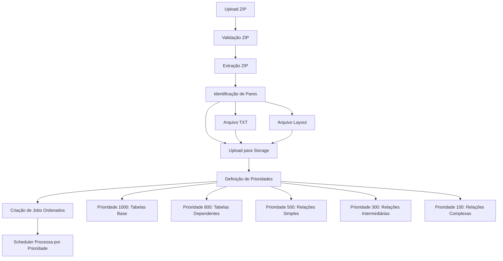

# Refatoração SIGTAP - Upload ZIP com Extração e Processamento Ordenado

## Objetivo

Substituir o upload individual de arquivos SIGTAP (arquivo + layout) por um sistema que:

1. Aceita upload de arquivo ZIP completo
2. Extrai automaticamente todos os arquivos do ZIP
3. Salva arquivos extraídos no Storage do Supabase organizados por competência
4. Cria jobs ordenados com prioridades baseadas em dependências
5. Remove o endpoint atual de upload individual

## Arquitetura




## Mudanças Necessárias

### 1. Novo Serviço: Extração de ZIP SIGTAP

**Arquivo:** `src/main/java/com/upsaude/service/job/SigtapZipExtractionService.java`

- Extrai arquivos do ZIP em memória (usando `ZipInputStream`)
- Identifica pares de arquivos (arquivo.txt + arquivo_layout.txt)
- Valida estrutura do ZIP (verifica se contém arquivos esperados)
- Retorna lista de arquivos extraídos com metadados (nome, tamanho, checksum)

**Métodos:**

- `ExtrairResultado extrairZip(InputStream zipInputStream)`: Extrai e valida ZIP
- `List<ArquivoPar> identificarPares(List<ArquivoExtraido> arquivos)`: Identifica pares arquivo + layout
- `void validarEstruturaZip(List<ArquivoExtraido> arquivos)`: Valida se ZIP contém arquivos necessários

**Classes auxiliares:**

- `ArquivoExtraido`: nome, conteúdo (byte[]), tamanho, checksum
- `ArquivoPar`: arquivoDados (ArquivoExtraido), arquivoLayout (ArquivoExtraido)
- `ExtrairResultado`: lista de pares, lista de arquivos sem par, erros

### 2. Novo Serviço: Orquestração de Jobs SIGTAP

**Arquivo:** `src/main/java/com/upsaude/service/job/SigtapJobOrchestrator.java`

- Define ordem de processamento baseada em dependências
- Calcula prioridades para cada arquivo
- Cria jobs na ordem correta

**Métodos:**

- `int calcularPrioridade(String nomeArquivo)`: Retorna prioridade baseada no nome do arquivo
- `List<ArquivoComPrioridade> ordenarArquivos(List<ArquivoPar> pares)`: Ordena arquivos por prioridade
- `Map<String, Integer> obterMapaPrioridades()`: Retorna mapa de nome de arquivo → prioridade

**Ordem de Prioridades:**

- **1000 (maior)**: Tabelas base sem dependências
- `tb_grupo.txt`, `tb_sub_grupo.txt`, `tb_financiamento.txt`, `tb_rubrica.txt`, `tb_modalidade.txt`, `tb_registro.txt`, `tb_tipo_leito.txt`, `tb_servico.txt`, `tb_servico_classificacao.txt`, `tb_ocupacao.txt`, `tb_habilitacao.txt`, `tb_grupo_habilitacao.txt`, `tb_regra_condicionada.txt`, `tb_renases.txt`, `tb_tuss.txt`, `tb_componente_rede.txt`, `tb_rede_atencao.txt`, `tb_sia_sih.txt`, `tb_cid.txt`
- **800**: Tabelas que dependem das base
- `tb_procedimento.txt`, `tb_forma_organizacao.txt`, `tb_detalhe.txt`, `tb_descricao.txt`, `tb_descricao_detalhe.txt`
- **500**: Relações simples
- `rl_procedimento_modalidade.txt`, `rl_procedimento_registro.txt`, `rl_procedimento_comp_rede.txt`, `rl_procedimento_origem.txt`, `rl_procedimento_regra_cond.txt`, `rl_procedimento_renases.txt`, `rl_procedimento_tuss.txt`
- **300**: Relações intermediárias
- `rl_procedimento_cid.txt`, `rl_procedimento_ocupacao.txt`, `rl_procedimento_habilitacao.txt`, `rl_procedimento_leito.txt`, `rl_procedimento_servico.txt`, `rl_procedimento_incremento.txt`, `rl_procedimento_sia_sih.txt`
- **100 (menor)**: Relações complexas
- `rl_procedimento_detalhe.txt`, `rl_excecao_compatibilidade.txt`

### 3. Atualização do Controller

**Arquivo:** `src/main/java/com/upsaude/controller/job/SigtapFileImportController.java`**Remover:**

- Método `uploadSigtap()` (linhas 45-100) - endpoint `/v1/sigtap/import/upload`

**Adicionar:**

- Método `uploadZipSigtap()` - novo endpoint `/v1/sigtap/import/upload-zip`
- Recebe: `MultipartFile zipFile`, `String competencia`
- Valida: formato ZIP, competência (AAAAMM)
- Chama: `importJobUploadService.criarJobsFromZipSigtap()`
- Retorna: lista de jobs criados + job master (opcional)

**Manter:**

- Método `listarArquivos()` - pode ser útil para debug
- Método `importarCompetencia()` - já está deprecated, manter

### 4. Atualização da Interface do Serviço

**Arquivo:** `src/main/java/com/upsaude/service/job/ImportJobUploadService.java`**Remover:**

- Método `criarJobUploadComLayoutSigtap()` (linhas 32-39)

**Adicionar:**

- Método `CriarJobsZipResultado criarJobsFromZipSigtap(MultipartFile zipFile, String competenciaAno, String competenciaMes, Tenant tenant, UUID createdByUserId)`

**Classe de resultado:**

- `CriarJobsZipResultado`: lista de jobs criados, total de arquivos processados, erros (se houver)

### 5. Atualização da Implementação do Serviço

**Arquivo:** `src/main/java/com/upsaude/service/impl/job/ImportJobUploadServiceImpl.java`**Remover:**

- Método `criarJobUploadComLayoutSigtap()` (linhas 106-148)
- Dependências relacionadas ao upload individual SIGTAP

**Adicionar:**

- Injeção: `SigtapZipExtractionService`, `SigtapJobOrchestrator`
- Método `criarJobsFromZipSigtap()`:

1. Valida ZIP e competência
2. Chama `sigtapZipExtractionService.extrairZip()`
3. Chama `sigtapZipExtractionService.identificarPares()`
4. Para cada par:

    - Faz upload de ambos arquivos para Storage (pasta `competencia/{ano}/{mes}/extracted/`)
    - Calcula checksum
    - Obtém prioridade via `sigtapJobOrchestrator.calcularPrioridade()`
    - Cria job com prioridade correta

5. Retorna resultado com lista de jobs criados

**Estrutura de Storage:**

- Antes: `tenant/{id}/tipo/sigtap/competencia/{ano}/{mes}/arquivo.txt`
- Depois: `tenant/{id}/tipo/sigtap/competencia/{ano}/{mes}/extracted/arquivo.txt`

### 6. Ajustes no Worker SIGTAP

**Arquivo:** `src/main/java/com/upsaude/service/impl/job/workers/SigtapImportJobWorker.java`**Verificar:**

- O worker já lê `layoutPath` do `payloadJson` - não precisa mudar
- O worker já processa arquivos do Storage - não precisa mudar
- Garantir que o worker funciona com a nova estrutura de paths (`extracted/`)

### 7. Validações e Tratamento de Erros

**Validações no Upload ZIP:**

- Arquivo é ZIP válido
- Competência no formato AAAAMM
- ZIP contém pelo menos um arquivo TXT
- Todos os arquivos TXT têm seu layout correspondente (ou permitir alguns sem layout?)
- Tamanho máximo do ZIP (configurável)

**Tratamento de Erros:**

- Se extração falhar: rollback (não criar nenhum job)
- Se upload de arquivo falhar: marcar erro específico, continuar com outros
- Se criação de job falhar: logar erro, continuar com outros
- Retornar lista de erros no resultado

### 8. Configurações

**Arquivo:** `src/main/resources/config/common/import/application-import-sigtap.properties`**Adicionar:**

```properties
# Upload ZIP SIGTAP
sigtap.import.zip.max-size-bytes=1073741824
sigtap.import.zip.require-all-files=false
sigtap.import.zip.extracted-path-prefix=extracted
```


### 9. Testes e Validação

**Cenários de teste:**

1. Upload ZIP válido com todos os arquivos
2. Upload ZIP com arquivos faltando
3. Upload ZIP com arquivos sem layout correspondente
4. Upload ZIP muito grande
5. Verificar ordem de processamento (jobs com prioridades corretas)
6. Verificar que jobs são processados na ordem correta pelo scheduler

## Ordem de Implementação

1. Criar `SigtapZipExtractionService` e classes auxiliares
2. Criar `SigtapJobOrchestrator` com mapa de prioridades
3. Atualizar `ImportJobUploadService` (interface) - adicionar novo método, remover antigo
4. Atualizar `ImportJobUploadServiceImpl` - implementar novo método, remover antigo
5. Atualizar `SigtapFileImportController` - adicionar novo endpoint, remover antigo
6. Adicionar configurações
7. Testar extração e criação de jobs
8. Verificar processamento ordenado

## Impactos

**Breaking Changes:**

- Endpoint `/v1/sigtap/import/upload` será removido
- Clientes que usam upload individual precisarão migrar para upload ZIP

**Compatibilidade:**

- Endpoint deprecated `/v1/sigtap/import/{competencia}` permanece (já retorna 410)
- Endpoint `GET /v1/sigtap/import/arquivos/{competencia}` permanece (útil para debug)

**Performance:**

- Upload único de ZIP é mais eficiente que múltiplos uploads
- Extração em memória pode consumir bastante RAM para ZIPs grandes
- Considerar streaming de extração para ZIPs muito grandes (futuro)

## Notas Técnicas

- O scheduler já ordena por `priority DESC` (ver `ImportJobJobRepository.findPendingJobsForProcessing`)