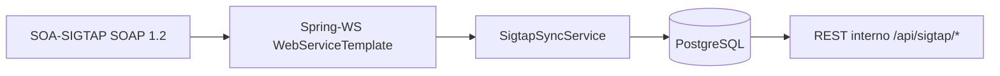

# UPSa?de-back ? Integra??o SOA-SIGTAP (DATASUS)

Este m?dulo implementa uma **integra??o completa** com o **SOA-SIGTAP (DATASUS)** via **SOAP 1.2** com **WS-Security UsernameToken**, realizando **sincroniza??o para PostgreSQL** e disponibilizando os dados via **API REST interna**.

> Importante: **n?o** consultamos o SIGTAP em tempo real para telas. O consumo ? sempre do **banco local sincronizado**.

## Vis?o geral do fluxo



## Servi?os SOAP (produ??o)

- `ProcedimentoService`: `https://servicos.saude.gov.br/sigtap/ProcedimentoService/v1?wsdl`
- `NivelAgregacaoService`: `https://servicos.saude.gov.br/sigtap/NivelAgregacaoService/v1?wsdl`
- `CompatibilidadeService`: `https://servicos.saude.gov.br/sigtap/CompatibilidadeService/v1?wsdl`
- `CompatibilidadePossivelService`: `https://servicos.saude.gov.br/sigtap/CompatibilidadePossivelService/v1?wsdl`

## Credenciais (DATASUS ? p?blicas)

- Username: `SIGTAP.PUBLICO`
- Password: `sigtap#2015public`

As credenciais ficam configur?veis via properties por boas pr?ticas (mesmo sendo p?blicas).

## Arquitetura (onde est? cada coisa)

- **WSDLs/XSDs versionados**: `src/main/resources/wsdl/sigtap/` (com XSDs em `src/main/resources/wsdl/sigtap/xsd/`)
- **Stubs gerados (wsimport)**: `target/generated-sources/wsimport` (package `com.upsaude.integration.sigtap.wsdl`)
- **Config SOAP (SOAP 1.2 + UsernameToken + timeouts)**: `src/main/java/com/upsaude/config/SigtapSoapConfig.java`
- **Clients SOAP**: `src/main/java/com/upsaude/integration/sigtap/soap/client/*`
- **Entidades JPA**: `src/main/java/com/upsaude/entity/sigtap/*`
- **Migra??o Flyway (tabelas sigtap_*)**: `src/main/resources/db/migration/V002__create_sigtap_schema.sql`
- **Servi?o de sincroniza??o**: `src/main/java/com/upsaude/service/SigtapSyncService.java` e `src/main/java/com/upsaude/service/impl/SigtapSyncServiceImpl.java`
- **Job mensal**: `src/main/java/com/upsaude/service/job/SigtapSyncJob.java`
- **Trigger manual (interno)**: `src/main/java/com/upsaude/controller/SigtapSyncController.java`
- **API REST interna de leitura**: `src/main/java/com/upsaude/controller/SigtapController.java`

## Configura??o (application.properties)

Principais chaves:

- Flyway:
  - `spring.flyway.enabled=true`
  - `spring.flyway.locations=classpath:db/migration`
  - `spring.flyway.baseline-on-migrate=true`
- SIGTAP SOAP:
  - `sigtap.soap.base-url=https://servicos.saude.gov.br/sigtap`
  - `sigtap.soap.*-service-path=/.../v1`
  - `sigtap.soap.username=SIGTAP.PUBLICO`
  - `sigtap.soap.password=sigtap#2015public`
  - `sigtap.soap.connect-timeout-ms=10000`
  - `sigtap.soap.read-timeout-ms=60000`
- Job:
  - `sigtap.sync.cron=0 0 3 1 * *` (todo dia 1 ?s 03:00)
  - `sigtap.sync.default-competencia=` (se vazio, calcula m?s anterior automaticamente)

## Como gerar os stubs (WSDL ? Java)

O build j? est? configurado com `jaxws-maven-plugin` e `build-helper-maven-plugin`.

Para gerar e compilar:

```bash
mvn -DskipTests clean compile
```

## Como sincronizar o SIGTAP

### 1) Job mensal (@Scheduled)

Executa conforme `sigtap.sync.cron` e chama `SigtapSyncService#sincronizarTudo(null)`.

### 2) Manual (endpoint interno)

- `POST /api/sigtap/sync?competencia=AAAAMM`
  - `competencia` ? opcional; se omitida, usa `sigtap.sync.default-competencia` ou m?s anterior.

Exemplo:

```bash
curl -X POST "http://localhost:8080/api/sigtap/sync?competencia=202512"
```

## API REST interna (leitura)

> Base path da aplica??o: `server.servlet.context-path=/api`

- `GET /api/sigtap/grupos`
- `GET /api/sigtap/procedimentos?q=...&competencia=AAAAMM` (pagina??o via `Pageable`)
- `GET /api/sigtap/procedimentos/{codigo}?competencia=AAAAMM`
- `GET /api/sigtap/compatibilidades?codigoProcedimentoPrincipal=...&competencia=AAAAMM` (pagina??o via `Pageable`)

## Idempot?ncia e boas pr?ticas adotadas

- **Idempot?ncia**: upsert por chaves naturais (reposit?rios) + constraints/?ndices ?nicos no banco.
- **Sem vazamento de credenciais**: interceptor de logging registra apenas **Body** (payload), n?o o Header com UsernameToken.
- **Resili?ncia**: falhas de um procedimento n?o interrompem a carga completa; h? etapa de retry no detalhamento.

