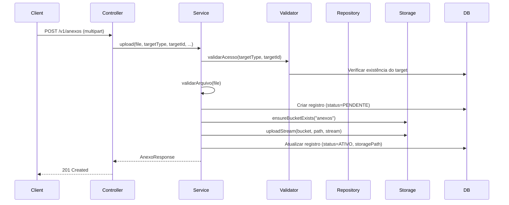
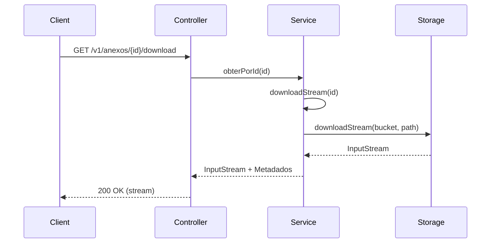
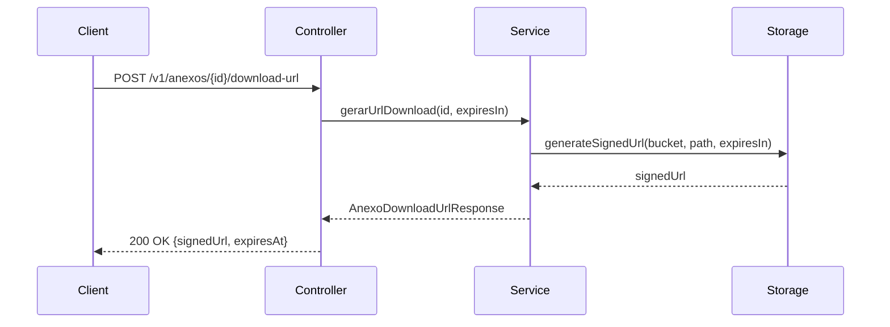

# Documentação Técnica — Módulo de Anexos

## Arquitetura

### Visão Geral

O módulo de anexos utiliza uma arquitetura em camadas com separação clara de responsabilidades:

```
┌─────────────────────────────────────────────────────────────┐
│                    Controller Layer                          │
│              (AnexoController)                              │
└──────────────────────┬──────────────────────────────────────┘
                       │
┌──────────────────────▼──────────────────────────────────────┐
│                    Service Layer                             │
│         (AnexoService + AnexoTargetPermissionValidator)     │
└──────────────────────┬──────────────────────────────────────┘
                       │
        ┌──────────────┼──────────────┐
        │              │              │
┌───────▼──────┐ ┌───▼──────┐ ┌─────▼──────────┐
│   Repository │ │ Storage  │ │  Permission   │
│   (JPA)      │ │ (Supabase)│ │  Validator     │
└──────────────┘ └───────────┘ └────────────────┘
        │              │
┌───────▼──────────────▼──────┐
│      PostgreSQL              │
│   (Metadados dos anexos)     │
└──────────────────────────────┘
```

### Componentes Principais

#### 1. Entidade (`Anexo`)

Localização: `com.upsaude.entity.anexo.Anexo`

```java
@Entity
@Table(name = "anexos")
public class Anexo extends BaseEntity {
    private TargetTypeAnexoEnum targetType;    // Tipo do recurso alvo
    private UUID targetId;                      // ID do recurso alvo
    private String storageBucket;               // Bucket no Supabase
    private String storageObjectPath;           // Caminho do arquivo
    private String fileNameOriginal;            // Nome original
    private String mimeType;                    // Tipo MIME
    private Long sizeBytes;                     // Tamanho em bytes
    private String checksum;                    // SHA-256 hash
    private CategoriaAnexoEnum categoria;       // Categoria
    private Boolean visivelParaPaciente;        // Visibilidade
    private StatusAnexoEnum status;             // Status
    private String descricao;                    // Descrição
    private String tags;                         // Tags
    private UUID criadoPor;                      // Usuário criador
    private UUID excluidoPor;                   // Usuário que excluiu
}
```

#### 2. Repository (`AnexoRepository`)

Localização: `com.upsaude.repository.anexo.AnexoRepository`

Queries principais:
- `findByTarget()` - Buscar por targetType e targetId
- `findByGestao()` - Busca completa com múltiplos filtros
- `findByIdAndTenant()` - Buscar por ID com validação de tenant

#### 3. Service (`AnexoService`)

Localização: `com.upsaude.service.api.anexo.AnexoService`

Métodos principais:
- `upload()` - Upload de arquivo
- `downloadStream()` - Download direto (streaming)
- `gerarUrlDownload()` - Gerar URL assinada
- `listarGestao()` - Listagem completa para gestão
- `gerarThumbnailUrl()` - Gerar URL de miniatura
- `atualizar()` - Atualizar metadados
- `excluir()` - Excluir anexo

#### 4. Storage Service (`SupabaseStorageService`)

Localização: `com.upsaude.integration.supabase.SupabaseStorageService`

Métodos utilizados:
- `ensureBucketExists()` - Garantir que bucket existe
- `uploadStream()` - Upload streaming
- `downloadStream()` - Download streaming
- `generateSignedUrl()` - Gerar URL assinada
- `deleteObject()` - Deletar arquivo

---

## Modelo de Dados

### Tabela: `anexos`

```sql
CREATE TABLE public.anexos (
    -- Campos herdados de BaseEntity
    id UUID PRIMARY KEY,
    criado_em TIMESTAMPTZ NOT NULL,
    atualizado_em TIMESTAMPTZ,
    tenant_id UUID NOT NULL,
    estabelecimento_id UUID,
    ativo BOOLEAN NOT NULL DEFAULT true,
    
    -- Vínculo genérico
    target_type VARCHAR(50) NOT NULL,
    target_id UUID NOT NULL,
    
    -- Storage
    storage_bucket VARCHAR(100) NOT NULL,
    storage_object_path VARCHAR(500) NOT NULL,
    
    -- Metadados
    file_name_original VARCHAR(255) NOT NULL,
    mime_type VARCHAR(100) NOT NULL,
    size_bytes BIGINT NOT NULL,
    checksum VARCHAR(64),
    
    -- Categorização
    categoria INTEGER,
    visivel_para_paciente BOOLEAN NOT NULL DEFAULT false,
    status INTEGER NOT NULL DEFAULT 1,
    
    -- Descrição
    descricao TEXT,
    tags VARCHAR(500),
    
    -- Auditoria
    criado_por UUID,
    excluido_por UUID
);
```

### Índices

```sql
-- Índice composto para busca por target
CREATE INDEX idx_anexo_tenant_target 
ON anexos(tenant_id, target_type, target_id);

-- Índice para busca por target (sem tenant)
CREATE INDEX idx_anexo_target 
ON anexos(target_type, target_id);

-- Índice para status
CREATE INDEX idx_anexo_status 
ON anexos(status);

-- Índice para data de criação
CREATE INDEX idx_anexo_criado_em 
ON anexos(criado_em);

-- Índice para checksum (deduplicação)
CREATE INDEX idx_anexo_checksum 
ON anexos(checksum);

-- Índice parcial para visibilidade
CREATE INDEX idx_anexo_visivel_paciente 
ON anexos(visivel_para_paciente) 
WHERE visivel_para_paciente = true;
```

### Enums

#### `TargetTypeAnexoEnum`

```java
PACIENTE("PACIENTE", "Paciente")
AGENDAMENTO("AGENDAMENTO", "Agendamento")
ATENDIMENTO("ATENDIMENTO", "Atendimento")
CONSULTA("CONSULTA", "Consulta Médica")
PRONTUARIO_EVENTO("PRONTUARIO_EVENTO", "Evento do Prontuário")
PROFISSIONAL_SAUDE("PROFISSIONAL_SAUDE", "Profissional de Saúde")
USUARIO_SISTEMA("USUARIO_SISTEMA", "Usuário do Sistema")
FINANCEIRO_FATURAMENTO("FINANCEIRO_FATURAMENTO", "Financeiro/Faturamento")
```

#### `CategoriaAnexoEnum`

```java
LAUDO(1, "Laudo")
EXAME(2, "Exame")
DOCUMENTO(3, "Documento")
IMAGEM(4, "Imagem")
RECEITA(5, "Receita")
ATESTADO(6, "Atestado")
ENCAMINHAMENTO(7, "Encaminhamento")
OUTROS(99, "Outros")
```

#### `StatusAnexoEnum`

```java
PENDENTE(1, "Pendente")
ATIVO(2, "Ativo")
INATIVO(3, "Inativo")
EXCLUIDO(4, "Excluído")
```

---

## Storage (Supabase)

### Bucket

- **Nome**: `anexos`
- **Tipo**: Privado (não público)
- **Criação**: Automática via `ensureBucketExists()`

### Estrutura de Caminhos

Padrão: `tenant/{tenantId}/{targetType}/{targetId}/{anexoId}/{nomeSeguro}`

Exemplo:
```
tenant/550e8400-e29b-41d4-a716-446655440000/PACIENTE/123e4567-e89b-12d3-a456-426614174000/789e0123-e45b-67c8-d901-234567890abc/documento_rg.pdf
```

### URLs Assinadas

- **TTL padrão**: 300 segundos (5 minutos)
- **Endpoint**: `POST /storage/v1/object/sign/{bucket}/{path}`
- **Uso**: Download temporário sem expor bucket privado

---

## Fluxos Técnicos

### Upload



### Download Direto



### Geração de URL Assinada



---

## Segurança

### Validação de Permissões

O módulo valida permissões através do `AnexoTargetPermissionValidator`:

1. **Validação de Tenant**: Usuário deve pertencer ao tenant do anexo
2. **Validação de Target**: Usuário deve ter acesso ao recurso alvo (paciente, atendimento, etc.)
3. **Validação de Status**: Anexos excluídos não podem ser baixados

### Row Level Security (RLS)

Políticas PostgreSQL aplicadas:

- **SELECT**: Usuários veem apenas anexos do seu tenant
- **INSERT**: Usuários podem inserir apenas no seu tenant
- **UPDATE**: Usuários podem atualizar apenas do seu tenant
- **DELETE**: Usuários podem deletar apenas do seu tenant

### Validações de Arquivo

- **Tamanho máximo**: 50MB
- **Tipo MIME**: Validado no upload
- **Nome do arquivo**: Sanitizado (remove caracteres perigosos)

---

## Integrações

### Supabase Storage

- **Configuração**: Via `SupabaseConfig`
- **Autenticação**: Service Role Key
- **Bucket**: Criado automaticamente se não existir
- **Streaming**: Upload e download via streaming (não carrega tudo em memória)

### Multitenancy

- **Isolamento**: Todos os anexos são isolados por `tenant_id`
- **Validação**: Sempre valida tenant do usuário autenticado
- **Storage Path**: Inclui tenantId no caminho

---

## Performance

### Otimizações

1. **Streaming**: Upload/download não carrega arquivo inteiro em memória
2. **Índices**: Índices compostos para queries frequentes
3. **Lazy Loading**: Relacionamentos carregados sob demanda
4. **Paginação**: Todas as listagens são paginadas

### Limites

- **Tamanho máximo de arquivo**: 50MB
- **TTL de URL assinada**: 5 minutos (padrão)
- **Tamanho de thumbnail**: 200x200px (padrão)

---

## Troubleshooting

### Erro: "Bucket não encontrado"

**Causa**: Bucket não foi criado no Supabase Storage

**Solução**: O sistema cria automaticamente, mas verifique:
1. Credenciais do Supabase configuradas corretamente
2. Service Role Key com permissões adequadas
3. Conexão com Supabase funcionando

### Erro: "Acesso negado"

**Causa**: Usuário não tem permissão para acessar o recurso alvo

**Solução**: Verifique:
1. Usuário pertence ao tenant correto
2. Recurso alvo existe e pertence ao mesmo tenant
3. Usuário tem permissão para acessar o tipo de recurso

### Erro: "Arquivo muito grande"

**Causa**: Arquivo excede 50MB

**Solução**: Reduza o tamanho do arquivo ou aumente o limite em `AnexoServiceImpl.MAX_FILE_SIZE`

### Erro: "Não é possível gerar thumbnail"

**Causa**: Arquivo não é uma imagem

**Solução**: Thumbnails só estão disponíveis para arquivos com MIME type `image/*`

---

## Arquivos Principais

```
src/main/java/com/upsaude/
├── entity/anexo/
│   └── Anexo.java
├── repository/anexo/
│   └── AnexoRepository.java
├── service/api/anexo/
│   ├── AnexoService.java
│   └── AnexoTargetPermissionValidator.java
├── service/impl/api/anexo/
│   ├── AnexoServiceImpl.java
│   └── AnexoTargetPermissionValidatorImpl.java
├── controller/api/anexo/
│   └── AnexoController.java
├── api/request/anexo/
│   ├── AnexoUploadRequest.java
│   └── AnexoUpdateRequest.java
├── api/response/anexo/
│   ├── AnexoResponse.java
│   ├── AnexoGestaoResponse.java
│   └── AnexoDownloadUrlResponse.java
└── integration/supabase/
    └── SupabaseStorageService.java (extendido)
```

---

## Migração

Arquivo: `migrations/create_anexos_table.sql`

Para aplicar a migração:

```sql
\i migrations/create_anexos_table.sql
```

Ou via MCP Supabase (ver seção abaixo).
