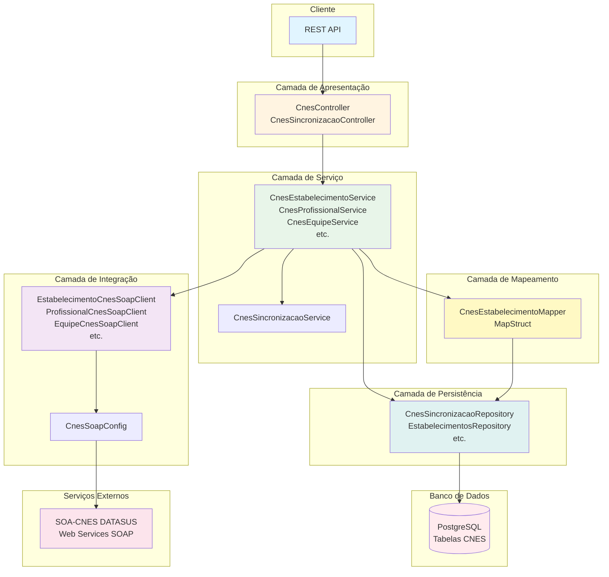
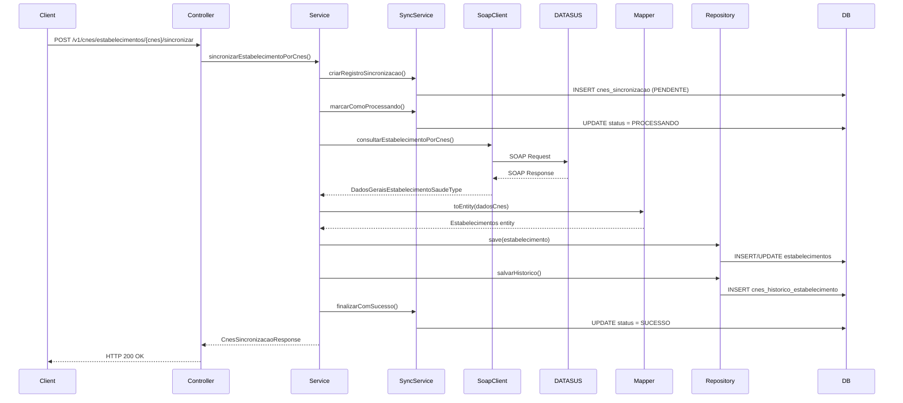
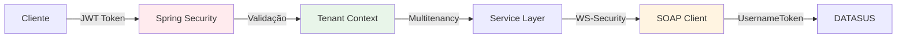
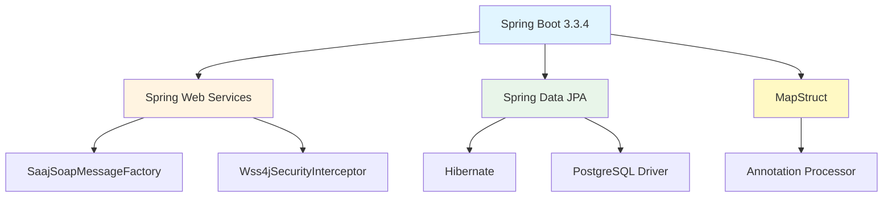
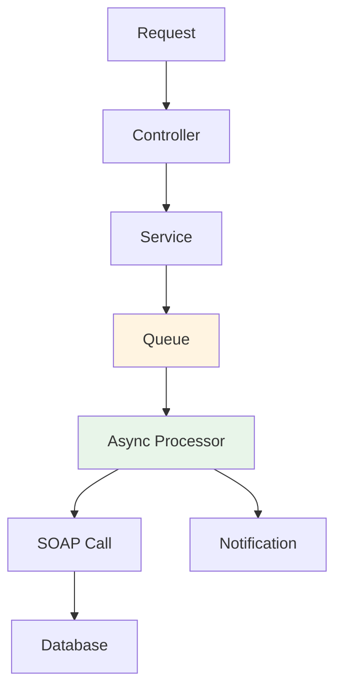

# Arquitetura e Design - Integração CNES

## 📐 Visão Geral da Arquitetura

A integração CNES foi desenvolvida seguindo uma arquitetura em camadas, utilizando Spring Boot e padrões de design para garantir manutenibilidade e escalabilidade.

## 🏗️ Diagrama de Arquitetura

## 🔄 Fluxo de Sincronização

## 🧩 Componentes Principais

### 1. Controllers (Camada de Apresentação)

**Localização**: `com.upsaude.controller.api.cnes`

- **CnesController**: Endpoints principais de sincronização
- **CnesSincronizacaoController**: Endpoints de consulta e histórico

### 2. Services (Camada de Negócio)

**Localização**: `com.upsaude.service.api.cnes`

- **CnesEstabelecimentoService**: Lógica de sincronização de estabelecimentos
- **CnesProfissionalService**: Lógica de sincronização de profissionais
- **CnesEquipeService**: Lógica de sincronização de equipes
- **CnesSincronizacaoService**: Gerenciamento de registros de sincronização

### 3. SOAP Clients (Camada de Integração)

**Localização**: `com.upsaude.integration.cnes.soap.client`

- **AbstractCnesSoapClient**: Classe base abstrata com lógica comum
- **EstabelecimentoCnesSoapClient**: Cliente para serviços de estabelecimentos
- **ProfissionalCnesSoapClient**: Cliente para serviços de profissionais
- **EquipeCnesSoapClient**: Cliente para serviços de equipes
- **EquipamentoCnesSoapClient**: Cliente para serviços de equipamentos
- **LeitoCnesSoapClient**: Cliente para serviços de leitos

### 4. Configuration (Configuração)

**Localização**: `com.upsaude.config`

- **CnesSoapConfig**: Configuração do Spring Web Services para SOAP

### 5. Mappers (Camada de Transformação)

**Localização**: `com.upsaude.mapper.cnes`

- **CnesEstabelecimentoMapper**: Conversão WSDL → JPA Entity (MapStruct)

### 6. Repositories (Camada de Persistência)

**Localização**: `com.upsaude.repository.cnes`

- **CnesSincronizacaoRepository**: Acesso a dados de sincronização
- **CnesHistoricoEstabelecimentoRepository**: Acesso a histórico

## 🔐 Segurança

A integração utiliza:
- **JWT Authentication** para acesso à API REST
- **WS-Security UsernameToken** para autenticação SOAP
- **Multitenancy** para isolamento de dados por tenant

## 📦 Dependências Principais

## 🎯 Padrões de Design Utilizados

1. **Repository Pattern**: Abstração de acesso a dados
2. **Service Layer Pattern**: Separação de lógica de negócio
3. **DTO Pattern**: Transferência de dados entre camadas
4. **Strategy Pattern**: Diferentes estratégias de sincronização
5. **Template Method**: Classe abstrata para SOAP clients
6. **Builder Pattern**: Construção de objetos complexos

## 🔄 Processamento Assíncrono (Futuro)

**Nota**: Atualmente a sincronização é síncrona. Uma implementação futura pode incluir processamento assíncrono para melhor performance.

## 📊 Monitoramento e Observabilidade

- **Logging**: SLF4J com Logback
- **Metrics**: Spring Boot Actuator
- **Health Checks**: `/actuator/health`
- **Tracing**: Preparado para integração com sistemas de tracing

## 🚀 Performance

- **Connection Pool**: HikariCP
- **Caching**: Preparado para Redis (futuro)
- **Timeout Configuration**: Configurável por propriedade
- **Retry Logic**: Implementado no AbstractCnesSoapClient

