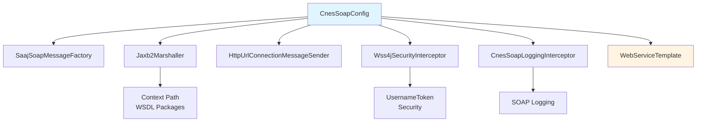
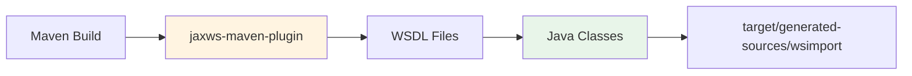
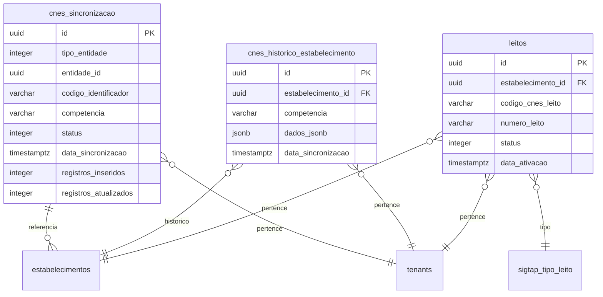

# Configuração e Setup - Integração CNES

## ⚙️ Configuração de Propriedades

### Arquivo de Configuração

**Localização**: `src/main/resources/config/common/integrations/application-soap-cnes.properties`

```properties
# Endpoints base (produção DATASUS)
cnes.soap.base-url=https://servicos.saude.gov.br/cnes
cnes.soap.cnes-service-path=/CnesService/v1r0
cnes.soap.estabelecimento-service-v1r0-path=/EstabelecimentoSaudeService/v1r0
cnes.soap.profissional-service-path=/ProfissionalSaudeService/v1r0
cnes.soap.equipe-service-path=/EquipeService/v1r0
cnes.soap.vinculacao-service-path=/VinculacaoProfissionalService/v1r0
cnes.soap.equipamento-service-path=/EquipamentoService/v1r0
cnes.soap.leito-service-path=/LeitoService/v1r0

# Credenciais públicas (DATASUS)
cnes.soap.username=CNES.PUBLICO
cnes.soap.password=cnes#2015public

# Timeouts (ms)
cnes.soap.connect-timeout-ms=10000
cnes.soap.read-timeout-ms=60000
```

### Importação no application.properties

O arquivo é importado automaticamente via:

```properties
spring.config.import=optional:classpath:config/common/integrations/application-soap-cnes.properties
```

## 🔧 Configuração do Spring

### CnesSoapConfig



**Localização**: `com.upsaude.config.CnesSoapConfig`

**Componentes Configurados**:

1. **SaajSoapMessageFactory**: Factory para criação de mensagens SOAP
2. **Jaxb2Marshaller**: Marshaler/unmarshaler JAXB para XML
3. **HttpUrlConnectionMessageSender**: Cliente HTTP para envio de mensagens
4. **Wss4jSecurityInterceptor**: Interceptor de segurança WS-Security
5. **CnesSoapLoggingInterceptor**: Interceptor para logging de requisições/respostas
6. **WebServiceTemplate**: Template principal para chamadas SOAP

## 📦 Geração de Classes WSDL

### Maven Configuration

**Localização**: `pom.xml`



### Execuções do Plugin

O plugin `jaxws-maven-plugin` é configurado com múltiplas execuções:

1. **generate-cnes-cnes-service**: Gera classes do CnesService
2. **generate-cnes-estabelecimento-v1r0**: Gera classes do EstabelecimentoSaudeService v1r0
3. **generate-cnes-profissional**: Gera classes do ProfissionalSaudeService
4. **generate-cnes-equipe**: Gera classes do EquipeService
5. **generate-cnes-equipamento**: Gera classes do EquipamentoService
6. **generate-cnes-leito**: Gera classes do LeitoService

### Comando para Gerar Classes

```bash
mvn generate-sources
```

As classes são geradas em:
```
target/generated-sources/wsimport/com/upsaude/integration/cnes/wsdl/
```

## 🗄️ Configuração do Banco de Dados

### Migrations Flyway

**Localização**: `src/main/resources/assets/db/migration/V045__criar_tabelas_cnes.sql`

### Tabelas Criadas



## 🔐 Configuração de Segurança

### WS-Security Configuration

```java
Wss4jSecurityInterceptor securityInterceptor = new Wss4jSecurityInterceptor();
securityInterceptor.setSecurementActions("UsernameToken");
securityInterceptor.setSecurementUsername(properties.getSoap().getUsername());
securityInterceptor.setSecurementPassword(properties.getSoap().getPassword());
securityInterceptor.setSecurementPasswordType("PasswordText");
```

### Autenticação REST API

A API REST utiliza JWT authentication configurada no Spring Security.

## 🌍 Configuração por Ambiente

### Local

**Arquivo**: `src/main/resources/config/local/application-local.properties`

```properties
# Configurações específicas do ambiente local
spring.profiles.active=local
```

### Desenvolvimento

```properties
# Configurações específicas do ambiente de desenvolvimento
cnes.soap.base-url=https://servicos.saude.gov.br/cnes
```

### Produção

```properties
# Configurações específicas do ambiente de produção
cnes.soap.base-url=https://servicos.saude.gov.br/cnes
```

## 🧪 Configuração de Testes

### Testes Unitários

**Localização**: `src/test/java/com/upsaude/integration/cnes/`

### Mock de Serviços SOAP

Para testes, é possível mockar os serviços SOAP usando:
- **Mockito** para mocks
- **WireMock** para mock de serviços HTTP

## 📊 Configuração de Logging

### Logback Configuration

**Localização**: `src/main/resources/logback-spring.xml`

### Níveis de Log

- **DEBUG**: Logs detalhados de SOAP requests/responses
- **INFO**: Logs de sincronizações e operações importantes
- **WARN**: Avisos de validação e erros recuperáveis
- **ERROR**: Erros críticos e exceções

### Interceptor de Logging SOAP

O `CnesSoapLoggingInterceptor` registra:
- Request SOAP completo
- Response SOAP completo
- Tempo de execução
- Erros de comunicação

## ⏱️ Configuração de Timeouts

### Timeouts Configuráveis

```properties
# Timeout de conexão (10 segundos)
cnes.soap.connect-timeout-ms=10000

# Timeout de leitura (60 segundos)
cnes.soap.read-timeout-ms=60000
```

### Ajuste de Timeouts

Para operações que podem demorar mais:
1. Ajustar `read-timeout-ms` no arquivo de propriedades
2. Reiniciar a aplicação

## 🔄 Configuração de Retry

### Retry Logic

Implementado no `AbstractCnesSoapClient`:
- Retry automático em caso de falhas de rede
- Configurável via propriedades (futuro)

## 📝 Checklist de Setup

- [ ] Propriedades configuradas em `application-soap-cnes.properties`
- [ ] Classes WSDL geradas via `mvn generate-sources`
- [ ] Migrations Flyway executadas
- [ ] Configuração de segurança WS-Security ativa
- [ ] Logging configurado corretamente
- [ ] Timeouts ajustados conforme necessidade
- [ ] Testes unitários executados com sucesso

## 🚀 Próximos Passos

Após a configuração:
1. Verificar conectividade com DATASUS
2. Testar sincronização de estabelecimento
3. Monitorar logs para identificar problemas
4. Ajustar timeouts se necessário

