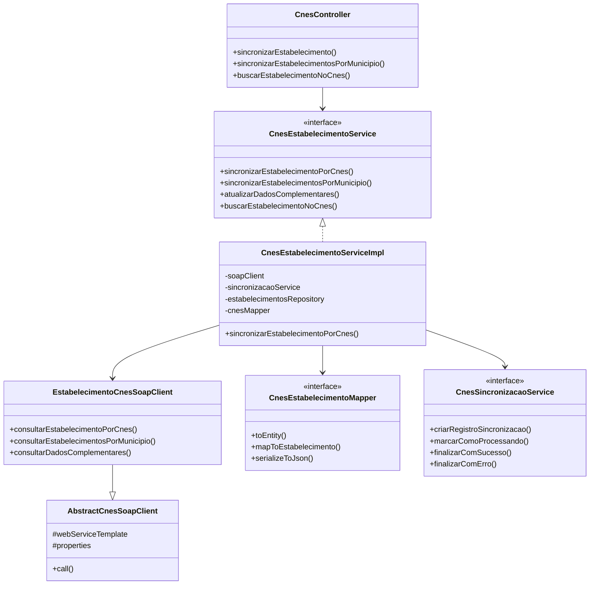
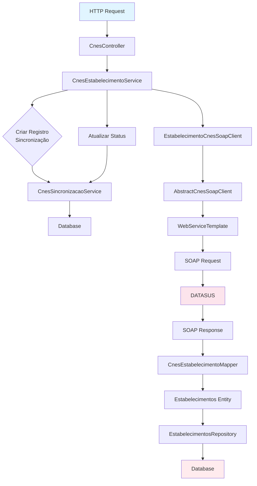

# Estrutura de Código - Integração CNES

## 📁 Estrutura de Diretórios

```
src/main/java/com/upsaude/
├── controller/api/cnes/
│   ├── CnesController.java
│   └── CnesSincronizacaoController.java
├── service/api/cnes/
│   ├── CnesEstabelecimentoService.java
│   ├── CnesProfissionalService.java
│   ├── CnesEquipeService.java
│   ├── CnesVinculacaoService.java
│   ├── CnesEquipamentoService.java
│   ├── CnesLeitoService.java
│   └── CnesSincronizacaoService.java
├── service/impl/api/cnes/
│   ├── CnesEstabelecimentoServiceImpl.java
│   ├── CnesProfissionalServiceImpl.java
│   ├── CnesEquipeServiceImpl.java
│   ├── CnesVinculacaoServiceImpl.java
│   ├── CnesEquipamentoServiceImpl.java
│   ├── CnesLeitoServiceImpl.java
│   └── CnesSincronizacaoServiceImpl.java
├── integration/cnes/
│   ├── soap/
│   │   ├── client/
│   │   │   ├── AbstractCnesSoapClient.java
│   │   │   ├── EstabelecimentoCnesSoapClient.java
│   │   │   ├── ProfissionalCnesSoapClient.java
│   │   │   ├── EquipeCnesSoapClient.java
│   │   │   ├── EquipamentoCnesSoapClient.java
│   │   │   └── LeitoCnesSoapClient.java
│   │   └── interceptor/
│   │       └── CnesSoapLoggingInterceptor.java
│   └── properties/
│       └── CnesProperties.java
├── mapper/cnes/
│   └── CnesEstabelecimentoMapper.java
├── repository/cnes/
│   ├── CnesSincronizacaoRepository.java
│   └── CnesHistoricoEstabelecimentoRepository.java
├── entity/cnes/
│   ├── CnesSincronizacao.java
│   ├── CnesHistoricoEstabelecimento.java
│   └── Leitos.java
├── enums/
│   ├── TipoEntidadeCnesEnum.java
│   ├── StatusSincronizacaoEnum.java
│   ├── EsferaAdministrativaEnum.java
│   └── StatusLeitoEnum.java
├── exception/
│   ├── CnesSoapException.java
│   └── CnesSincronizacaoException.java
├── util/
│   └── CnesValidator.java
└── config/
    └── CnesSoapConfig.java
```

## 🏗️ Diagrama de Classes



## 🔄 Fluxo de Dados



## 📦 Pacotes e Responsabilidades

### `controller.api.cnes`

**Responsabilidade**: Receber requisições HTTP e delegar para services.

**Classes**:
- `CnesController`: Endpoints principais
- `CnesSincronizacaoController`: Endpoints de consulta

### `service.api.cnes`

**Responsabilidade**: Interfaces de serviços (contratos).

**Interfaces**:
- `CnesEstabelecimentoService`
- `CnesProfissionalService`
- `CnesEquipeService`
- `CnesSincronizacaoService`
- etc.

### `service.impl.api.cnes`

**Responsabilidade**: Implementação da lógica de negócio.

**Classes**:
- `CnesEstabelecimentoServiceImpl`: Orquestra sincronização de estabelecimentos
- `CnesSincronizacaoServiceImpl`: Gerencia registros de sincronização

### `integration.cnes.soap.client`

**Responsabilidade**: Comunicação com serviços SOAP do DATASUS.

**Classes**:
- `AbstractCnesSoapClient`: Classe base com lógica comum
- `EstabelecimentoCnesSoapClient`: Cliente específico para estabelecimentos
- Outros clients específicos

### `mapper.cnes`

**Responsabilidade**: Conversão entre objetos WSDL e entidades JPA.

**Classes**:
- `CnesEstabelecimentoMapper`: Mapeamento usando MapStruct

### `repository.cnes`

**Responsabilidade**: Acesso a dados do banco.

**Interfaces**:
- `CnesSincronizacaoRepository`
- `CnesHistoricoEstabelecimentoRepository`

### `entity.cnes`

**Responsabilidade**: Entidades JPA para persistência.

**Classes**:
- `CnesSincronizacao`: Registro de sincronização
- `CnesHistoricoEstabelecimento`: Histórico por competência
- `Leitos`: Entidade de leitos

## 🔧 Padrões de Implementação

### 1. Template Method Pattern

```java
public abstract class AbstractCnesSoapClient {
    protected <T> T call(String endpoint, Object request, 
                         Class<T> responseType, String operacao) {
        // Lógica comum de chamada SOAP
    }
}
```

### 2. Strategy Pattern

Diferentes estratégias de sincronização por tipo de entidade:
- Estabelecimento
- Profissional
- Equipe
- etc.

### 3. Repository Pattern

```java
public interface CnesSincronizacaoRepository 
    extends JpaRepository<CnesSincronizacao, UUID> {
    // Métodos customizados
}
```

### 4. DTO Pattern

```java
public class CnesSincronizacaoResponse {
    // DTO para resposta da API
}
```

## 🎯 Convenções de Código

### Nomenclatura

- **Controllers**: `*Controller`
- **Services**: `*Service` (interface), `*ServiceImpl` (implementação)
- **Repositories**: `*Repository`
- **Entities**: Nome no singular (ex: `CnesSincronizacao`)
- **DTOs**: `*Response`, `*Request`
- **Mappers**: `*Mapper`
- **Exceptions**: `*Exception`

### Estrutura de Métodos

```java
@Override
@Transactional
public CnesSincronizacaoResponse sincronizarEstabelecimentoPorCnes(
        String codigoCnes, String competencia) {
    // 1. Validação
    // 2. Criar registro de sincronização
    // 3. Marcar como processando
    // 4. Chamar SOAP client
    // 5. Mapear dados
    // 6. Persistir
    // 7. Atualizar status
    // 8. Retornar resposta
}
```

## 📝 Anotações Utilizadas

### Spring Framework

- `@RestController`: Controllers REST
- `@Service`: Services
- `@Repository`: Repositories
- `@Transactional`: Transações
- `@RequiredArgsConstructor`: Injeção de dependência (Lombok)

### MapStruct

- `@Mapper`: Interface de mapeamento
- `@Mapping`: Mapeamento de campos
- `@Named`: Métodos nomeados para conversão

### JPA

- `@Entity`: Entidades
- `@Table`: Configuração de tabela
- `@Column`: Configuração de coluna
- `@ManyToOne`, `@OneToMany`: Relacionamentos

## 🔍 Geração de Código

### MapStruct

MapStruct gera implementações em tempo de compilação:

```java
@Mapper(config = MappingConfig.class)
public interface CnesEstabelecimentoMapper {
    // Implementação gerada automaticamente
}
```

**Localização gerada**: `target/generated-sources/annotations/`

### WSDL Classes

Classes geradas do WSDL via `jaxws-maven-plugin`:

**Localização gerada**: `target/generated-sources/wsimport/`

## 🧪 Testabilidade

### Injeção de Dependências

Todas as dependências são injetadas via construtor (Lombok `@RequiredArgsConstructor`), facilitando testes unitários.

### Mocks

Para testes:
- Mock de `SoapClient`
- Mock de `Repository`
- Mock de `Mapper`

## 📊 Métricas de Código

- **Linhas de Código**: ~5000+ linhas
- **Classes**: 20+ classes
- **Interfaces**: 10+ interfaces
- **Testes**: Em desenvolvimento

## 🚀 Melhorias Futuras

1. **Testes Unitários**: Cobertura completa
2. **Testes de Integração**: Testes end-to-end
3. **Documentação JavaDoc**: Completar documentação
4. **Refatoração**: Otimização de código
5. **Cache**: Implementar cache para consultas frequentes

