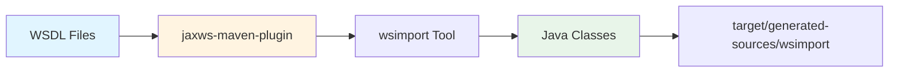
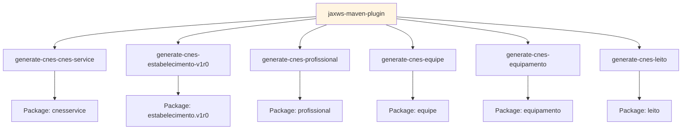
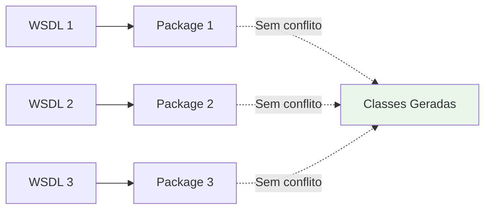
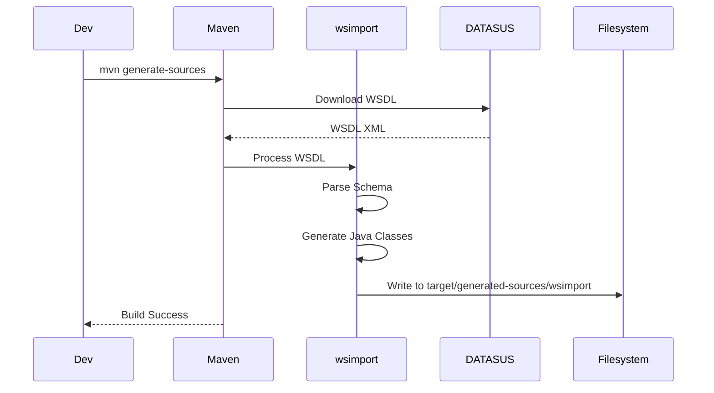

# WSDL e Geração de Classes - Integração CNES

## 📋 Visão Geral

A integração CNES utiliza **WSDL (Web Services Description Language)** para descrever os serviços SOAP disponíveis no DATASUS. As classes Java são geradas automaticamente a partir dos WSDLs usando o plugin Maven `jaxws-maven-plugin`.

## 🔄 Processo de Geração



## 📦 WSDLs Utilizados

### 1. CnesService (v1r0)

**Endpoint**: `https://servicos.saude.gov.br/cnes/CnesService/v1r0?wsdl`

**Operações**:
- `consultarEstabelecimentoSaude`: Consulta estabelecimento por CNES
- `consultarEstabelecimentoSaudePorMunicipio`: Consulta estabelecimentos por município
- `consultarDadosComplementaresEstabelecimentoSaude`: Consulta dados complementares

**Package gerado**: `com.upsaude.integration.cnes.wsdl.cnesservice`

### 2. EstabelecimentoSaudeService (v1r0)

**Endpoint**: `https://servicos.saude.gov.br/cnes/EstabelecimentoSaudeService/v1r0?wsdl`

**Operações**:
- Consultas detalhadas de estabelecimentos

**Package gerado**: `com.upsaude.integration.cnes.wsdl.estabelecimento.v1r0`

### 3. ProfissionalSaudeService (v1r0)

**Endpoint**: `https://servicos.saude.gov.br/cnes/ProfissionalSaudeService/v1r0?wsdl`

**Operações**:
- `consultarProfissionalSaude`: Consulta profissional por CNS/CPF
- `consultarProfissionaisSaude`: Consulta profissionais por estabelecimento

**Package gerado**: `com.upsaude.integration.cnes.wsdl.profissional`

### 4. EquipeService (v1r0)

**Endpoint**: `https://servicos.saude.gov.br/cnes/EquipeService/v1r0?wsdl`

**Operações**:
- `pesquisarEquipe`: Pesquisa equipes
- `detalharEquipe`: Detalha equipe específica

**Package gerado**: `com.upsaude.integration.cnes.wsdl.equipe`

### 5. EquipamentoService (v1r0)

**Endpoint**: `https://servicos.saude.gov.br/cnes/EquipamentoService/v1r0?wsdl`

**Operações**:
- `consultarEquipamentos`: Consulta equipamentos de estabelecimento

**Package gerado**: `com.upsaude.integration.cnes.wsdl.equipamento`

### 6. LeitoService (v1r0)

**Endpoint**: `https://servicos.saude.gov.br/cnes/LeitoService/v1r0?wsdl`

**Operações**:
- `consultarLeitosCNES`: Consulta leitos de estabelecimento

**Package gerado**: `com.upsaude.integration.cnes.wsdl.leito`

> [!IMPORTANT]
> **VinculacaoProfissionalService**: Este serviço está temporariamente desabilitado no sistema devido a instabilidades no WSDL oficial do DATASUS. A lógica de vinculação foi migrada para utilizar os dados já presentes nos retornos de `ProfissionalSaudeService` e `CnesService`.

## ⚙️ Configuração Maven

### Plugin Configuration

```xml
<plugin>
    <groupId>com.sun.xml.ws</groupId>
    <artifactId>jaxws-maven-plugin</artifactId>
    <version>4.0.2</version>
    <executions>
        <!-- Múltiplas execuções, uma por WSDL -->
    </executions>
</plugin>
```

### Estrutura de Execuções



### Exemplo de Execução

```xml
<execution>
    <id>generate-cnes-cnes-service</id>
    <goals>
        <goal>wsimport</goal>
    </goals>
    <configuration>
        <wsdlUrls>
            <wsdlUrl>https://servicos.saude.gov.br/cnes/CnesService/v1r0?wsdl</wsdlUrl>
        </wsdlUrls>
        <packageName>com.upsaude.integration.cnes.wsdl.cnesservice</packageName>
        <sourceDestDir>${project.build.directory}/generated-sources/wsimport</sourceDestDir>
    </configuration>
</execution>
```

## 🏗️ Estrutura de Classes Geradas

### Hierarquia de Packages

```
com.upsaude.integration.cnes.wsdl/
├── cnesservice/
│   ├── ObjectFactory.java
│   ├── ResponseConsultarEstabelecimentoSaude.java
│   ├── DadosGeraisEstabelecimentoSaudeType.java
│   ├── CodigoCNESType.java
│   ├── TelefoneType.java
│   ├── EmailType.java
│   └── ...
├── estabelecimento/
│   └── v1r0/
│       └── ...
├── profissional/
│   └── ...
├── equipe/
│   └── ...
├── equipamento/
│   └── ...
└── leito/
    └── ...
```

### Classes Principais

#### ObjectFactory

Cada package contém um `ObjectFactory` para criar instâncias de objetos:

```java
ObjectFactory factory = new ObjectFactory();
CodigoCNESType cnes = factory.createCodigoCNESType();
cnes.setCodigo("2530031");
```

#### Response Types

Classes que representam respostas dos serviços:

- `ResponseConsultarEstabelecimentoSaude`
- `ResponseConsultarEstabelecimentoSaudePorMunicipio`
- `ResponseConsultarDadosComplementaresEstabelecimentoSaude`

#### Data Types

Classes que representam tipos de dados:

- `DadosGeraisEstabelecimentoSaudeType`
- `CodigoCNESType`
- `TelefoneType`
- `EmailType`
- `LocalizacaoType`
- etc.

## 🔧 Resolução de Conflitos

### Problema: Classes com Mesmo Nome

Diferentes WSDLs podem definir tipos com o mesmo nome, causando conflitos.

### Solução: Packages Separados

Cada WSDL é processado em um package único:



### Binding Files

Para WSDLs problemáticos, são usados arquivos de binding customizados:

**Localização**: `src/main/resources/assets/wsdl/cnes/bindings-*.xml`

```xml
<jaxws:bindings>
    <jaxb:package name="com.upsaude.integration.cnes.wsdl.estabelecimento.v2r0"/>
    <jaxb:bindings node="//xs:complexType[@name='FiltroPesquisaEstabelecimentoSaudeType']">
        <jaxb:class name="FiltroPesquisaEstabelecimentoSaudeV2r0Type"/>
    </jaxb:bindings>
</jaxws:bindings>
```

## 🚀 Comandos Maven

### Gerar Classes

```bash
mvn generate-sources
```

### Compilar com Classes Geradas

```bash
mvn clean compile
```

### Build Completo

```bash
mvn clean install
```

## 📊 Fluxo de Build



## 🔍 Verificação de Classes Geradas

### Localização

```
target/generated-sources/wsimport/com/upsaude/integration/cnes/wsdl/
```

### Verificar Geração

```bash
find target/generated-sources/wsimport -name "*.java" | wc -l
```

### Listar Classes de um Package

```bash
find target/generated-sources/wsimport/com/upsaude/integration/cnes/wsdl/cnesservice -name "*.java"
```

## ⚠️ Problemas Comuns

### 1. WSDL Não Acessível

**Erro**: `Failed to read schema document`

**Solução**: Verificar conectividade com DATASUS ou usar WSDL local.

### 2. Conflitos de Nome

**Erro**: `A class/interface with the same name ... is already in use`

**Solução**: Usar packages separados ou binding files.

### 3. Schema Incompatível

**Erro**: `schema_reference: Failed to read schema document`

**Solução**: Baixar WSDL e schemas localmente.

## 🔄 Atualização de WSDLs

### Quando Atualizar

- Nova versão de serviço disponível
- Mudanças no schema
- Correções de bugs

### Processo de Atualização

1. Verificar nova versão do WSDL
2. Atualizar URL no `pom.xml`
3. Executar `mvn generate-sources`
4. Verificar classes geradas
5. Ajustar código se necessário
6. Testar integração

## 📝 Boas Práticas

1. **Não editar classes geradas**: Sempre regenerar se necessário
2. **Versionar WSDLs**: Manter cópias locais dos WSDLs
3. **Testar após geração**: Verificar se compilação funciona
4. **Documentar mudanças**: Registrar alterações nos WSDLs
5. **Isolar packages**: Usar packages distintos para evitar conflitos

## 🎯 Próximos Passos

Após gerar as classes:
1. Configurar `Jaxb2Marshaller` com context paths
2. Implementar SOAP clients
3. Criar mappers para entidades JPA
4. Testar integração

