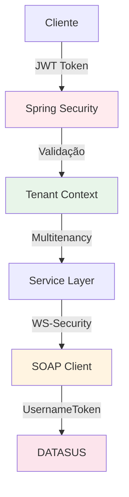
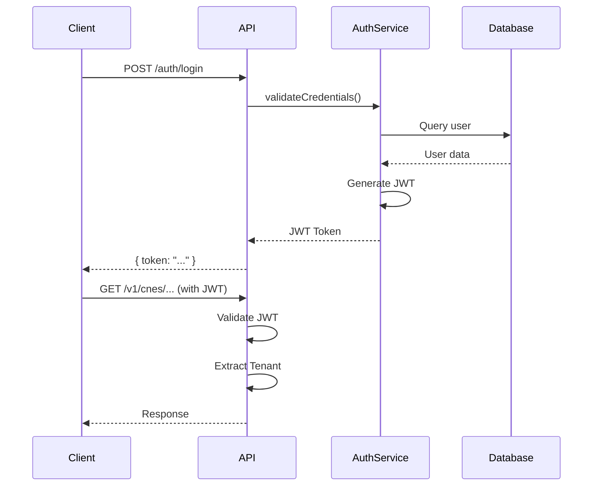
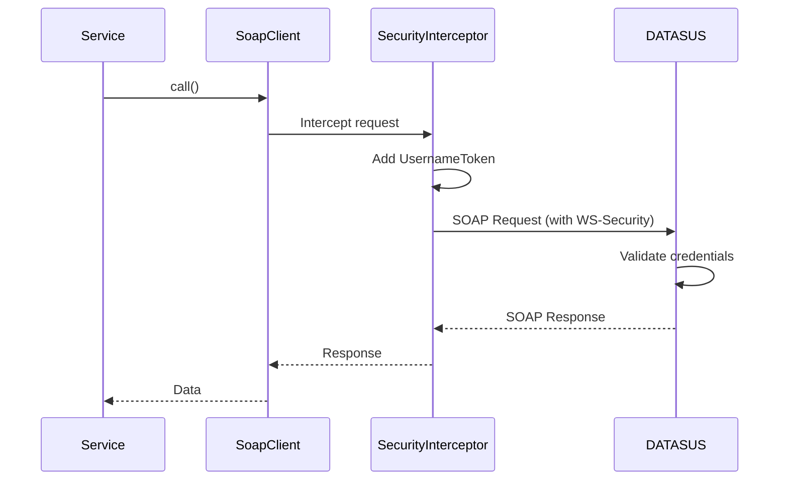
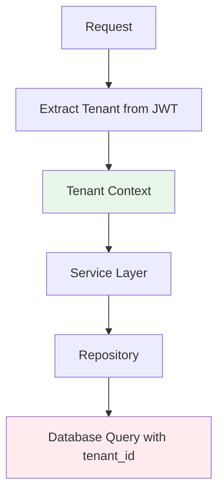
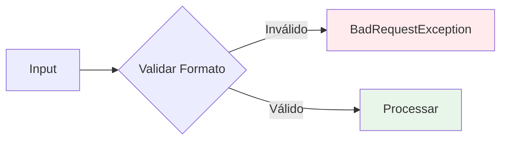
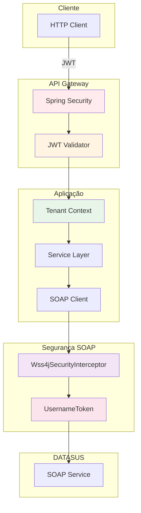

# Segurança e Autenticação - Integração CNES

## 🔐 Visão Geral

A integração CNES utiliza múltiplas camadas de segurança:
1. **REST API**: Autenticação JWT
2. **SOAP Services**: WS-Security UsernameToken
3. **Multitenancy**: Isolamento de dados por tenant

## 🛡️ Camadas de Segurança



## 🔑 Autenticação REST API

### JWT Authentication

A API REST utiliza **JSON Web Tokens (JWT)** para autenticação.

#### Fluxo de Autenticação



### Headers Necessários

```http
Authorization: Bearer <jwt_token>
X-Tenant-Id: <tenant_id> (opcional, extraído do JWT)
```

### Validação de Token

O Spring Security valida automaticamente:
- Assinatura do token
- Expiração
- Claims (tenant, roles, etc.)

## 🔒 WS-Security para SOAP

### Configuração

A autenticação SOAP utiliza **WS-Security UsernameToken Profile**.

#### Wss4jSecurityInterceptor

```java
Wss4jSecurityInterceptor securityInterceptor = new Wss4jSecurityInterceptor();
securityInterceptor.setSecurementActions("UsernameToken");
securityInterceptor.setSecurementUsername("CNES.PUBLICO");
securityInterceptor.setSecurementPassword("cnes#2015public");
securityInterceptor.setSecurementPasswordType("PasswordText");
```

### Estrutura do Token

```xml
<wsse:Security xmlns:wsse="http://docs.oasis-open.org/wss/2004/01/oasis-200401-wss-wssecurity-secext-1.0.xsd">
    <wsse:UsernameToken>
        <wsse:Username>CNES.PUBLICO</wsse:Username>
        <wsse:Password Type="http://docs.oasis-open.org/wss/2004/01/oasis-200401-wss-username-token-profile-1.0#PasswordText">
            cnes#2015public
        </wsse:Password>
    </wsse:UsernameToken>
</wsse:Security>
```

### Fluxo de Autenticação SOAP



## 🏢 Multitenancy

### Isolamento por Tenant

Cada requisição é associada a um tenant, garantindo isolamento de dados.



### Tenant Service

```java
public interface TenantService {
    UUID validarTenantAtual();
    Tenant obterTenantDoUsuarioAutenticado();
}
```

### Filtros de Tenant

Todas as queries incluem filtro por `tenant_id`:

```java
@Query("SELECT s FROM CnesSincronizacao s WHERE s.id = :id AND s.tenant.id = :tenantId")
Optional<CnesSincronizacao> findByIdAndTenant(@Param("id") UUID id, @Param("tenantId") UUID tenantId);
```

## 🔐 Credenciais

### Credenciais Públicas DATASUS

As credenciais são públicas e configuradas em:

```properties
cnes.soap.username=CNES.PUBLICO
cnes.soap.password=cnes#2015public
```

**⚠️ Nota**: Estas são credenciais públicas do DATASUS para acesso aos serviços SOAP.

### Armazenamento Seguro

Para ambientes de produção, considere:
- Usar variáveis de ambiente
- Criptografar com Jasypt
- Usar secrets management (Vault, AWS Secrets Manager, etc.)

## 🛡️ Validação de Entrada

### CnesValidator

Classe utilitária para validação de formatos:

```java
public class CnesValidator {
    public static void validarCnes(String cnes);      // 7 dígitos
    public static void validarCns(String cns);        // 15 dígitos
    public static void validarIne(String ine);        // 15 caracteres alfanuméricos
    public static void validarCompetencia(String competencia); // AAAAMM
}
```

### Validações Aplicadas



## 🔍 Logging e Auditoria

### Logging de Segurança

Operações sensíveis são logadas:

```java
log.info("Sincronização iniciada. CNES: {}, Tenant: {}", codigoCnes, tenantId);
```

### Auditoria

Registros de sincronização incluem:
- Tenant ID
- Usuário que iniciou
- Timestamp
- Status

## 🚨 Tratamento de Erros de Segurança

### Exceções de Autenticação

```java
// JWT inválido ou expirado
401 Unauthorized

// WS-Security falhou
CnesSoapException: "Falha de autenticação SOAP"
```

### Exceções de Autorização

```java
// Acesso negado ao recurso
403 Forbidden

// Tenant não autorizado
403 Forbidden
```

## 📊 Diagrama de Segurança Completo



## 🔄 Renovação de Tokens

### JWT Refresh

Para tokens JWT:
- Implementar endpoint de refresh
- Validar refresh token
- Emitir novo access token

### SOAP Credentials

Credenciais SOAP são estáticas (públicas do DATASUS), não requerem renovação.

## 📝 Checklist de Segurança

- [x] JWT authentication implementado
- [x] WS-Security configurado
- [x] Multitenancy ativo
- [x] Validação de entrada
- [x] Logging de operações
- [x] Tratamento de erros
- [ ] Rate limiting (futuro)
- [ ] Criptografia de dados sensíveis (futuro)
- [ ] Audit log completo (futuro)

## 🚀 Melhorias Futuras

1. **Rate Limiting**: Limitar requisições por tenant
2. **Criptografia**: Criptografar dados sensíveis
3. **Audit Log**: Log completo de todas as operações
4. **IP Whitelisting**: Restringir acesso por IP
5. **2FA**: Autenticação de dois fatores (se necessário)

