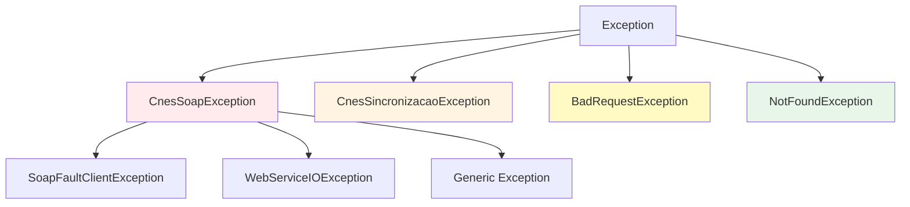
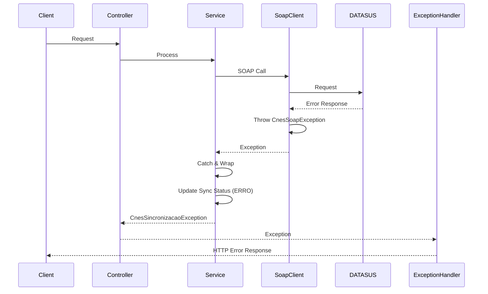
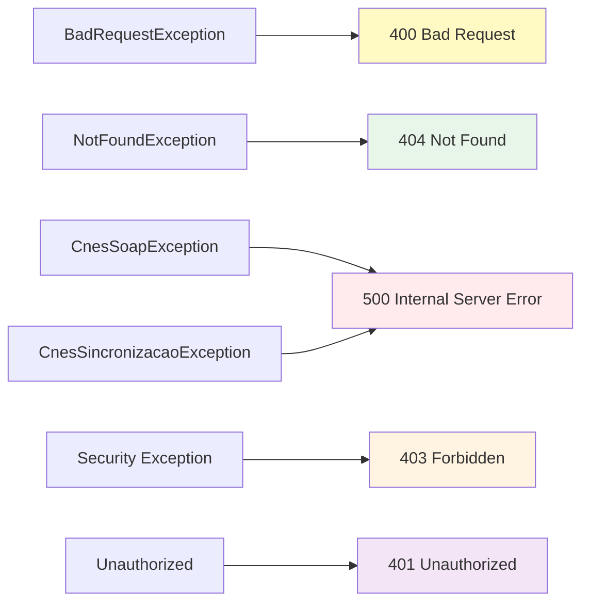
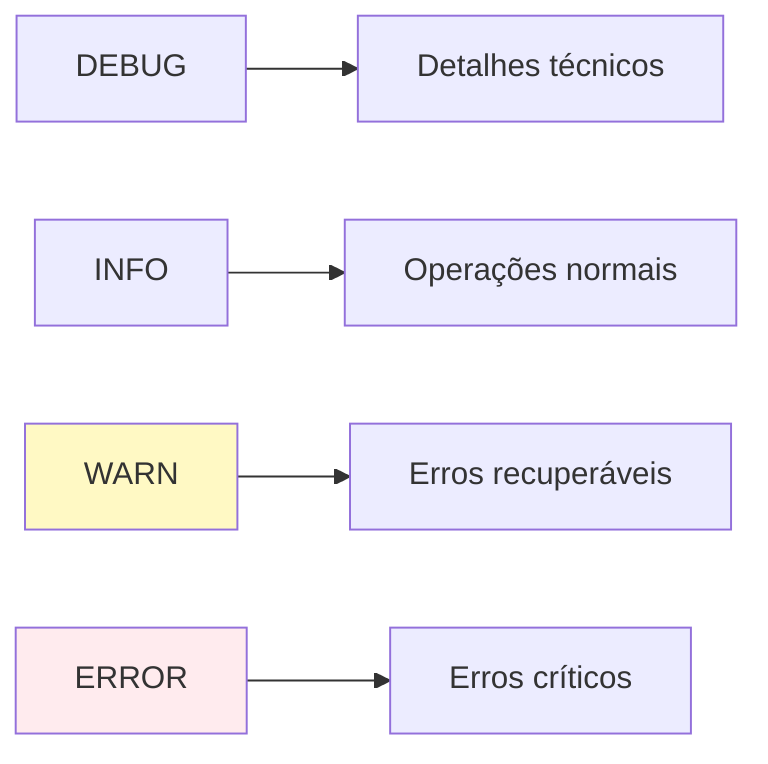

# Tratamento de Erros - Integração CNES

## 🚨 Visão Geral

A integração CNES implementa um sistema robusto de tratamento de erros, cobrindo desde validações de entrada até falhas de comunicação com serviços externos.

## 📊 Hierarquia de Exceções



## 🔴 Tipos de Exceções

### 1. CnesSoapException

**Localização**: `com.upsaude.exception.CnesSoapException`

**Quando ocorre**:
- Falhas na comunicação SOAP
- Erros de autenticação WS-Security
- Timeouts
- Respostas inesperadas

**Exemplo**:
```java
throw new CnesSoapException("Falha ao executar operação CNES " + operacao, e);
```

### 2. CnesSincronizacaoException

**Localização**: `com.upsaude.exception.CnesSincronizacaoException`

**Quando ocorre**:
- Erros durante processo de sincronização
- Dados inválidos do CNES
- Falhas na persistência

**Exemplo**:
```java
throw new CnesSincronizacaoException("Falha ao sincronizar estabelecimento: " + e.getMessage(), e);
```

### 3. BadRequestException

**Localização**: `com.upsaude.exception.BadRequestException`

**Quando ocorre**:
- Validação de entrada falhou
- Formato inválido (CNES, CNS, etc.)
- Parâmetros obrigatórios ausentes

**Exemplo**:
```java
throw new BadRequestException("CNES deve conter exatamente 7 dígitos numéricos");
```

### 4. NotFoundException

**Localização**: `com.upsaude.exception.NotFoundException`

**Quando ocorre**:
- Recurso não encontrado
- Estabelecimento não existe no CNES
- Sincronização não encontrada

**Exemplo**:
```java
throw new NotFoundException("Estabelecimento não encontrado no CNES: " + codigoCnes);
```

## 🔄 Fluxo de Tratamento de Erros



## 🛡️ Tratamento em Camadas

### 1. Camada de Validação

```java
public static void validarCnes(String cnes) {
    if (cnes == null || cnes.isBlank()) {
        throw new BadRequestException("CNES não pode ser vazio");
    }
    if (!CNES_PATTERN.matcher(cnes.trim()).matches()) {
        throw new BadRequestException("CNES deve conter exatamente 7 dígitos numéricos");
    }
}
```

### 2. Camada SOAP Client

```java
protected <T> T call(String endpoint, Object request, Class<T> responseType, String operacao) {
    try {
        Object raw = webServiceTemplate.marshalSendAndReceive(endpoint, request);
        // Processamento...
    } catch (SoapFaultClientException e) {
        log.warn("CNES SOAP fault operacao={} endpoint={} faultCode={} faultString={}",
                operacao, endpoint, e.getFaultCode(), e.getFaultStringOrReason());
        throw new CnesSoapException("Fault SOAP do CNES na operação " + operacao, e);
    } catch (WebServiceIOException e) {
        throw new CnesSoapException("Falha de transporte/timeout no CNES na operação " + operacao, e);
    } catch (Exception e) {
        throw new CnesSoapException("Falha ao executar operação CNES " + operacao, e);
    }
}
```

### 3. Camada de Service

```java
try {
    sincronizacaoService.marcarComoProcessando(registro.getId());
    
    // Processamento...
    
    sincronizacaoService.finalizarComSucesso(registro.getId(), 1, 0);
} catch (CnesSoapException e) {
    log.error("Erro SOAP ao sincronizar estabelecimento CNES: {}", codigoCnes, e);
    sincronizacaoService.finalizarComErro(registro.getId(), 
            "Erro SOAP: " + e.getMessage(), 
            e.toString(), 
            1);
    throw new CnesSincronizacaoException("Falha ao sincronizar estabelecimento: " + e.getMessage(), e);
} catch (Exception e) {
    log.error("Erro inesperado ao sincronizar estabelecimento CNES: {}", codigoCnes, e);
    sincronizacaoService.finalizarComErro(registro.getId(), 
            "Erro inesperado: " + e.getMessage(), 
            e.toString(), 
            1);
    throw new CnesSincronizacaoException("Falha ao sincronizar estabelecimento: " + e.getMessage(), e);
}
```

## 📝 Registro de Erros

### Tabela cnes_sincronizacao

Os erros são registrados na tabela `cnes_sincronizacao`:

```sql
UPDATE cnes_sincronizacao 
SET status = 4, -- ERRO
    data_fim = NOW(),
    mensagem_erro = '...',
    detalhes_erro = '...'::jsonb,
    registros_erro = 1
WHERE id = ...
```

### Estrutura de Detalhes de Erro

```json
{
  "exception": "CnesSoapException",
  "message": "Falha ao executar operação CNES consultarEstabelecimentoPorCnes",
  "cause": "SoapFaultClientException",
  "faultCode": "...",
  "faultString": "...",
  "timestamp": "2025-01-07T10:30:00Z"
}
```

## 🔍 Códigos de Status HTTP

### Mapeamento de Exceções



### Respostas de Erro

#### 400 Bad Request

```json
{
  "timestamp": "2025-01-07T10:30:00Z",
  "status": 400,
  "error": "Bad Request",
  "message": "CNES deve conter exatamente 7 dígitos numéricos. Valor recebido: 123",
  "path": "/api/v1/cnes/estabelecimentos/123/sincronizar"
}
```

#### 404 Not Found

```json
{
  "timestamp": "2025-01-07T10:30:00Z",
  "status": 404,
  "error": "Not Found",
  "message": "Estabelecimento não encontrado no CNES: 2530031",
  "path": "/api/v1/cnes/estabelecimentos/2530031/buscar"
}
```

#### 500 Internal Server Error

```json
{
  "timestamp": "2025-01-07T10:30:00Z",
  "status": 500,
  "error": "Internal Server Error",
  "message": "Falha ao sincronizar estabelecimento: Falha de transporte/timeout no CNES",
  "path": "/api/v1/cnes/estabelecimentos/2530031/sincronizar"
}
```

## 🚨 Cenários de Erro Comuns

### 1. CNES Inválido

**Causa**: Formato incorreto do código CNES

**Tratamento**:
```java
CnesValidator.validarCnes(codigoCnes); // Lança BadRequestException
```

### 2. Timeout SOAP

**Causa**: Serviço DATASUS não respondeu a tempo

**Tratamento**:
```java
catch (WebServiceIOException e) {
    throw new CnesSoapException("Falha de transporte/timeout no CNES", e);
}
```

### 3. Estabelecimento Não Encontrado

**Causa**: CNES não existe no DATASUS

**Tratamento**:
```java
if (resposta == null || dadosGerais == null) {
    throw new NotFoundException("Estabelecimento não encontrado no CNES: " + codigoCnes);
}
```

### 4. Erro de Autenticação SOAP

**Causa**: Credenciais WS-Security inválidas

**Tratamento**:
```java
catch (SoapFaultClientException e) {
    if (e.getFaultCode().contains("Authentication")) {
        throw new CnesSoapException("Falha de autenticação SOAP", e);
    }
}
```

### 5. Dados Inválidos do CNES

**Causa**: Resposta do CNES não contém dados esperados

**Tratamento**:
```java
if (respostaCnes == null || respostaCnes.getResultadoPesquisaEstabelecimentoSaude() == null) {
    throw new CnesSincronizacaoException("Resposta do CNES não contém dados do estabelecimento");
}
```

## 📊 Logging de Erros

### Níveis de Log



### Exemplo de Logging

```java
log.error("Erro ao sincronizar estabelecimento CNES: {}", codigoCnes, e);
log.warn("CNES SOAP fault operacao={} endpoint={} faultCode={}", 
        operacao, endpoint, e.getFaultCode());
log.debug("Detalhes da requisição SOAP: {}", request);
```

## 🔄 Retry Logic

### Implementação Futura

Para erros temporários (timeout, rede), implementar retry:

```java
@Retryable(
    value = {WebServiceIOException.class},
    maxAttempts = 3,
    backoff = @Backoff(delay = 1000, multiplier = 2)
)
public Response consultarEstabelecimentoPorCnes(String codigoCnes) {
    // ...
}
```

## 📋 Checklist de Tratamento de Erros

- [x] Validação de entrada
- [x] Tratamento de exceções SOAP
- [x] Registro de erros no banco
- [x] Logging adequado
- [x] Respostas HTTP apropriadas
- [x] Mensagens de erro claras
- [ ] Retry automático (futuro)
- [ ] Circuit breaker (futuro)
- [ ] Alertas automáticos (futuro)

## 🚀 Melhorias Futuras

1. **Circuit Breaker**: Prevenir chamadas quando serviço está indisponível
2. **Retry com Backoff**: Retry automático para erros temporários
3. **Dead Letter Queue**: Armazenar requisições que falharam permanentemente
4. **Alertas**: Notificações automáticas para erros críticos
5. **Métricas**: Coletar métricas de erros para análise

