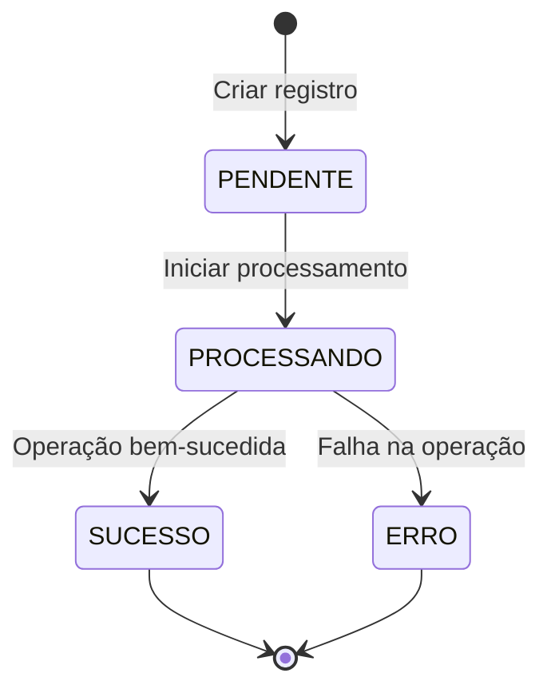

# Endpoints REST - Integração CNES

## 📋 Visão Geral

Esta documentação lista todos os endpoints REST disponíveis na API de integração CNES, com detalhes completos de parâmetros, respostas e exemplos.

## 🗺️ Mapa de Endpoints

```mermaid
graph TB
    A[/v1/cnes] --> B[/estabelecimentos]
    A --> C[/profissionais]
    A --> D[/equipes]
    A --> E[/vinculacoes]
    A --> F[/equipamentos]
    A --> G[/leitos]
    A --> H[/sincronizacoes]
    
    B --> B1[POST /{cnes}/sincronizar]
    B --> B2[POST /municipio/{codigo}/sincronizar]
    B --> B3[POST /{cnes}/dados-complementares]
    B --> B4[GET /{cnes}/buscar]
    
    C --> C1[POST /cns/{cns}/sincronizar]
    C --> C2[POST /cpf/{cpf}/sincronizar]
    C --> C3[GET /cns/{cns}]
    
    D --> D1[POST /estabelecimento/{cnes}/sincronizar]
    D --> D2[POST /estabelecimento/{cnes}/equipe/{ine}/sincronizar]
    
    E --> E1[POST /profissional/{cpfOuCns}/sincronizar]
    E --> E2[POST /estabelecimento/{cnes}/sincronizar]
    
    F --> F1[POST /estabelecimento/{cnes}/sincronizar]
    
    G --> G1[POST /estabelecimento/{cnes}/sincronizar]
    G --> G2[GET /estabelecimento/{cnes}]
    
    H --> H1[GET /]
    H --> H2[GET /{id}]
    H --> H3[GET /historico/estabelecimento/{id}]
    
    style A fill:#e1f5ff
    style B fill:#fff4e1
    style C fill:#e8f5e9
    style H fill:#f3e5f5
```

## 🏥 Estabelecimentos

### POST /v1/cnes/estabelecimentos/{codigoCnes}/sincronizar

Sincroniza um estabelecimento específico do CNES.

**Path Parameters**:
- `codigoCnes` (string, required): Código CNES de 7 dígitos

**Query Parameters**:
- `competencia` (string, optional): Competência no formato AAAAMM

**Request**:
```http
POST /api/v1/cnes/estabelecimentos/2530031/sincronizar?competencia=202501
Authorization: Bearer <token>
```

**Response 200**:
```json
{
  "id": "550e8400-e29b-41d4-a716-446655440000",
  "tipoEntidade": "ESTABELECIMENTO",
  "entidadeId": "660e8400-e29b-41d4-a716-446655440001",
  "codigoIdentificador": "2530031",
  "competencia": "202501",
  "status": "SUCESSO",
  "dataSincronizacao": "2025-01-07T10:30:00Z",
  "dataFim": "2025-01-07T10:30:05Z",
  "registrosInseridos": 1,
  "registrosAtualizados": 0,
  "registrosErro": 0
}
```

### POST /v1/cnes/estabelecimentos/municipio/{codigoMunicipio}/sincronizar

Sincroniza todos os estabelecimentos de um município.

**Path Parameters**:
- `codigoMunicipio` (string, required): Código IBGE do município

**Query Parameters**:
- `competencia` (string, optional): Competência no formato AAAAMM

**Response 200**:
```json
[
  {
    "id": "550e8400-e29b-41d4-a716-446655440000",
    "tipoEntidade": "ESTABELECIMENTO",
    "status": "SUCESSO",
    ...
  },
  ...
]
```

### GET /v1/cnes/estabelecimentos/{codigoCnes}/buscar

Busca um estabelecimento no CNES sem sincronizar.

**Response 200**:
```json
{
  "id": "660e8400-e29b-41d4-a716-446655440001",
  "dadosIdentificacao": {
    "cnes": "2530031",
    "nome": "HOSPITAL GERAL",
    "nomeFantasia": "HOSPITAL GERAL",
    "cnpj": "12345678000190"
  },
  "esferaAdministrativa": "MUNICIPAL",
  "contato": {
    "telefone": "(61) 3333-4444",
    "email": "contato@hospital.com.br"
  },
  "localizacao": {
    "latitude": -15.7942,
    "longitude": -47.8822
  }
}
```

## 👨‍⚕️ Profissionais

### POST /v1/cnes/profissionais/cns/{numeroCns}/sincronizar

Sincroniza um profissional por CNS.

**Path Parameters**:
- `numeroCns` (string, required): Número do CNS (15 dígitos)

**Response 200**:
```json
{
  "id": "770e8400-e29b-41d4-a716-446655440002",
  "tipoEntidade": "PROFISSIONAL",
  "codigoIdentificador": "701009864978597",
  "status": "SUCESSO",
  ...
}
```

### POST /v1/cnes/profissionais/cpf/{numeroCpf}/sincronizar

Sincroniza um profissional por CPF.

**Path Parameters**:
- `numeroCpf` (string, required): Número do CPF

### GET /v1/cnes/profissionais/cns/{numeroCns}

Busca um profissional no CNES por CNS.

## 👥 Equipes

### POST /v1/cnes/equipes/estabelecimento/{codigoCnes}/sincronizar

Sincroniza todas as equipes de um estabelecimento.

**Path Parameters**:
- `codigoCnes` (string, required): Código CNES

### POST /v1/cnes/equipes/estabelecimento/{codigoCnes}/equipe/{ine}/sincronizar

Sincroniza uma equipe específica.

**Path Parameters**:
- `codigoCnes` (string, required): Código CNES
- `ine` (string, required): INE da equipe (15 caracteres)

## 🔗 Vinculações

### POST /v1/cnes/vinculacoes/profissional/{cpfOuCns}/sincronizar

Sincroniza vinculações de um profissional.

**Path Parameters**:
- `cpfOuCns` (string, required): CPF ou CNS do profissional

### POST /v1/cnes/vinculacoes/estabelecimento/{codigoCnes}/sincronizar

Sincroniza vinculações de um estabelecimento.

## 🏥 Equipamentos

### POST /v1/cnes/equipamentos/estabelecimento/{codigoCnes}/sincronizar

Sincroniza equipamentos de um estabelecimento.

## 🛏️ Leitos

### POST /v1/cnes/leitos/estabelecimento/{codigoCnes}/sincronizar

Sincroniza leitos de um estabelecimento.

### GET /v1/cnes/leitos/estabelecimento/{codigoCnes}

Lista leitos de um estabelecimento.

**Response 200**:
```json
[
  {
    "id": "880e8400-e29b-41d4-a716-446655440003",
    "codigoCnesLeito": "LEITO001",
    "numeroLeito": "101",
    "status": "DISPONIVEL",
    "setorUnidade": "UTI",
    ...
  },
  ...
]
```

## 📊 Sincronizações

### GET /v1/cnes/sincronizacoes

Lista sincronizações com filtros.

**Query Parameters**:
- `tipoEntidade` (enum, optional): ESTABELECIMENTO, PROFISSIONAL, EQUIPE, VINCULACAO, EQUIPAMENTO, LEITO
- `status` (enum, optional): PENDENTE, PROCESSANDO, SUCESSO, ERRO
- `dataInicio` (datetime, optional): Data início (ISO 8601)
- `dataFim` (datetime, optional): Data fim (ISO 8601)
- `page` (int, optional): Número da página (padrão: 0)
- `size` (int, optional): Tamanho da página (padrão: 20)
- `sort` (string, optional): Campo para ordenação

**Response 200**:
```json
{
  "content": [
    {
      "id": "550e8400-e29b-41d4-a716-446655440000",
      "tipoEntidade": "ESTABELECIMENTO",
      "status": "SUCESSO",
      ...
    }
  ],
  "pageable": {
    "pageNumber": 0,
    "pageSize": 20
  },
  "totalElements": 100,
  "totalPages": 5
}
```

### GET /v1/cnes/sincronizacoes/{id}

Obtém detalhes de uma sincronização específica.

**Path Parameters**:
- `id` (UUID, required): ID da sincronização

### GET /v1/cnes/sincronizacoes/historico/estabelecimento/{estabelecimentoId}

Consulta histórico de sincronização de estabelecimento.

**Path Parameters**:
- `estabelecimentoId` (UUID, required): ID do estabelecimento

**Query Parameters**:
- `competencia` (string, optional): Competência específica (AAAAMM)

**Response 200**:
```json
[
  {
    "id": "990e8400-e29b-41d4-a716-446655440004",
    "estabelecimentoId": "660e8400-e29b-41d4-a716-446655440001",
    "competencia": "202501",
    "dadosJsonb": "{...}",
    "dataSincronizacao": "2025-01-07T10:30:00Z"
  },
  ...
]
```

## 📊 Resumo de Endpoints

| Método | Endpoint | Descrição |
|--------|----------|-----------|
| POST | `/estabelecimentos/{cnes}/sincronizar` | Sincronizar estabelecimento |
| POST | `/estabelecimentos/municipio/{codigo}/sincronizar` | Sincronizar por município |
| GET | `/estabelecimentos/{cnes}/buscar` | Buscar estabelecimento |
| POST | `/profissionais/cns/{cns}/sincronizar` | Sincronizar profissional por CNS |
| POST | `/profissionais/cpf/{cpf}/sincronizar` | Sincronizar profissional por CPF |
| POST | `/equipes/estabelecimento/{cnes}/sincronizar` | Sincronizar equipes |
| POST | `/equipamentos/estabelecimento/{cnes}/sincronizar` | Sincronizar equipamentos |
| POST | `/leitos/estabelecimento/{cnes}/sincronizar` | Sincronizar leitos |
| GET | `/sincronizacoes` | Listar sincronizações |
| GET | `/sincronizacoes/{id}` | Obter sincronização |
| GET | `/sincronizacoes/historico/estabelecimento/{id}` | Histórico de estabelecimento |

## 🔄 Fluxo de Estados


```mermaid
stateDiagram-v2
    [*] --> PENDENTE: Criar registro
    PENDENTE --> PROCESSANDO: Iniciar processamento
    PROCESSANDO --> SUCESSO: Operação bem-sucedida
    PROCESSANDO --> ERRO: Falha na operação
    SUCESSO --> [*]
    ERRO --> [*]
```

## 📝 Notas Importantes

1. **Autenticação**: Todos os endpoints requerem token JWT válido
2. **Multitenancy**: Dados são isolados por tenant automaticamente
3. **Validação**: Parâmetros são validados antes do processamento
4. **Assíncrono**: Sincronizações podem ser processadas de forma assíncrona (futuro)
5. **Rate Limiting**: Pode ser implementado no futuro

