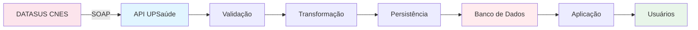
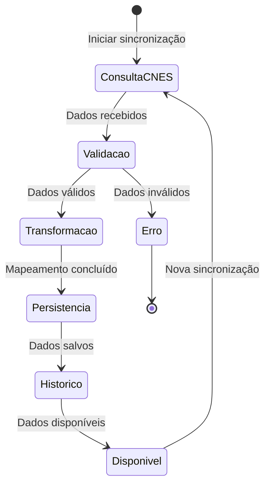
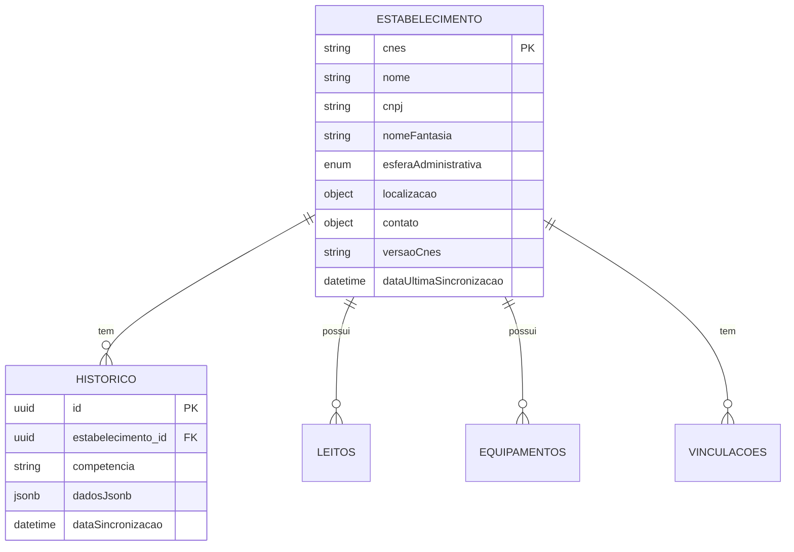

# Visão Geral dos Dados - Integração CNES

## 📊 Introdução

A integração CNES permite sincronizar e gerenciar dados oficiais do **Cadastro Nacional de Estabelecimentos de Saúde** do DATASUS, agregando valor significativo ao negócio através de dados atualizados e confiáveis.

## 🎯 Dados Disponíveis

### 1. Estabelecimentos de Saúde

Dados completos de estabelecimentos de saúde cadastrados no CNES:

- **Identificação**: CNES, nome, CNPJ, nome fantasia
- **Localização**: Endereço, coordenadas geográficas, município
- **Classificação**: Tipo de estabelecimento, esfera administrativa
- **Contato**: Telefones, email
- **Dados Complementares**: Natureza jurídica, gestão, etc.

### 2. Profissionais de Saúde

Informações sobre profissionais vinculados ao CNES:

- **Identificação**: CNS, CPF, nome
- **Formação**: CBO, especialidades
- **Vinculações**: Estabelecimentos onde atua

### 3. Equipes de Saúde

Equipes cadastradas no CNES:

- **Identificação**: INE, nome da equipe
- **Composição**: Profissionais da equipe
- **Área de Atuação**: Território, população atendida

### 4. Equipamentos

Equipamentos disponíveis nos estabelecimentos:

- **Tipo**: Classificação do equipamento
- **Quantidade**: Disponibilidade
- **Localização**: Estabelecimento

### 5. Leitos

Leitos disponíveis nos estabelecimentos:

- **Tipo**: UTI, enfermaria, etc.
- **Status**: Disponível, ocupado, manutenção
- **Localização**: Setor, andar, sala

## 📈 Fluxo de Dados

## 🔄 Ciclo de Vida dos Dados

## 📊 Estrutura de Dados por Entidade

### Estabelecimento

## 💼 Valor Agregado ao Negócio

### 1. Dados Oficiais e Atualizados

- ✅ Fonte oficial do DATASUS
- ✅ Atualização automática via sincronização
- ✅ Rastreabilidade através de histórico

### 2. Integração Completa

- ✅ Múltiplos tipos de dados (estabelecimentos, profissionais, equipes)
- ✅ Relacionamentos entre entidades
- ✅ Dados complementares

### 3. Auditoria e Rastreabilidade

- ✅ Histórico completo de sincronizações
- ✅ Dados originais preservados em JSONB
- ✅ Controle de versões por competência

### 4. Multitenancy

- ✅ Isolamento de dados por tenant
- ✅ Segurança e privacidade
- ✅ Escalabilidade

## 📋 Tipos de Dados

### Identificadores

| Tipo | Formato | Exemplo | Descrição |
|------|---------|---------|-----------|
| CNES | 7 dígitos | `2530031` | Código do estabelecimento |
| CNS | 15 dígitos | `701009864978597` | Cartão Nacional de Saúde |
| INE | 15 caracteres | `000000000000001` | Identificador Nacional de Equipe |
| CPF | 11 dígitos | `12345678901` | CPF do profissional |
| Competência | AAAAMM | `202501` | Ano e mês da competência |

### Enums

#### TipoEntidadeCnesEnum

- `ESTABELECIMENTO` (1)
- `PROFISSIONAL` (2)
- `EQUIPE` (3)
- `VINCULACAO` (4)
- `EQUIPAMENTO` (5)
- `LEITO` (6)

#### StatusSincronizacaoEnum

- `PENDENTE` (1)
- `PROCESSANDO` (2)
- `SUCESSO` (3)
- `ERRO` (4)

#### EsferaAdministrativaEnum

- `FEDERAL` (1)
- `ESTADUAL` (2)
- `MUNICIPAL` (3)
- `PRIVADO` (4)

#### StatusLeitoEnum

- `DISPONIVEL` (1)
- `OCUPADO` (2)
- `MANUTENCAO` (3)
- `INATIVO` (4)

## 🔍 Consultas e Relatórios

### Dados Disponíveis para Consulta

1. **Estabelecimentos**:
   - Por CNES
   - Por município
   - Por esfera administrativa
   - Por tipo

2. **Sincronizações**:
   - Por tipo de entidade
   - Por status
   - Por período
   - Por estabelecimento

3. **Histórico**:
   - Por estabelecimento
   - Por competência
   - Evolução temporal

## 📊 Métricas e Indicadores

### Dados Disponíveis

- Total de estabelecimentos sincronizados
- Taxa de sucesso de sincronizações
- Tempo médio de sincronização
- Última atualização por estabelecimento
- Distribuição por esfera administrativa
- Distribuição por tipo de estabelecimento

## 🎯 Casos de Uso de Negócio

### 1. Cadastro de Estabelecimentos

- Preencher automaticamente dados do CNES
- Validar informações
- Manter dados atualizados

### 2. Gestão de Profissionais

- Verificar vinculações profissionais
- Validar CNS/CPF
- Consultar especialidades

### 3. Planejamento de Recursos

- Consultar disponibilidade de leitos
- Verificar equipamentos disponíveis
- Mapear cobertura de equipes

### 4. Relatórios e Análises

- Relatórios de estabelecimentos por região
- Análise de cobertura de saúde
- Indicadores de infraestrutura

## 🔄 Sincronização e Atualização

### Frequência Recomendada

- **Estabelecimentos**: Mensal ou quando necessário
- **Profissionais**: Conforme necessidade
- **Equipes**: Mensal
- **Leitos**: Diária ou semanal
- **Equipamentos**: Trimestral

### Competência

A competência (AAAAMM) permite:
- Rastrear versões dos dados
- Manter histórico
- Comparar evoluções temporais

## 📝 Próximos Passos

- Veja [Estrutura de Tabelas](./02-estrutura-tabelas.md) para detalhes do banco
- Consulte [Tipos de Dados e Enums](./03-tipos-dados-enums.md) para referência completa
- Leia [Valor Agregado ao Negócio](./04-valor-agregado.md) para benefícios detalhados

