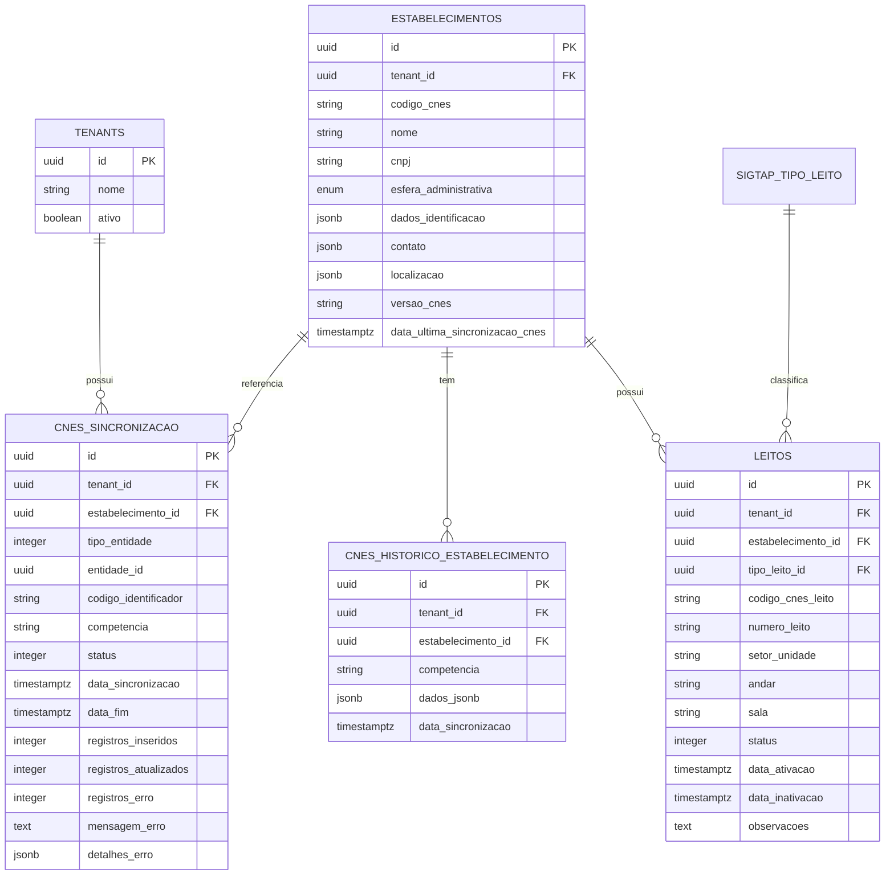
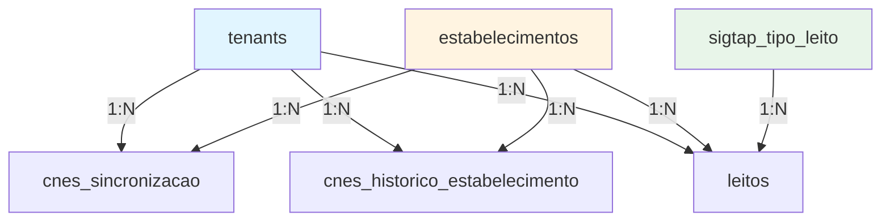

# Estrutura de Tabelas - Integração CNES

## 📊 Visão Geral

A integração CNES utiliza três tabelas principais no banco de dados PostgreSQL para armazenar dados de sincronização, histórico e leitos.

## 🗄️ Diagrama de Entidade-Relacionamento



## 📋 Tabela: cnes_sincronizacao

### Descrição

Tabela de controle de sincronizações CNES. Registra todas as operações de sincronização realizadas.

### Estrutura

| Coluna | Tipo | Descrição |
|--------|------|-----------|
| `id` | UUID | Chave primária |
| `criado_em` | TIMESTAMPTZ | Data de criação |
| `atualizado_em` | TIMESTAMPTZ | Data de atualização |
| `ativo` | BOOLEAN | Status ativo/inativo |
| `tenant_id` | UUID | ID do tenant (FK) |
| `tipo_entidade` | INTEGER | Tipo: 1=ESTABELECIMENTO, 2=PROFISSIONAL, etc. |
| `entidade_id` | UUID | ID da entidade sincronizada |
| `codigo_identificador` | VARCHAR(50) | CNES, CNS, INE, etc. |
| `competencia` | VARCHAR(6) | Competência no formato AAAAMM |
| `status` | INTEGER | 1=PENDENTE, 2=PROCESSANDO, 3=SUCESSO, 4=ERRO |
| `data_sincronizacao` | TIMESTAMPTZ | Data de início da sincronização |
| `data_fim` | TIMESTAMPTZ | Data de conclusão |
| `registros_inseridos` | INTEGER | Quantidade de registros inseridos |
| `registros_atualizados` | INTEGER | Quantidade de registros atualizados |
| `registros_erro` | INTEGER | Quantidade de registros com erro |
| `mensagem_erro` | TEXT | Mensagem de erro (se houver) |
| `detalhes_erro` | JSONB | Detalhes do erro em JSON |
| `estabelecimento_id` | UUID | ID do estabelecimento relacionado (FK) |

### Índices

- `idx_cnes_sincronizacao_tipo_entidade`: Por tipo de entidade
- `idx_cnes_sincronizacao_entidade_id`: Por ID da entidade
- `idx_cnes_sincronizacao_status`: Por status
- `idx_cnes_sincronizacao_data_sincronizacao`: Por data
- `idx_cnes_sincronizacao_codigo_identificador`: Por código identificador
- `idx_cnes_sincronizacao_estabelecimento`: Por estabelecimento
- `idx_cnes_sincronizacao_tenant_tipo_status`: Composto (tenant, tipo, status)

### Exemplo de Dados

```sql
INSERT INTO cnes_sincronizacao (
    id, tenant_id, tipo_entidade, codigo_identificador,
    competencia, status, data_sincronizacao, registros_inseridos
) VALUES (
    '550e8400-e29b-41d4-a716-446655440000',
    '660e8400-e29b-41d4-a716-446655440001',
    1, -- ESTABELECIMENTO
    '2530031',
    '202501',
    3, -- SUCESSO
    NOW(),
    1
);
```

## 📋 Tabela: cnes_historico_estabelecimento

### Descrição

Armazena histórico de sincronizações de estabelecimentos por competência. Mantém os dados completos retornados pelo CNES em formato JSONB.

### Estrutura

| Coluna | Tipo | Descrição |
|--------|------|-----------|
| `id` | UUID | Chave primária |
| `criado_em` | TIMESTAMPTZ | Data de criação |
| `atualizado_em` | TIMESTAMPTZ | Data de atualização |
| `ativo` | BOOLEAN | Status ativo/inativo |
| `tenant_id` | UUID | ID do tenant (FK) |
| `estabelecimento_id` | UUID | ID do estabelecimento (FK) |
| `competencia` | VARCHAR(6) | Competência no formato AAAAMM |
| `dados_jsonb` | JSONB | Dados completos da resposta CNES |
| `data_sincronizacao` | TIMESTAMPTZ | Data da sincronização |

### Constraints

- **Unique**: `(estabelecimento_id, competencia)` - Um histórico por competência por estabelecimento

### Índices

- `idx_cnes_historico_estabelecimento_id`: Por estabelecimento
- `idx_cnes_historico_competencia`: Por competência
- `idx_cnes_historico_data_sincronizacao`: Por data
- `idx_cnes_historico_tenant_estabelecimento`: Composto (tenant, estabelecimento)

### Exemplo de Dados

```sql
INSERT INTO cnes_historico_estabelecimento (
    id, tenant_id, estabelecimento_id, competencia,
    dados_jsonb, data_sincronizacao
) VALUES (
    '770e8400-e29b-41d4-a716-446655440002',
    '660e8400-e29b-41d4-a716-446655440001',
    '880e8400-e29b-41d4-a716-446655440003',
    '202501',
    '{"resultadoPesquisaEstabelecimentoSaude": {...}}'::jsonb,
    NOW()
);
```

## 📋 Tabela: leitos

### Descrição

Armazena informações sobre leitos de estabelecimentos sincronizados do CNES.

### Estrutura

| Coluna | Tipo | Descrição |
|--------|------|-----------|
| `id` | UUID | Chave primária |
| `criado_em` | TIMESTAMPTZ | Data de criação |
| `atualizado_em` | TIMESTAMPTZ | Data de atualização |
| `ativo` | BOOLEAN | Status ativo/inativo |
| `tenant_id` | UUID | ID do tenant (FK) |
| `estabelecimento_id` | UUID | ID do estabelecimento (FK) |
| `codigo_cnes_leito` | VARCHAR(50) | Código oficial CNES do leito |
| `numero_leito` | VARCHAR(50) | Número interno do leito |
| `tipo_leito_id` | UUID | ID do tipo de leito (FK para sigtap_tipo_leito) |
| `setor_unidade` | VARCHAR(255) | Setor/unidade do leito |
| `andar` | VARCHAR(50) | Andar |
| `sala` | VARCHAR(50) | Sala |
| `status` | INTEGER | 1=DISPONIVEL, 2=OCUPADO, 3=MANUTENCAO, 4=INATIVO |
| `data_ativacao` | TIMESTAMPTZ | Data de ativação |
| `data_inativacao` | TIMESTAMPTZ | Data de inativação (se aplicável) |
| `observacoes` | TEXT | Observações sobre o leito |

### Índices

- `idx_leitos_codigo_cnes`: Por código CNES
- `idx_leitos_estabelecimento`: Por estabelecimento
- `idx_leitos_status`: Por status
- `idx_leitos_tenant_estabelecimento`: Composto (tenant, estabelecimento)
- `idx_leitos_estabelecimento_status`: Composto (estabelecimento, status)

## 🔗 Relacionamentos

### Diagrama de Relacionamentos



## 📊 Consultas Úteis

### Consultar Sincronizações por Status

```sql
SELECT 
    tipo_entidade,
    status,
    COUNT(*) as total,
    SUM(registros_inseridos) as total_inseridos,
    SUM(registros_atualizados) as total_atualizados
FROM cnes_sincronizacao
WHERE tenant_id = :tenantId
GROUP BY tipo_entidade, status;
```

### Consultar Histórico de Estabelecimento

```sql
SELECT 
    competencia,
    data_sincronizacao,
    dados_jsonb->'resultadoPesquisaEstabelecimentoSaude'->'estabelecimentoSaude'->>'nomeFantasia' as nome
FROM cnes_historico_estabelecimento
WHERE estabelecimento_id = :estabelecimentoId
  AND tenant_id = :tenantId
ORDER BY competencia DESC;
```

### Consultar Leitos Disponíveis

```sql
SELECT 
    l.numero_leito,
    l.setor_unidade,
    l.status,
    e.dados_identificacao->>'nome' as estabelecimento
FROM leitos l
JOIN estabelecimentos e ON l.estabelecimento_id = e.id
WHERE l.tenant_id = :tenantId
  AND l.status = 1 -- DISPONIVEL
ORDER BY e.dados_identificacao->>'nome', l.setor_unidade;
```

## 🔄 Migrations

### Flyway Migration

A estrutura das tabelas é criada através da migration Flyway:

**Arquivo**: `V045__criar_tabelas_cnes.sql`

**Comando para aplicar**:
```bash
# Executado automaticamente na inicialização da aplicação
# Ou manualmente:
mvn flyway:migrate
```

## 📝 Boas Práticas

1. **Índices**: Utilize os índices criados para otimizar consultas
2. **Multitenancy**: Sempre inclua `tenant_id` nas queries
3. **JSONB**: Use operadores JSONB para consultar dados históricos
4. **Competência**: Use competência para rastrear versões dos dados
5. **Soft Delete**: Use campo `ativo` para exclusão lógica

## 🚀 Próximos Passos

- Veja [Tipos de Dados e Enums](./03-tipos-dados-enums.md) para referência completa
- Consulte [Fluxos de Sincronização](./05-fluxos-sincronizacao.md) para entender o processo
- Leia [Relatórios e Consultas](./06-relatorios-consultas.md) para exemplos práticos

