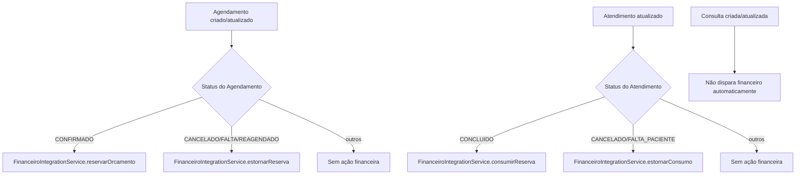
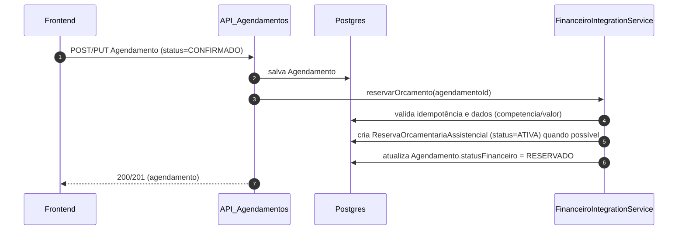
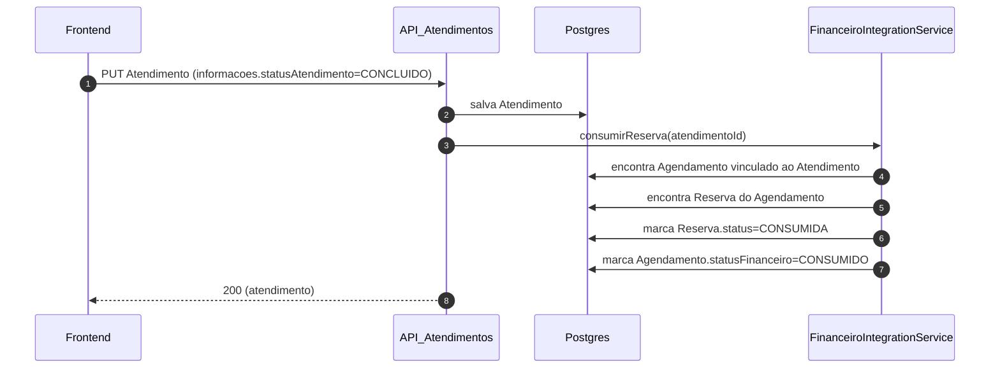
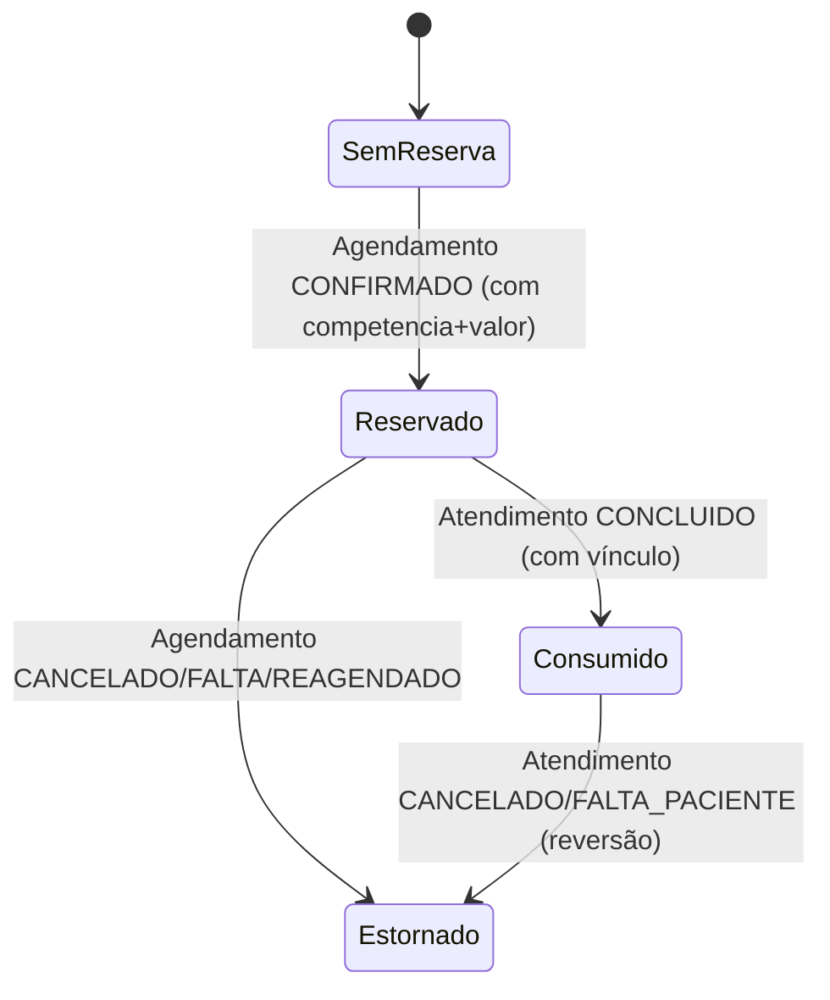

# FINANCEIRO — Como funciona no Agendamento, Atendimento e Consulta (automático vs manual)

Este documento responde à pergunta prática:

> “Quando tem um agendamento e uma consulta, como é feito o financeiro? É automático ou precisa chamar endpoint e enviar CID10/SIGTAP?”

## Visão executiva (resumo)

- **Agendamento (CONFIRMADO)**: o backend **tenta reservar orçamento automaticamente**.
- **Agendamento (CANCELADO/FALTA/REAGENDADO)**: o backend **tenta estornar/liberar automaticamente**.
- **Atendimento (CONCLUIDO)**: o backend **tenta consumir automaticamente** a reserva do **agendamento vinculado**.
- **Atendimento (CANCELADO/FALTA_PACIENTE)**: o backend **tenta estornar automaticamente** (via agendamento vinculado).
- **Consulta**: no modelo atual, **não dispara financeiro automaticamente**.
- **CID10 / SIGTAP**: **não são necessários** para reserva/consumo/estorno orçamentário do fluxo assistencial (modelo atual). Esses dados são relevantes para **faturamento/produção/análises**, não para o gatilho da reserva.

## O que dispara automaticamente (gatilhos)

### Gatilhos do Agendamento

- `status = CONFIRMADO` → chama internamente **reservar orçamento**
- `status ∈ {CANCELADO, FALTA, REAGENDADO}` → chama internamente **estornar reserva**

### Gatilhos do Atendimento

- `informacoes.statusAtendimento = CONCLUIDO` → chama internamente **consumir reserva**
- `informacoes.statusAtendimento ∈ {CANCELADO, FALTA_PACIENTE}` → chama internamente **estornar consumo**

### Consulta (atenção)

O fluxo de **Consulta** (`Consulta`) possui criador/atualizador próprio e, no momento, **não chama** a integração financeira.

> Implicação: se o seu produto usa Consulta como “fim do fluxo” e não atualiza o Atendimento para `CONCLUIDO`, o consumo da reserva pode não acontecer.

## Fluxograma (alto nível)

## Sequência (como o back faz por baixo)

### 1) Reserva automática no Agendamento

### 2) Consumo automático no Atendimento

## Quais dados são necessários (e quais não são)

### Para reservar automaticamente

O backend só cria a reserva se o Agendamento tiver:

- `competenciaFinanceira` **preenchida**; e
- `valorEstimadoTotal > 0`.

Se faltar competência ou valor, o backend **não quebra a operação**: ele registra log e **não reserva**.

### CID10 / SIGTAP são obrigatórios?

Para o fluxo **orçamentário** (reserva/consumo/estorno) atual:

- **Não**: você não precisa enviar CID10 nem SIGTAP para disparar reserva/consumo.

Eles são importantes para:

- **Faturamento** / BPA / guias;
- **Produção SIA (ETL/analytics)**;
- auditoria de procedimento/diagnóstico.

## “Preciso chamar endpoint do financeiro?”

### Regra prática

- **Não** no dia a dia, se você fizer as transições de status corretas no Assistencial.
- **Sim** apenas para **correções operacionais** e **reprocessamento**.

### Endpoints de operações explícitas (quando usar)

Use quando:

- o agendamento foi confirmado sem competência/valor e você corrigiu depois;
- houve falha operacional e precisa reprocessar;
- quer forçar consumo/estorno para alinhar histórico;
- quer fechar competência (quando for implementado por completo).

Endpoints:

- Reservar: `POST /api/v1/financeiro/operacoes/agendamentos/{agendamentoId}/reservar`
- Estornar reserva: `POST /api/v1/financeiro/operacoes/agendamentos/{agendamentoId}/estornar` com `{ "motivo": "..." }`
- Consumir: `POST /api/v1/financeiro/operacoes/atendimentos/{atendimentoId}/consumir`
- Estornar consumo: `POST /api/v1/financeiro/operacoes/atendimentos/{atendimentoId}/estornar` com `{ "motivo": "..." }`

## Estado (status) recomendável para UI/UX

### Agendamento: status assistencial vs status financeiro

O front deve tratar `statusFinanceiro` como “source of truth” para exibição:

- `RESERVADO`
- `CONSUMIDO`
- `ESTORNADO`
- `SEM_RESERVA` (quando aplicável)

## Checklist de troubleshooting (para o front)

### “Não reservou quando confirmou”

- Agendamento está **CONFIRMADO**?
- `competenciaFinanceira` está preenchida?
- `valorEstimadoTotal > 0`?
- O usuário autenticado tem `UsuariosSistema` e tenant válido?
- Se precisou confirmar antes de definir competência/valor: usar operação explícita de **reservar** ou re-confirmar o status (conforme regra do produto).

### “Não consumiu quando concluiu”

- O Atendimento foi realmente atualizado para `CONCLUIDO`?
- Existe **vínculo** do Atendimento com o Agendamento (modelo híbrido)?
- Existe uma reserva `ATIVA` para aquele agendamento?

