# Processamento assíncrono de importações (Import Jobs)

Este documento descreve **como funciona** (visão técnica e não-técnica) o pipeline de importação de arquivos grandes (SIA-PA, SIGTAP, CID10) usando:

- Upload via API (Multipart)
- Armazenamento no **Supabase Storage**
- Enfileiramento via **tabela `public.import_job`**
- Processamento em **background** (Scheduler + Executor dedicado)
- Acompanhamento de progresso pelo frontend via polling

---

## Visão não-técnica (para operação/usuário)

- **Você envia um arquivo** (ou, no SIGTAP, o arquivo + layout).
- O sistema **salva o arquivo no Storage** e cria um **job**.
- O job entra numa **fila** e será processado **em segundo plano**.
- Você acompanha a evolução (linhas lidas, inseridas, erros) até finalizar.
- Se ocorrer falha, o job fica com status **ERRO**, e é possível ver detalhes.

---

## Visão técnica (arquitetura)

### Componentes principais

- **Controllers (upload)**:
  - SIA: `POST /api/v1/sia/import/upload`
  - SIGTAP: `POST /api/v1/sigtap/import/upload` (**requer `file` + `layoutFile`**)
  - CID10: `POST /api/v1/cid10/import/upload`
  - Comportamento: validação leve + upload para storage + criação de job + retorna **202 Accepted**

- **Storage**
  - Serviço: `SupabaseStorageService`
  - Upload streaming (sem carregar arquivo inteiro em memória)

- **Fila (DB)**
  - Tabela: `public.import_job`
  - Estados principais: `ENFILEIRADO`, `PROCESSANDO`, `CONCLUIDO`, `ERRO`
  - Controle de concorrência: global e por tenant (`import.job.max-concurrent-global`, `import.job.max-concurrent-per-tenant`)

- **Scheduler**
  - Classe: `ImportJobScheduler`
  - Estratégia: `SELECT ... FOR UPDATE SKIP LOCKED` para pegar jobs sem disputa
  - Heartbeat: detecta jobs travados e re-enfileira com backoff

- **Workers**
  - SIA-PA: `SiaPaImportJobWorker`
  - SIGTAP: `SigtapImportJobWorker`
  - CID10: `Cid10ImportJobWorker`
  - Processamento: stream -> parse -> batch -> transação curta -> checkpoint/progresso

---

## Fluxos (Mermaid)

### 1) Upload e criação do job

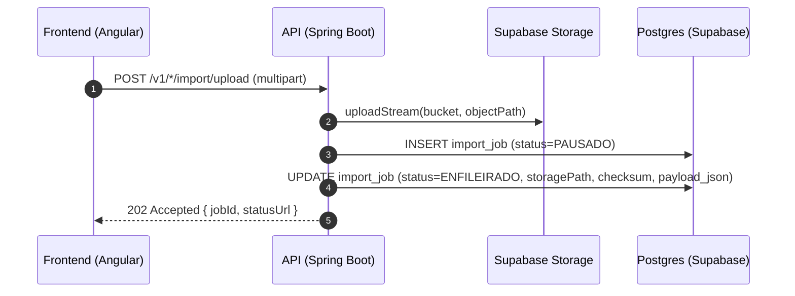

### 2) Scheduler e execução em background

```mermaid
flowchart TD
  A[Scheduler (ImportJobScheduler)] -->|FOR UPDATE SKIP LOCKED| B[Seleciona jobs ENFILEIRADO]
  B --> C{Limite global/per-tenant ok?}
  C -- Não --> A
  C -- Sim --> D[Marca job PROCESSANDO + locked_by + started_at]
  D --> E[Submit no Executor dedicado (importJobExecutor)]
  E --> F[ImportJobProcessor]
  F --> G[Worker (SIA/SIGTAP/CID10)]
```

### 3) Worker (stream + batch + checkpoint)

```mermaid
flowchart TD
  A[Worker] --> B[downloadStream(Storage)]
  B --> C[BufferedReader: linha a linha]
  C --> D[Parse + validação]
  D --> E[Acumula batch (N linhas)]
  E --> F[Transação curta: saveAll + flush/clear]
  F --> G[Atualiza progresso + checkpoint + heartbeat]
  G --> C
  C -->|EOF| H[Finaliza job: CONCLUIDO/ERRO]
```

### 4) Acompanhamento pelo frontend (polling)

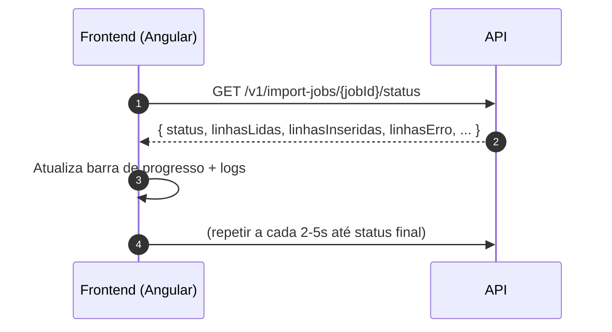

---

## Endpoints (contrato para o frontend)

### Upload (retorna 202)

- **SIA-PA**
  - `POST /api/v1/sia/import/upload`
  - form-data:
    - `file`: CSV
    - `competenciaAno`: `YYYY`
    - `competenciaMes`: `MM`
    - `uf`: `MG`, `SP`, etc.

- **SIGTAP** (arquivo + layout)
  - `POST /api/v1/sigtap/import/upload`
  - form-data:
    - `file`: `tb_*.txt` (dados)
    - `layoutFile`: `tb_*_layout.txt` (layout)
    - `competencia`: `AAAAMM`

- **CID10**
  - `POST /api/v1/cid10/import/upload`
  - form-data:
    - `file`: CSV (ex: `CID-10-CATEGORIAS.CSV`)
    - `competencia`: `AAAAMM`

### Status e erros (polling)

- `GET /api/v1/import-jobs/{jobId}/status`
- `GET /api/v1/import-jobs/{jobId}/errors?page=0&size=50`
- `GET /api/v1/import-jobs/{jobId}/errors/count-by-code`

---

## Recomendação de UX no Angular

- **Upload**:
  - Enviar multipart e, ao receber `202 + jobId`, navegar para uma tela de progresso.

- **Polling**:
  - Intervalo recomendado: **2s–5s**
  - Parar polling quando status ∈ {`CONCLUIDO`, `ERRO`, `CANCELADO`}

- **Experiência**:
  - Mostrar `linhasInseridas`, `linhasErro` e `durationMs`
  - Link/aba para listar erros paginados do job

---

## Observações importantes

- Os endpoints legados síncronos (`/import/{...}`) foram marcados como **deprecated** e retornam **410** para impedir processamento pesado no ciclo HTTP.
- O SIGTAP exige layout; o job armazena o `layoutPath` em `import_job.payload_json`.
- O processamento é feito em batches com transações curtas para respeitar limites do pool de conexões (Supabase).

# Sistema de Importação de Arquivos - Jobs Assíncronos

## 📋 Índice

1. [Visão Geral (Não Técnica)](#visão-geral-não-técnica)
2. [Arquitetura Técnica](#arquitetura-técnica)
3. [Fluxos Principais](#fluxos-principais)
4. [Como Usar a API](#como-usar-a-api)
5. [Estados e Status dos Jobs](#estados-e-status-dos-jobs)
6. [Processamento e Checkpoint](#processamento-e-checkpoint)
7. [Tratamento de Erros](#tratamento-de-erros)
8. [Configurações](#configurações)

---

## 🎯 Visão Geral (Não Técnica)

### O que é este sistema?

Este sistema permite fazer upload de arquivos CSV grandes (milhões de linhas) e processá-los de forma assíncrona, sem travar a interface do usuário.

### Como funciona?

Imagine que você precisa importar um arquivo gigante de dados de saúde:

1. **Você faz upload do arquivo** → O sistema recebe o arquivo e salva no armazenamento (Supabase Storage)
2. **Você recebe uma resposta imediata** → "Arquivo recebido! ID do job: xyz123"
3. **O sistema processa em segundo plano** → Enquanto isso, você pode fazer outras coisas
4. **Você acompanha o progresso** → Consulta o status periodicamente (ex: "Processando... 45% concluído")
5. **Você recebe o resultado** → "Processamento concluído! 1.234.567 registros importados"

### Por que é importante?

- **Não trava a interface**: Você não precisa esperar horas com a tela congelada
- **Pode processar arquivos gigantes**: Milhões de linhas são processadas em lotes pequenos
- **Confiança**: Se algo der errado, o sistema tenta novamente automaticamente
- **Rastreabilidade**: Você sempre sabe o que está acontecendo e pode ver erros específicos

---

## 🏗️ Arquitetura Técnica

### Componentes Principais

```
┌─────────────────┐
│  Frontend       │
│  (Angular)      │
└────────┬────────┘
         │ HTTP/REST
         ▼
┌─────────────────────────────────────┐
│  Spring Boot API                    │
│  ┌───────────────────────────────┐  │
│  │  Upload Controller            │  │
│  │  - Recebe arquivo (Multipart) │  │
│  │  - Salva no Storage           │  │
│  │  - Cria job ENFILEIRADO       │  │
│  │  - Retorna 202 Accepted       │  │
│  └───────────────────────────────┘  │
│  ┌───────────────────────────────┐  │
│  │  Query Controller             │  │
│  │  - GET /import-jobs/{id}      │  │
│  │  - GET /import-jobs/{id}/status│ │
│  │  - GET /import-jobs/{id}/erros│  │
│  └───────────────────────────────┘  │
│  ┌───────────────────────────────┐  │
│  │  Scheduler (@Scheduled)       │  │
│  │  - Verifica fila a cada 5s    │  │
│  │  - Pega jobs pendentes        │  │
│  │  - Respeita limites           │  │
│  └───────────────────────────────┘  │
│  ┌───────────────────────────────┐  │
│  │  Executor Dedicado            │  │
│  │  - Thread pool isolado        │  │
│  │  - Não usa threads do Tomcat  │  │
│  └───────────────────────────────┘  │
│  ┌───────────────────────────────┐  │
│  │  Worker de Processamento      │  │
│  │  - Lê arquivo via stream      │  │
│  │  - Processa linha a linha     │  │
│  │  - Salva em batches           │  │
│  │  - Atualiza progresso         │  │
│  └───────────────────────────────┘  │
└─────────┬───────────────────────────┘
          │
          ├──────────────────┬──────────────────┐
          ▼                  ▼                  ▼
┌─────────────────┐  ┌──────────────┐  ┌─────────────────┐
│  Supabase       │  │  PostgreSQL  │  │  PostgreSQL     │
│  Storage        │  │  (Jobs)      │  │  (Dados)        │
│  - Arquivos     │  │  - Fila      │  │  - SIA_PA       │
│                 │  │  - Status    │  │  - SIGTAP       │
│                 │  │  - Progresso │  │  - CID10        │
└─────────────────┘  └──────────────┘  └─────────────────┘
```

### Fluxo de Dados Completo

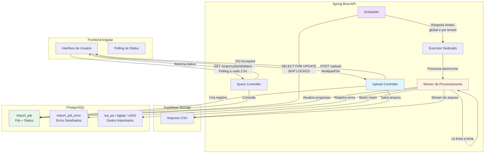

---

## 🔄 Fluxos Principais

### 1. Fluxo de Upload de Arquivo

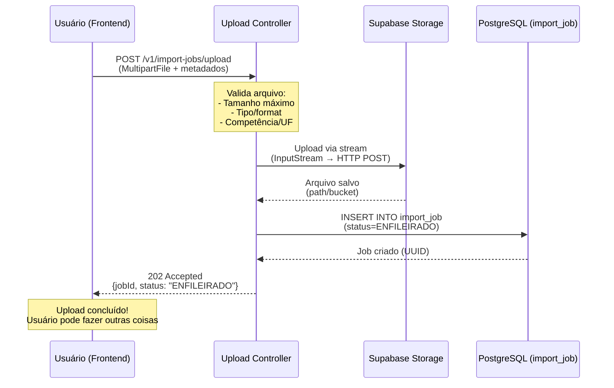

### 2. Fluxo de Processamento (Scheduler + Worker)

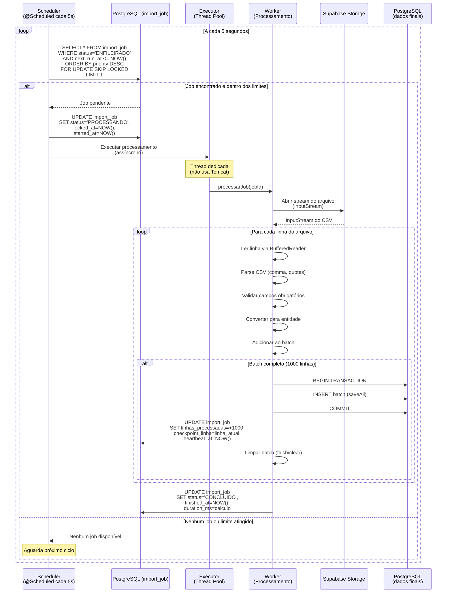

### 3. Fluxo de Acompanhamento pelo Frontend

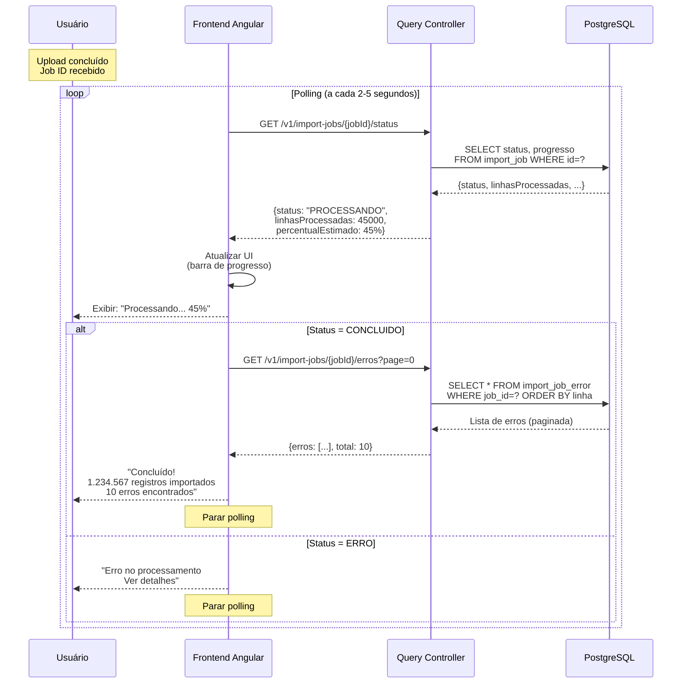

### 4. Fluxo de Estados do Job

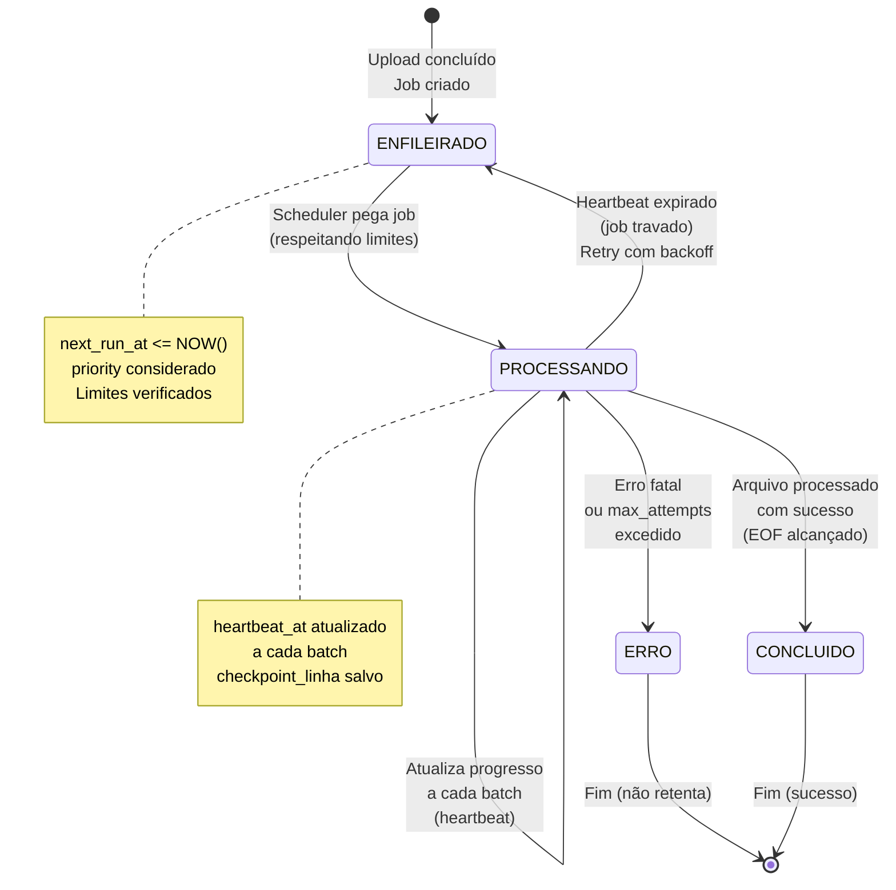

### 5. Fluxo de Recuperação (Checkpoint)

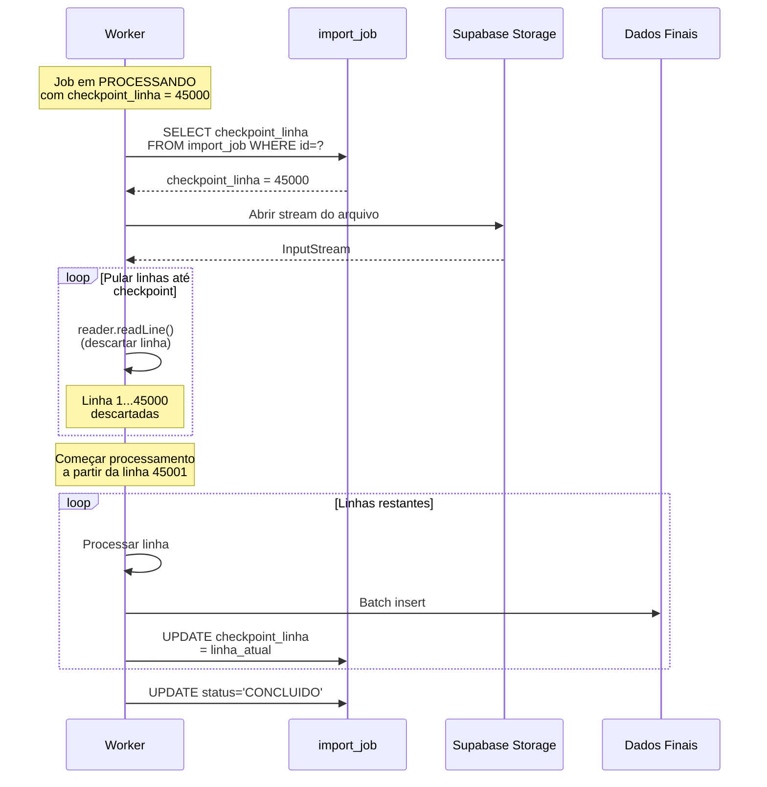

### 6. Fluxo de Controle de Concorrência

```mermaid
graph TB
    subgraph Scheduler[Scheduler - Ciclo de Verificação]
        Check[Verificar fila]
        CountGlobal[Contar jobs PROCESSANDO<br/>globalmente]
        CheckLimits{Global < max<br/>concurrent?}
        CountTenant[Agrupar por tenant<br/>contar PROCESSANDO por tenant}
        CheckTenantLimits{Tenant < max<br/>per tenant?}
        PickJob[SELECT FOR UPDATE<br/>SKIP LOCKED<br/>ORDER BY priority]
        Execute[Enviar para Executor]
    end
    
    Check --> CountGlobal
    CountGlobal --> CheckLimits
    CheckLimits -->|Sim| CountTenant
    CheckLimits -->|Não| Wait[Aguardar próximo ciclo]
    CountTenant --> CheckTenantLimits
    CheckTenantLimits -->|Sim| PickJob
    CheckTenantLimits -->|Não| Wait
    PickJob -->|Job encontrado| Execute
    PickJob -->|Nenhum job| Wait
    Execute --> Wait
    Wait --> Check
    
    style CheckLimits fill:#fff4e1
    style CheckTenantLimits fill:#fff4e1
    style PickJob fill:#e1f5ff
```

---

## 📡 Como Usar a API

### 1. Upload de Arquivo

**Endpoint:** `POST /v1/import-jobs/upload`

**Request:**
```http
POST /api/v1/import-jobs/upload
Content-Type: multipart/form-data

{
  "file": <arquivo.csv>,
  "tipo": "SIA_PA",
  "competenciaAno": "2025",
  "competenciaMes": "01",
  "uf": "MG"
}
```

**Response (202 Accepted):**
```json
{
  "jobId": "550e8400-e29b-41d4-a716-446655440000",
  "status": "ENFILEIRADO",
  "mensagem": "Upload concluído. Processamento iniciará em breve.",
  "originalFilename": "PAMG2501a.csv",
  "sizeBytes": 104857600,
  "statusUrl": "/api/v1/import-jobs/550e8400-e29b-41d4-a716-446655440000/status",
  "errosUrl": "/api/v1/import-jobs/550e8400-e29b-41d4-a716-446655440000/erros"
}
```

### 2. Consultar Status (Polling)

**Endpoint:** `GET /v1/import-jobs/{jobId}/status`

**Response:**
```json
{
  "id": "550e8400-e29b-41d4-a716-446655440000",
  "status": "PROCESSANDO",
  "linhasLidas": 45000,
  "linhasProcessadas": 45000,
  "linhasInseridas": 44950,
  "linhasErro": 50,
  "percentualEstimado": 45.0,
  "startedAt": "2025-01-15T10:30:00Z",
  "finishedAt": null,
  "durationMs": null,
  "errorSummary": null,
  "totalErros": 50
}
```

**Estados possíveis:**
- `ENFILEIRADO`: Aguardando processamento
- `PROCESSANDO`: Em processamento
- `CONCLUIDO`: Processamento concluído com sucesso
- `ERRO`: Processamento falhou
- `CANCELADO`: Cancelado pelo usuário
- `PAUSADO`: Pausado (futuro)

### 3. Listar Jobs

**Endpoint:** `GET /v1/import-jobs?page=0&size=20&sortBy=createdAt&sortDir=DESC`

**Response:**
```json
{
  "content": [
    {
      "id": "...",
      "tipo": "SIA_PA",
      "status": "CONCLUIDO",
      "originalFilename": "PAMG2501a.csv",
      "linhasProcessadas": 100000,
      "createdAt": "2025-01-15T10:00:00Z",
      ...
    }
  ],
  "totalElements": 15,
  "totalPages": 1,
  "number": 0,
  "size": 20
}
```

### 4. Listar Erros de um Job

**Endpoint:** `GET /v1/import-jobs/{jobId}/erros?page=0&size=50`

**Response:**
```json
{
  "content": [
    {
      "id": "...",
      "linha": 123,
      "codigoErro": "VALIDATION_ERROR",
      "mensagem": "Campo obrigatório ausente: PA_PROC_ID",
      "rawLinePreview": "MG,2501,1234567,..."
    }
  ],
  "totalElements": 50,
  "totalPages": 5
}
```

---

## 📊 Estados e Status dos Jobs

### Diagrama de Estados Detalhado

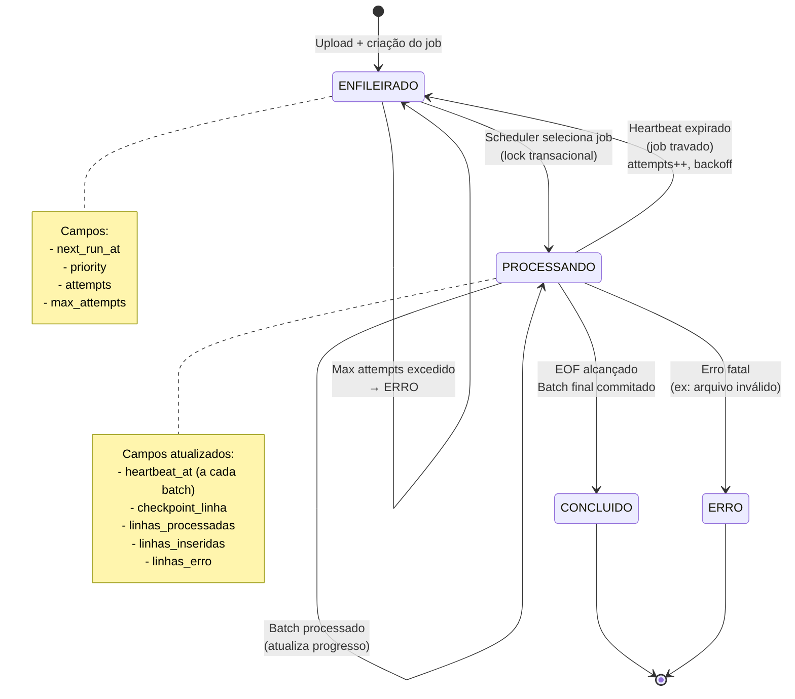

### Campos de Progresso

| Campo | Descrição | Quando é atualizado |
|-------|-----------|---------------------|
| `linhasLidas` | Total de linhas lidas do arquivo | A cada linha |
| `linhasProcessadas` | Linhas que passaram pela validação | Após validação |
| `linhasInseridas` | Linhas inseridas no banco com sucesso | Após commit do batch |
| `linhasErro` | Linhas com erro | Quando erro é registrado |
| `percentualEstimado` | Porcentagem estimada (se calculável) | A cada atualização |
| `checkpointLinha` | Última linha processada com sucesso | A cada batch commitado |
| `heartbeatAt` | Última atualização (detecta jobs travados) | A cada batch |

---

## ⚙️ Processamento e Checkpoint

### Estratégia de Processamento em Batches

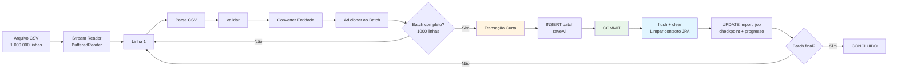

### Transações Curtas vs Longas

**❌ ERRADO (Transação Longa):**
```java
@Transactional(timeout = 7200) // 2 horas - PROBLEMA!
public void processarArquivo() {
    // Processa milhões de linhas em UMA transação
    // Conexão ocupada por horas
    // Risco de timeout, deadlock, pool esgotado
}
```

**✅ CORRETO (Transações Curtas):**
```java
// Sem @Transactional no método principal
public void processarArquivo() {
    for (Batch batch : batches) {
        processarBatch(batch); // Transação curta por batch
    }
}

@Transactional // Transação curta (segundos)
private void processarBatch(Batch batch) {
    repository.saveAll(batch);
    // COMMIT imediato
    // Conexão liberada
}
```

### Checkpoint e Recuperação

**Como funciona:**

1. **Durante processamento:** A cada batch commitado, salva `checkpoint_linha = linha_atual`
2. **Em caso de falha:** Job volta para `ENFILEIRADO` com `attempts++`
3. **Ao retomar:** Worker lê `checkpoint_linha` e pula linhas até chegar no ponto de retomada
4. **Vantagem:** Não precisa reprocessar linhas já importadas

**Exemplo:**

```
Job inicia: checkpoint_linha = 0
Processa linhas 1-1000: checkpoint_linha = 1000 ✅
Processa linhas 1001-2000: checkpoint_linha = 2000 ✅
CRASH! (servidor caiu)

Job reinicia: checkpoint_linha = 2000
Pula linhas 1-2000 (já processadas)
Continua da linha 2001 ✅
```

---

## 🚨 Tratamento de Erros

### Tipos de Erros

1. **Erros de Linha (não bloqueiam):**
   - Campo obrigatório ausente
   - Formato inválido
   - Valor fora do esperado
   - **Ação:** Registra em `import_job_error`, continua processamento

2. **Erros de Batch (bloqueiam batch atual):**
   - Erro de validação JPA
   - Constraint violation
   - **Ação:** Rollback do batch, registra erro, continua próximo batch

3. **Erros Fatais (bloqueiam job):**
   - Arquivo não encontrado
   - Erro de conexão com Storage
   - Erro de conexão com banco
   - **Ação:** Marca job como `ERRO`, não retenta

### Fluxo de Erro e Retry

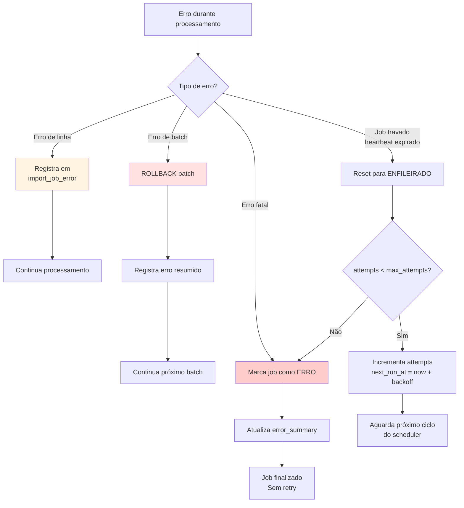

---

## 🔧 Configurações

### application.properties

```properties
# ============================================
# Upload de Arquivos
# ============================================
spring.servlet.multipart.max-file-size=500MB
spring.servlet.multipart.max-request-size=500MB
spring.servlet.multipart.file-size-threshold=1MB
server.tomcat.max-swallow-size=-1
server.tomcat.connection-timeout=60000

# ============================================
# Jobs de Importação
# ============================================
# Concorrência global (número máximo de jobs processando simultaneamente)
import.job.max-concurrent-global=1

# Concorrência por tenant
import.job.max-concurrent-per-tenant=1

# Intervalo do scheduler (segundos)
import.job.scheduler-interval-seconds=5

# Timeout de heartbeat (segundos) - jobs sem heartbeat por mais tempo são considerados travados
import.job.heartbeat-timeout-seconds=300

# Prioridades padrão por tipo (maior número = maior prioridade)
import.job.priority.sia-pa=100
import.job.priority.sigtap=50
import.job.priority.cid10=10

# Tamanho de batch para processamento (linhas por batch)
import.job.batch-size=1000

# Intervalo para atualizar progresso (número de batches entre atualizações)
import.job.progress-update-interval-batches=10
```

### Dockerfile (Heap de Memória)

```dockerfile
ENTRYPOINT ["java", "-Xms256m", "-Xmx1g", "-XX:+UseG1GC", "-XX:MaxGCPauseMillis=200", "-jar", "app.jar"]
```

**Explicação:**
- `-Xms256m`: Heap inicial de 256MB
- `-Xmx1g`: Heap máximo de 1GB (ajustar conforme recursos)
- `-XX:+UseG1GC`: Garbage Collector G1 (melhor para server-side)
- `-XX:MaxGCPauseMillis=200`: Tenta manter pausas do GC abaixo de 200ms

---

## 📈 Métricas e Observabilidade

### Métricas Expostas (Actuator)

- `import.jobs.status.{status}.count`: Contagem de jobs por status
- `import.jobs.processing.throughput`: Linhas processadas por segundo
- `import.jobs.processing.duration`: Duração média de processamento
- `import.jobs.errors.count`: Total de erros registrados
- `import.jobs.queue.wait-time`: Tempo médio de espera na fila

### Logs Estruturados

```
INFO  - Job iniciado: jobId=xxx, tipo=SIA_PA, tenant=yyy
INFO  - Batch processado: jobId=xxx, batch=5, linhas=5000, tempo=1234ms
WARN  - Erros no batch: jobId=xxx, batch=5, erros=3
INFO  - Progresso atualizado: jobId=xxx, linhasProcessadas=50000, percentual=50%
INFO  - Job concluído: jobId=xxx, linhasInseridas=100000, duracao=3600000ms
ERROR - Erro fatal: jobId=xxx, erro=Arquivo não encontrado
```

---

## 🎓 Conceitos Técnicos Importantes

### Por que usar fila no banco?

- ✅ **Auditoria completa:** Histórico de todos os jobs
- ✅ **Rastreabilidade:** Sempre sabe quem iniciou, quando, status atual
- ✅ **Sem dependência externa:** Não precisa de Redis/RabbitMQ
- ✅ **Transacional:** Lock `FOR UPDATE SKIP LOCKED` evita duplicidade
- ✅ **Query flexível:** Fácil filtrar por tenant, tipo, status

### Por que transações curtas?

- ✅ **Pool de conexões limitado:** Conexões ficam ocupadas por segundos, não horas
- ✅ **Evita timeouts:** `max-lifetime` de conexões não é ultrapassado
- ✅ **Melhor performance:** Menos lock time no banco
- ✅ **Resiliente:** Falha em um batch não invalida os anteriores

### Por que executor dedicado?

- ✅ **Isolamento:** Não compete com threads do Tomcat (servidor web)
- ✅ **Controle:** Tamanho do pool configurável
- ✅ **Priorização:** Fila própria para jobs pesados
- ✅ **Backpressure:** Rejeita novos jobs se fila cheia

### Por que checkpoint?

- ✅ **Recuperação:** Retoma de onde parou após falha
- ✅ **Eficiência:** Não reprocessa linhas já importadas
- ✅ **Confiabilidade:** Jobs longos não são perdidos completamente

---

## 📝 Resumo Executivo

### Fluxo Simplificado

```
1. Upload → Storage → Job criado → 202 Accepted
2. Scheduler verifica fila (a cada 5s)
3. Worker processa: stream → parse → batch → insert → checkpoint
4. Frontend faz polling de status
5. Job concluído: usuário recebe resultado
```

### Características Principais

- ✅ **Assíncrono:** Upload retorna imediatamente
- ✅ **Escalável:** Processa milhões de linhas em batches
- ✅ **Resiliente:** Checkpoint + retry automático
- ✅ **Rastreável:** Status, progresso e erros detalhados
- ✅ **Isolado:** Não impacta performance da API
- ✅ **Multi-tenant:** Limites e isolamento por tenant

---

**Última atualização:** Janeiro 2025
**Versão:** 1.0

