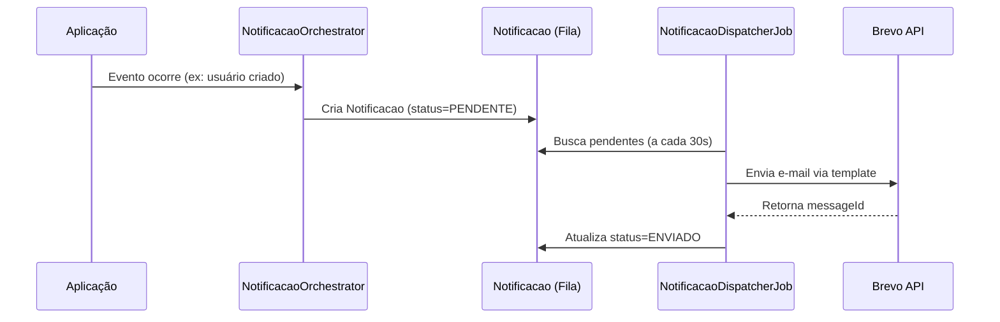

# Módulo de Notificações — UPSaúde (Documentação Completa)

Esta documentação cobre o **módulo de Notificações por E-mail via Brevo** com foco em:

- **Visão Geral**: conceito, arquitetura e objetivos do módulo
- **Negócio**: regras de negócio, casos de uso e eventos disparados
- **Técnico**: arquitetura técnica, modelo de dados e integrações
- **Configuração**: passo a passo completo de configuração
- **Templates**: guia de criação e uso de templates no Brevo
- **Endpoints**: catálogo completo de endpoints REST
- **Exemplos**: exemplos práticos de uso e integração
- **Integração Frontend**: guia para integração no frontend

## 📋 Índice

1. [Visão Geral](#visão-geral)
2. [Estrutura da Documentação](#estrutura-da-documentação)
3. [Início Rápido](#início-rápido)
4. [Leitura Recomendada](#leitura-recomendada)

---

## Visão Geral

O módulo de **Notificações por E-mail** permite enviar e-mails transacionais automaticamente quando eventos importantes ocorrem no sistema. A integração utiliza o **Brevo (anteriormente Sendinblue)** como provedor de e-mail transacional, oferecendo alta taxa de entrega, rastreamento e templates personalizados.

### Características Principais

- ✅ **Automático**: Dispara e-mails automaticamente em eventos do sistema
- ✅ **Manual**: Permite envio manual via API
- ✅ **Templates**: Suporte a templates do Brevo com variáveis dinâmicas
- ✅ **Fila de Envio**: Sistema de fila com retry automático e backoff exponencial
- ✅ **Auditoria**: Registro completo de todas as notificações enviadas
- ✅ **Multitenancy**: Isolamento completo por tenant
- ✅ **Configurável**: Controle por estabelecimento (ligar/desligar tipos de notificação)
- ✅ **Extensível**: Preparado para expansão futura (WhatsApp, SMS)

### Eventos Suportados

1. **Criação de Novo Usuário** - Bem-vindo ao sistema
2. **Confirmação de Alteração de Senha** - Notificação de segurança
3. **Atualização de Dados Pessoais** - Confirmação de alterações
4. **Confirmação de Agendamento** - Agendamento confirmado
5. **Cancelamento de Agendamento** - Agendamento cancelado
6. **Lembrete de Agendamento (24h antes)** - Lembrete automático
7. **Lembrete de Agendamento (1h antes)** - Lembrete automático

---

## Estrutura da Documentação

```
docs/NOTIFICACOES/
├── README.md                    # Este arquivo (visão geral)
├── TECNICO.md                  # Arquitetura técnica e modelo de dados
├── NEGOCIO.md                  # Regras de negócio e casos de uso
├── CONFIGURACAO.md             # Passo a passo de configuração
├── TEMPLATES.md                # Guia de templates do Brevo
├── ENDPOINTS.md                # Catálogo completo de endpoints REST
├── EXEMPLOS.md                 # Exemplos práticos de uso
└── INTEGRACAO_FRONT.md         # Guia para integração frontend
```

---

## Início Rápido

### 1. Configuração Inicial

```bash
# 1. Configure a variável de ambiente
export BREVO_API_KEY="SUA_CHAVE_API_BREVO_AQUI"

# 2. Execute a migration
psql -U postgres -d upsaude -f migrations/add_brevo_template_id_to_templates_notificacao.sql

# 3. Reinicie a aplicação
```

### 2. Criar Template no Brevo

1. Acesse https://app.brevo.com
2. Vá em **Transactional** > **Templates**
3. Crie um template para "Usuário Criado"
4. Anote o ID do template (ex: 123)
5. Cadastre no sistema via API (veja [TEMPLATES.md](./TEMPLATES.md))

### 3. Verificar Funcionamento

```bash
# Criar um usuário (dispara notificação automaticamente)
curl -X POST "http://localhost:8080/api/v1/usuarios-sistema" \
  -H "Authorization: Bearer <TOKEN>" \
  -H "Content-Type: application/json" \
  -d '{
    "email": "usuario@exemplo.com",
    "senha": "Senha@123",
    "dadosIdentificacao": {
      "username": "usuario"
    }
  }'

# Verificar notificação criada
curl -X GET "http://localhost:8080/api/v1/notificacoes?tipoNotificacao=USUARIO_CRIADO" \
  -H "Authorization: Bearer <TOKEN>"
```

---

## Leitura Recomendada

1. **Configuração**: [CONFIGURACAO.md](./CONFIGURACAO.md) - Configure o sistema passo a passo
2. **Templates**: [TEMPLATES.md](./TEMPLATES.md) - Crie e configure templates no Brevo
3. **Técnico**: [TECNICO.md](./TECNICO.md) - Entenda a arquitetura e modelo de dados
4. **Negócio**: [NEGOCIO.md](./NEGOCIO.md) - Conheça as regras de negócio e eventos
5. **Endpoints**: [ENDPOINTS.md](./ENDPOINTS.md) - Explore todos os endpoints disponíveis
6. **Exemplos**: [EXEMPLOS.md](./EXEMPLOS.md) - Veja exemplos práticos de integração
7. **Frontend**: [INTEGRACAO_FRONT.md](./INTEGRACAO_FRONT.md) - Integre no frontend

---

## Pré-requisitos

- **Base URL**: `http://localhost:8080/api` (ou conforme configuração)
- **Autenticação**: `Authorization: Bearer <TOKEN>`
- **Tenant**: Resolvido automaticamente via usuário autenticado
- **Brevo Account**: Conta ativa no Brevo (https://app.brevo.com)
- **API Key**: Chave API do Brevo configurada

---

## Fluxo de Funcionamento



---

## Status do Módulo

✅ **Implementado e Funcional**

- Integração com Brevo API
- Disparo automático de notificações
- Sistema de fila com retry
- Templates do Brevo
- Auditoria completa
- Multitenancy
- Configuração por estabelecimento

🚧 **Em Desenvolvimento**

- Integração WhatsApp (estrutura preparada)
- Dashboard de métricas de envio
- Webhooks do Brevo para status de entrega

---

## Suporte

Para dúvidas ou problemas, consulte:

- [CONFIGURACAO.md](./CONFIGURACAO.md) - Problemas de configuração
- [TECNICO.md](./TECNICO.md) - Troubleshooting técnico
- [NEGOCIO.md](./NEGOCIO.md) - Regras de negócio e validações
- [EXEMPLOS.md](./EXEMPLOS.md) - Exemplos práticos

---

## Segurança

⚠️ **IMPORTANTE**: A chave API do Brevo é sensível e deve ser:

- Armazenada em variável de ambiente (`BREVO_API_KEY`)
- Nunca commitada no repositório
- Rotacionada periodicamente
- Acessível apenas para serviços autorizados

---

## Próximos Passos

1. Configure o sistema seguindo [CONFIGURACAO.md](./CONFIGURACAO.md)
2. Crie templates no Brevo conforme [TEMPLATES.md](./TEMPLATES.md)
3. Teste os eventos conforme [EXEMPLOS.md](./EXEMPLOS.md)
4. Integre no frontend seguindo [INTEGRACAO_FRONT.md](./INTEGRACAO_FRONT.md)
