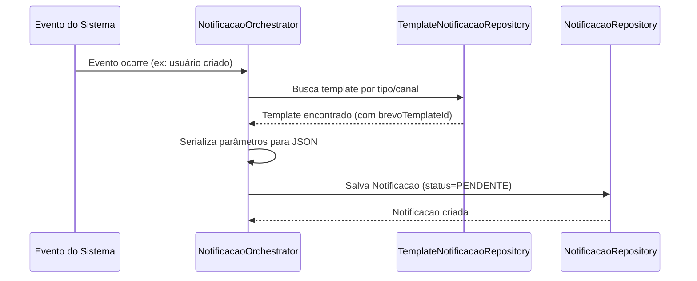
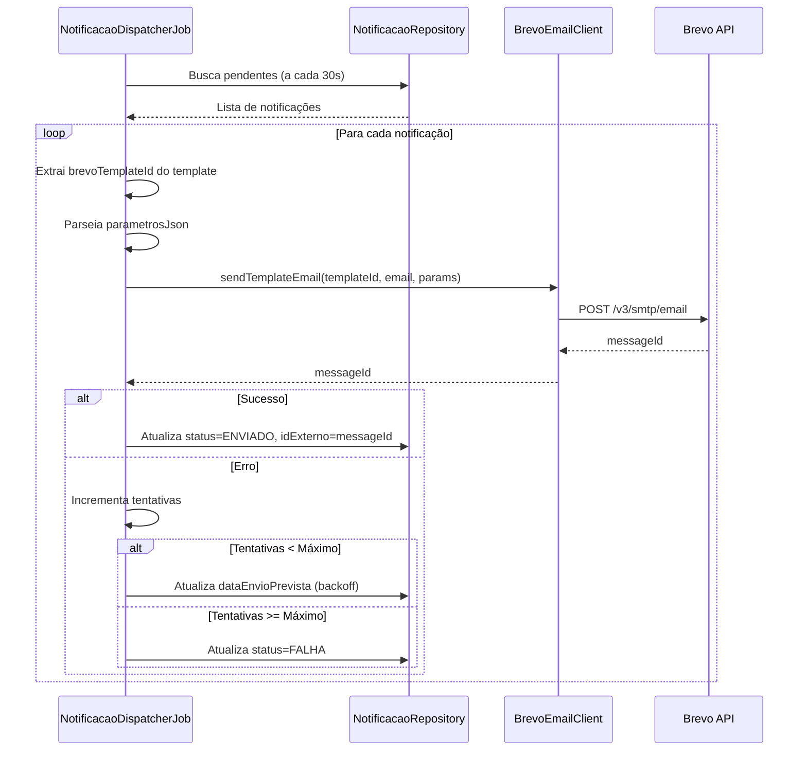
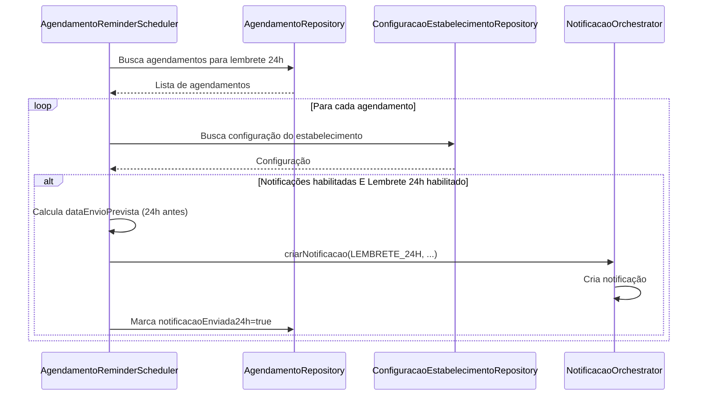

# Documentação Técnica — Módulo de Notificações Brevo

## Arquitetura

### Visão Geral

O módulo de notificações utiliza uma arquitetura em camadas com sistema de fila assíncrona:

```
┌─────────────────────────────────────────────────────────────┐
│                    Domain Services                           │
│  (UsuariosSistemaService, PacienteService, AgendamentoService)│
└──────────────────────┬──────────────────────────────────────┘
                       │
┌──────────────────────▼──────────────────────────────────────┐
│              NotificacaoOrchestrator                        │
│         (Cria notificações nos eventos)                    │
└──────────────────────┬──────────────────────────────────────┘
                       │
┌──────────────────────▼──────────────────────────────────────┐
│              Notificacao (Fila/Queue)                       │
│         (status=PENDENTE, dataEnvioPrevista)                │
└──────────────────────┬──────────────────────────────────────┘
                       │
        ┌──────────────┼──────────────┐
        │              │              │
┌───────▼──────┐ ┌───▼──────┐ ┌─────▼──────────┐
│  Dispatcher  │ │ Scheduler│ │   Brevo API    │
│     Job      │ │  Lembretes│ │   (E-mail)     │
└──────┬───────┘ └───────────┘ └────────────────┘
       │
┌──────▼──────────────────────────────────────┐
│      PostgreSQL (Auditoria)                   │
│   (Notificacao: status, tentativas, logs)     │
└───────────────────────────────────────────────┘
```

### Componentes Principais

#### 1. BrevoEmailClient

**Localização:** `com.upsaude.integration.brevo.BrevoEmailClient`

**Responsabilidade:** Cliente HTTP para comunicação com API do Brevo.

**Métodos principais:**

```java
// Enviar e-mail usando template do Brevo
String sendTemplateEmail(
    Integer templateId,
    String toEmail,
    String toName,
    Map<String, Object> params,
    SenderType senderType
)

// Enviar e-mail com conteúdo direto (sem template)
String sendEmail(
    String toEmail,
    String toName,
    String subject,
    String htmlContent,
    String textContent,
    SenderType senderType
)
```

**Configuração:**

```java
@Configuration
@ConfigurationProperties(prefix = "brevo")
public class BrevoConfig {
    private Boolean enabled;
    private String apiKey;
    private String baseUrl;
    private Sender sender; // Remetentes configurados
}
```

#### 2. NotificacaoOrchestrator

**Localização:** `com.upsaude.service.sistema.notificacao.NotificacaoOrchestrator`

**Responsabilidade:** Criar notificações nos pontos de eventos do sistema.

**Métodos principais:**

```java
// Criar notificação genérica
Notificacao criarNotificacao(
    TipoNotificacaoEnum tipoNotificacao,
    CanalNotificacaoEnum canal,
    String destinatarioEmail,
    String destinatarioNome,
    String assunto,
    String mensagem,
    UUID pacienteId,
    UUID profissionalId,
    UUID agendamentoId,
    UUID estabelecimentoId,
    OffsetDateTime dataEnvioPrevista,
    Map<String, Object> parametros
)

// Métodos específicos por evento
void notificarUsuarioCriado(UsuariosSistema usuario, String email, String nome)
void notificarSenhaAlterada(String email, String nome)
void notificarDadosPessoaisAtualizados(String email, String nome, UUID pacienteId, UUID estabelecimentoId)
void notificarAgendamentoConfirmado(Agendamento agendamento)
void notificarAgendamentoCancelado(Agendamento agendamento)
void agendarLembretesAgendamento(Agendamento agendamento)
```

#### 3. NotificacaoDispatcherJob

**Localização:** `com.upsaude.service.impl.job.NotificacaoDispatcherJob`

**Responsabilidade:** Processar notificações pendentes e enviar via Brevo.

**Execução:** A cada 30 segundos (configurável)

**Fluxo:**

1. Busca notificações com `status=PENDENTE` e `dataEnvioPrevista <= agora`
2. Para cada notificação:
   - Busca template associado
   - Extrai `brevoTemplateId`
   - Parseia parâmetros JSON
   - Envia via `BrevoEmailClient`
   - Atualiza status para `ENVIADO` ou trata erro

**Retry Strategy:**

- Tentativa 1: Imediata
- Tentativa 2: +5 minutos
- Tentativa 3: +15 minutos
- Tentativa 4+: +1 hora
- Máximo: 3 tentativas (configurável)

#### 4. AgendamentoReminderScheduler

**Localização:** `com.upsaude.service.impl.job.AgendamentoReminderScheduler`

**Responsabilidade:** Criar notificações de lembretes (24h e 1h antes).

**Execução:** A cada 15 minutos (configurável)

**Fluxo:**

1. Busca agendamentos confirmados
2. Para lembrete 24h:
   - Agendamentos entre 23h e 25h no futuro
   - Flag `notificacaoEnviada24h = false`
3. Para lembrete 1h:
   - Agendamentos entre 55min e 2h no futuro
   - Flag `notificacaoEnviada1h = false`
4. Verifica configuração do estabelecimento
5. Cria notificação com `dataEnvioPrevista` calculada
6. Marca flag para evitar duplicidade

---

## Modelo de Dados

### Tabela: `notificacoes`

```sql
CREATE TABLE notificacoes (
    id UUID PRIMARY KEY,
    tenant_id UUID NOT NULL,
    estabelecimento_id UUID,
    paciente_id UUID,
    profissional_id UUID,
    agendamento_id UUID,
    template_id UUID,
    
    tipo_notificacao INTEGER NOT NULL,
    canal INTEGER NOT NULL,
    destinatario VARCHAR(255) NOT NULL,
    assunto VARCHAR(500),
    mensagem TEXT NOT NULL,
    
    status_envio VARCHAR(50) NOT NULL, -- PENDENTE, ENVIADO, FALHA
    data_envio_prevista TIMESTAMPTZ,
    data_envio TIMESTAMPTZ,
    data_leitura TIMESTAMPTZ,
    
    tentativas_envio INTEGER DEFAULT 0,
    maximo_tentativas INTEGER DEFAULT 3,
    erro_envio TEXT,
    log_envio TEXT,
    id_externo VARCHAR(255), -- messageId do Brevo
    
    parametros_json TEXT, -- JSON com variáveis para template
    
    enviado_por UUID,
    criado_em TIMESTAMPTZ NOT NULL,
    atualizado_em TIMESTAMPTZ,
    ativo BOOLEAN DEFAULT true,
    
    FOREIGN KEY (tenant_id) REFERENCES tenants(id),
    FOREIGN KEY (template_id) REFERENCES templates_notificacao(id)
);
```

**Índices:**

```sql
CREATE INDEX idx_notificacao_paciente ON notificacoes(paciente_id);
CREATE INDEX idx_notificacao_agendamento ON notificacoes(agendamento_id);
CREATE INDEX idx_notificacao_status ON notificacoes(status_envio);
CREATE INDEX idx_notificacao_data_envio ON notificacoes(data_envio_prevista);
CREATE INDEX idx_notificacao_tipo ON notificacoes(tipo_notificacao);
```

### Tabela: `templates_notificacao`

```sql
CREATE TABLE templates_notificacao (
    id UUID PRIMARY KEY,
    tenant_id UUID NOT NULL,
    estabelecimento_id UUID,
    
    nome VARCHAR(255) NOT NULL,
    descricao TEXT,
    tipo_notificacao INTEGER NOT NULL,
    canal INTEGER NOT NULL,
    
    assunto VARCHAR(500),
    mensagem TEXT NOT NULL,
    variaveis_disponiveis VARCHAR(1000),
    
    brevo_template_id INTEGER, -- NOVO: ID do template no Brevo
    
    envia_automaticamente BOOLEAN,
    horario_envio_previsto_horas INTEGER,
    condicoes_envio_json TEXT,
    
    criado_em TIMESTAMPTZ NOT NULL,
    atualizado_em TIMESTAMPTZ,
    ativo BOOLEAN DEFAULT true,
    
    FOREIGN KEY (tenant_id) REFERENCES tenants(id)
);
```

**Índices:**

```sql
CREATE INDEX idx_template_brevo_id ON templates_notificacao(brevo_template_id) 
WHERE brevo_template_id IS NOT NULL;
CREATE INDEX idx_template_tipo ON templates_notificacao(tipo_notificacao);
CREATE INDEX idx_template_canal ON templates_notificacao(canal);
```

### Tabela: `agendamentos`

**Campos relacionados a notificações:**

```sql
notificacao_enviada_24h BOOLEAN DEFAULT false,
notificacao_enviada_1h BOOLEAN DEFAULT false,
confirmacao_enviada BOOLEAN DEFAULT false
```

---

## Integração com Brevo API

### Endpoint Utilizado

```
POST https://api.brevo.com/v3/smtp/email
```

### Headers

```http
Content-Type: application/json
api-key: <BREVO_API_KEY>
```

### Payload para Template

```json
{
  "sender": {
    "name": "UPSaude - Notificações",
    "email": "notificacoes@wgbsolucoes.com.br"
  },
  "to": [
    {
      "name": "Nome do Destinatário",
      "email": "destinatario@exemplo.com"
    }
  ],
  "templateId": 123,
  "params": {
    "nome": "João Silva",
    "email": "joao@exemplo.com",
    "dataHora": "2026-01-14T10:30:00-03:00"
  }
}
```

### Resposta de Sucesso

```json
{
  "messageId": "abc123-def456-ghi789"
}
```

### Códigos de Erro Comuns

- **400 Bad Request**: Template não encontrado ou parâmetros inválidos
- **401 Unauthorized**: API key inválida ou expirada
- **402 Payment Required**: Limite de e-mails atingido
- **429 Too Many Requests**: Rate limit excedido

---

## Fluxo de Dados

### 1. Criação de Notificação



### 2. Processamento e Envio



### 3. Lembretes de Agendamento



---

## Classes e Interfaces Principais

### Entidades

#### Notificacao

```java
@Entity
@Table(name = "notificacoes")
public class Notificacao extends BaseEntity {
    private TipoNotificacaoEnum tipoNotificacao;
    private CanalNotificacaoEnum canal;
    private String destinatario;
    private String assunto;
    private String mensagem;
    private String statusEnvio; // PENDENTE, ENVIADO, FALHA
    private OffsetDateTime dataEnvioPrevista;
    private OffsetDateTime dataEnvio;
    private Integer tentativasEnvio;
    private Integer maximoTentativas;
    private String erroEnvio;
    private String idExterno; // messageId do Brevo
    private String parametrosJson; // JSON com variáveis
    // Relacionamentos...
}
```

#### TemplateNotificacao

```java
@Entity
@Table(name = "templates_notificacao")
public class TemplateNotificacao extends BaseEntity {
    private String nome;
    private TipoNotificacaoEnum tipoNotificacao;
    private CanalNotificacaoEnum canal;
    private String assunto;
    private String mensagem;
    private Integer brevoTemplateId; // NOVO
    private Boolean enviaAutomaticamente;
    // ...
}
```

### Enums

#### TipoNotificacaoEnum

```java
public enum TipoNotificacaoEnum {
    AGENDAMENTO_CRIADO(1, "Agendamento Criado"),
    AGENDAMENTO_CONFIRMADO(2, "Agendamento Confirmado"),
    AGENDAMENTO_CANCELADO(3, "Agendamento Cancelado"),
    AGENDAMENTO_REAGENDADO(4, "Agendamento Reagendado"),
    LEMBRETE_24H(5, "Lembrete 24 Horas Antes"),
    LEMBRETE_1H(6, "Lembrete 1 Hora Antes"),
    // ... outros tipos
    USUARIO_CRIADO(15, "Usuário Criado"), // NOVO
    SENHA_ALTERADA(16, "Senha Alterada"), // NOVO
    DADOS_PESSOAIS_ATUALIZADOS(17, "Dados Pessoais Atualizados"); // NOVO
}
```

#### CanalNotificacaoEnum

```java
public enum CanalNotificacaoEnum {
    EMAIL(1, "E-mail"),
    SMS(2, "SMS"),
    WHATSAPP(3, "WhatsApp"),
    // ...
}
```

### Repositórios

#### NotificacaoRepository

```java
@Repository
public interface NotificacaoRepository extends JpaRepository<Notificacao, UUID> {
    // Buscar pendentes para envio
    @Query("SELECT n FROM Notificacao n WHERE n.statusEnvio = 'PENDENTE' " +
           "AND (n.dataEnvioPrevista IS NULL OR n.dataEnvioPrevista <= :agora) " +
           "AND n.active = true ORDER BY n.dataEnvioPrevista ASC NULLS FIRST")
    List<Notificacao> findPendentesParaEnvio(@Param("agora") OffsetDateTime agora);
    
    // Outras queries...
}
```

#### AgendamentoRepository

```java
@Repository
public interface AgendamentoRepository extends JpaRepository<Agendamento, UUID> {
    // Buscar agendamentos para lembrete 24h
    @Query("SELECT a FROM Agendamento a WHERE a.status = :status " +
           "AND a.active = true AND a.dataHora BETWEEN :inicio AND :fim " +
           "AND (a.notificacaoEnviada24h IS NULL OR a.notificacaoEnviada24h = false)")
    List<Agendamento> findAgendamentosParaLembrete24h(
        @Param("status") StatusAgendamentoEnum status,
        @Param("inicio") OffsetDateTime inicio,
        @Param("fim") OffsetDateTime fim);
    
    // Similar para lembrete 1h...
}
```

---

## Configuração Técnica

### Propriedades

**Arquivo:** `config/common/integrations/application-brevo.properties`

```properties
# Habilitar/desabilitar
brevo.enabled=${BREVO_ENABLED:true}

# API Key (obrigatória)
brevo.api-key=${BREVO_API_KEY:}

# URL base
brevo.base-url=https://api.brevo.com/v3

# Timeout
brevo.timeout-seconds=30

# Retry
brevo.retry.max-attempts=3
brevo.retry.backoff-millis=5000

# Schedulers
brevo.dispatcher.interval-seconds=30
brevo.reminder-scheduler.interval-minutes=15

# Remetentes
brevo.sender.noreply.email=noreply@wgbsolucoes.com.br
brevo.sender.notificacoes.email=notificacoes@wgbsolucoes.com.br
brevo.sender.suporte.email=suporte@wgbsolucoes.com.br
```

### Beans Spring

#### BrevoConfig

```java
@Configuration
@ConfigurationProperties(prefix = "brevo")
public class BrevoConfig {
    @Bean(name = "brevoRestTemplate")
    public RestTemplate brevoRestTemplate() {
        // Configuração de HTTP client com timeout
    }
}
```

#### Jobs

```java
@Component
@ConditionalOnProperty(name = "brevo.enabled", havingValue = "true")
public class NotificacaoDispatcherJob {
    @Scheduled(fixedDelayString = "${brevo.dispatcher.interval-seconds:30}000")
    public void processarNotificacoesPendentes() {
        // Processa notificações pendentes
    }
}

@Component
@ConditionalOnProperty(name = "brevo.enabled", havingValue = "true")
public class AgendamentoReminderScheduler {
    @Scheduled(fixedDelayString = "${brevo.reminder-scheduler.interval-minutes:15}00000")
    public void processarLembretesAgendamento() {
        // Cria lembretes de agendamento
    }
}
```

---

## Hooks nos Pontos de Evento

### Usuários

**Arquivo:** `UsuariosSistemaServiceImpl.java`

```java
// Após criar usuário
notificacaoOrchestrator.notificarUsuarioCriado(usuario, email, nome);

// Após atualizar usuário (se senha alterada)
if (senhaAlterada) {
    notificacaoOrchestrator.notificarSenhaAlterada(email, nome);
}

// Após atualizar dados pessoais
notificacaoOrchestrator.notificarDadosPessoaisAtualizados(email, nome, pacienteId, null);

// Após trocar senha
notificacaoOrchestrator.notificarSenhaAlterada(email, nome);
```

### Pacientes

**Arquivo:** `PacienteServiceImpl.java`

```java
// Após atualizar paciente
notificacaoOrchestrator.notificarDadosPessoaisAtualizados(email, nome, pacienteId, null);
```

### Agendamentos

**Arquivo:** `AgendamentoCreator.java` e `AgendamentoUpdater.java`

```java
// Após criar agendamento confirmado
if (status == CONFIRMADO) {
    notificacaoOrchestrator.notificarAgendamentoConfirmado(agendamento);
    notificacaoOrchestrator.agendarLembretesAgendamento(agendamento);
}

// Após atualizar para confirmado
if (statusNovo == CONFIRMADO && statusAnterior != CONFIRMADO) {
    notificacaoOrchestrator.notificarAgendamentoConfirmado(agendamento);
    notificacaoOrchestrator.agendarLembretesAgendamento(agendamento);
}

// Após cancelar
if (statusNovo == CANCELADO) {
    notificacaoOrchestrator.notificarAgendamentoCancelado(agendamento);
}
```

---

## Tratamento de Erros

### Estratégia de Retry

```java
// Backoff exponencial
private long calcularBackoffMinutos(int tentativa) {
    switch (tentativa) {
        case 1: return 5;   // 5 minutos
        case 2: return 15;  // 15 minutos
        default: return 60; // 1 hora
    }
}
```

### Status de Notificação

- **PENDENTE**: Aguardando envio
- **ENVIADO**: Enviado com sucesso (tem `idExterno`)
- **FALHA**: Máximo de tentativas atingido
- **ERRO**: Erro não recuperável (ex: template não encontrado)

### Logs

Todas as operações são logadas:

```java
log.info("Notificação enviada com sucesso. ID: {}, MessageId: {}", notificacao.getId(), messageId);
log.warn("Notificação ID: {} atingiu máximo de tentativas", notificacao.getId());
log.error("Erro ao enviar notificação via Brevo. Notificação ID: {}", notificacao.getId(), e);
```

---

## Performance e Escalabilidade

### Otimizações

1. **Queries otimizadas** com índices apropriados
2. **Processamento em lote** (dispatcher processa múltiplas notificações)
3. **Transações separadas** para não bloquear operações principais
4. **Cache de templates** (futuro)

### Limites

- **Brevo API**: Rate limit conforme plano
- **Dispatcher**: Processa todas as pendentes a cada execução
- **Scheduler**: Verifica lembretes a cada 15 minutos

---

## Segurança

### API Key

- Armazenada em variável de ambiente
- Nunca commitada no repositório
- Rotacionada periodicamente

### Validações

- Validação de e-mail do destinatário
- Validação de template existente
- Validação de permissões (multitenancy)

---

## Extensibilidade

### Preparado para WhatsApp

A estrutura já suporta múltiplos canais:

```java
public enum CanalNotificacaoEnum {
    EMAIL(1, "E-mail"),
    SMS(2, "SMS"),
    WHATSAPP(3, "WhatsApp"), // Preparado
    // ...
}
```

### Adicionar Novo Tipo de Notificação

1. Adicionar enum em `TipoNotificacaoEnum`
2. Criar template no Brevo
3. Cadastrar template no sistema
4. Adicionar método em `NotificacaoOrchestrator`
5. Adicionar hook no ponto de evento

---

## Monitoramento

### Métricas Recomendadas

- Total de notificações criadas
- Taxa de sucesso de envio
- Tempo médio de processamento
- Notificações em falha
- Tentativas de retry

### Logs Importantes

```bash
# Notificações criadas
grep "Notificação criada" logs/upsaude.log

# Envios bem-sucedidos
grep "Notificação enviada com sucesso" logs/upsaude.log

# Erros
grep "Erro ao enviar notificação" logs/upsaude.log

# Dispatcher
grep "NotificacaoDispatcherJob" logs/upsaude.log
```

---

## Próximos Passos Técnicos

1. Implementar cache de templates
2. Adicionar webhooks do Brevo para status de entrega
3. Dashboard de métricas
4. Integração WhatsApp
5. Suporte a anexos em e-mails

Para mais detalhes, consulte:
- [NEGOCIO.md](./NEGOCIO.md) - Regras de negócio
- [CONFIGURACAO.md](./CONFIGURACAO.md) - Configuração passo a passo
