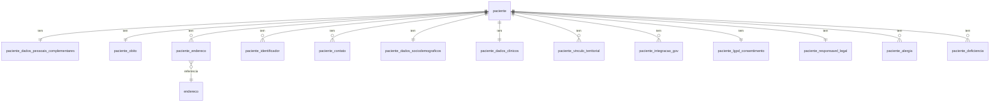

# Domínio Paciente - Documentação Completa

## Visão Geral

O domínio Paciente do sistema UPSaúde foi completamente refatorado para garantir:
- **Estabilidade**: Core mínimo e atemporal
- **Separação de Contextos**: Identidade, identificadores, contatos, APS, clínico, territorial, integração gov, LGPD
- **Rastreabilidade**: Todos os dados externos têm origem e datas
- **Performance**: EntityGraphs específicos por caso de uso
- **Segurança**: Proteção contra perda acidental de dados históricos
- **Preparação para Integrações Governamentais**: e-SUS APS, RNDS, CADSUS

## Arquitetura

### Core do Paciente (Estável)

A entidade `Paciente` contém apenas dados fundamentais e imutáveis:

- `id` (UUID)
- `nomeCompleto` (obrigatório)
- `nomeSocial`
- `dataNascimento`
- `sexo`
- `statusPaciente`
- `convenio` (FK)
- `numeroCarteirinha`
- `dataValidadeCarteirinha`
- `tipoAtendimentoPreferencial`
- `observacoes`
- Campos de auditoria (criado_em, atualizado_em, ativo)

**Campos removidos do core** (externalizados):
- Identificadores (CPF, CNS, RG) → `paciente_identificador`
- Contatos (telefone, email) → `paciente_contato`
- Dados pessoais complementares → `paciente_dados_pessoais_complementares`
- Óbito → `paciente_obito`
- Dados sociodemográficos → `paciente_dados_sociodemograficos`
- Dados clínicos → `paciente_dados_clinicos`
- Responsável legal → `paciente_responsavel_legal`
- LGPD → `paciente_lgpd_consentimento`
- Endereços → `paciente_endereco` (vínculo)
- Integrações → `paciente_integracao_gov`
- Vínculos territoriais → `paciente_vinculo_territorial`

## Contextos do Domínio

### 1. Identificadores (`paciente_identificador`)

Armazena identificadores oficiais do paciente permitindo múltiplos identificadores e múltiplas origens.

**Campos principais**:
- `tipo` (CPF, CNS, RG, OUTRO)
- `valor`
- `origem` (UPSAUDE, CADSUS, ESUS, RNDS, OUTRO)
- `validado`
- `principal`

**Regras**:
- Permitir múltiplos identificadores por paciente
- Permitir múltiplas origens para o mesmo tipo
- Permitir divergências controladas

### 2. Contatos (`paciente_contato`)

Armazena contatos do paciente (telefone, email, whatsapp).

**Campos principais**:
- `tipo` (TELEFONE, EMAIL, WHATSAPP, OUTRO)
- `valor`
- `principal`
- `verificado`

### 3. Dados Pessoais Complementares (`paciente_dados_pessoais_complementares`)

Dados que podem divergir entre fontes e precisam rastreabilidade.

**Campos**:
- `nomeMae`
- `nomePai`
- `identidadeGenero`
- `orientacaoSexual`

### 4. Óbito (`paciente_obito`)

Informações de óbito com rastreabilidade de origem.

**Campos**:
- `dataObito`
- `causaObitoCid10`
- `dataRegistro`
- `origem` (MANUAL, ESUS, RNDS, CADSUS, OUTRO)

### 5. Endereços (`paciente_endereco`)

Vínculo entre paciente e endereço com metadados completos.

**Campos principais**:
- `endereco` (FK para `enderecos`)
- `tipoEndereco` (RESIDENCIAL, COMERCIAL, CORRESPONDENCIA, RURAL, OUTRO)
- `principal`
- `origem` (MANUAL, ESUS, RNDS, CADSUS, OUTRO)
- `dataInicio`
- `dataFim`
- `ativo`

**Regras**:
- Permitir histórico de endereços
- Apenas um endereço principal por paciente

### 6. Dados Sociodemográficos (`paciente_dados_sociodemograficos`)

Dados APS/sociais do paciente.

**Campos**: `racaCor`, `nacionalidade`, `escolaridade`, `ocupacaoProfissao`, `situacaoRua`, etc.

### 7. Dados Clínicos (`paciente_dados_clinicos`)

Dados clínicos básicos do paciente.

**Campos**: `gestante`, `fumante`, `alcoolista`, `usuarioDrogas`, `historicoViolencia`, `acompanhamentoPsicossocial`

### 8. Vínculo Territorial (`paciente_vinculo_territorial`)

Vínculos territoriais/ESF do paciente permitindo histórico.

**Campos principais**:
- `cnesEstabelecimento`
- `ineEquipe`
- `microarea`
- `dataInicio`
- `dataFim`
- `origem` (ESUS, RNDS, MANUAL, OUTRO)
- `ativo`

**Regras**:
- Permitir histórico de vínculos
- Apenas um vínculo ativo por paciente

### 9. Integração Governamental (`paciente_integracao_gov`)

Integrações com sistemas governamentais (e-SUS APS, RNDS, CADSUS).

**Campos principais**:
- `sistema` (ESUS, RNDS, CADSUS, OUTRO)
- `idIntegracaoGov`
- `uuidRnds`
- `versaoLayout`
- `payloadBruto` (JSONB) - dados brutos recebidos/enviados
- `dataSincronizacao`
- `statusSincronizacao` (SUCESSO, ERRO, PENDENTE)
- `cnsValidado`
- `tipoCns`
- `cartaoSusAtivo`

**Regras**:
- Suporta múltiplas integrações por paciente
- Armazena payload bruto para evitar dependência de schema rígido
- Versionamento de layout para compatibilidade futura

### 10. LGPD (`paciente_lgpd_consentimento`)

Consentimentos LGPD do paciente.

**Campos**: `autorizacaoUsoDados`, `autorizacaoContatoWhatsApp`, `autorizacaoContatoEmail`, `dataConsentimento`

### 11. Responsável Legal (`paciente_responsavel_legal`)

Responsável legal do paciente.

**Campos**: `nome`, `cpf`, `tipoResponsavel`, `autorizacaoUsoDadosLGPD`, `autorizacaoResponsavel`

## EntityGraphs - Guia de Uso

### `Paciente.basic`
**Uso**: Consultas básicas que precisam apenas do convênio
**Carrega**: `convenio`

### `Paciente.listagem`
**Uso**: Listagens de pacientes
**Carrega**: `convenio`

### `Paciente.cadastro`
**Uso**: Tela de cadastro/edição de paciente
**Carrega**: `convenio` + todos relacionamentos 1:1 (dadosSociodemograficos, dadosClinicosBasicos, responsavelLegal, lgpdConsentimento, dadosPessoaisComplementares, obito)

### `Paciente.prontuarioResumido`
**Uso**: Visualização rápida do prontuário
**Carrega**: `convenio` + `dadosSociodemograficos` + `dadosClinicosBasicos` + `alergias` + `deficiencias`

### `Paciente.integracaoGov`
**Uso**: Processamento de integrações governamentais
**Carrega**: `convenio` + `identificadores` + `contatos` + `integracoesGov` + `vinculosTerritoriais`

### `Paciente.enderecos`
**Uso**: Consulta de endereços do paciente
**Carrega**: `enderecos` + `endereco` (entidade Endereco)

### `Paciente.prontuarioCompleto`
**Uso**: ⚠️ **ATENÇÃO**: Carrega TODOS os dados. Use apenas quando realmente necessário.
**Carrega**: Todos os relacionamentos

## Decisões Arquiteturais

### 1. Separação de Contextos
**Decisão**: Cada contexto tem sua própria tabela seguindo padrão `paciente_*`
**Justificativa**: Facilita evolução independente, rastreabilidade e preparação para integrações

### 2. Múltiplas Integrações
**Decisão**: `paciente_integracao_gov` é OneToMany
**Justificativa**: Um paciente pode ter integrações simultâneas com ESUS, RNDS e CADSUS

### 3. Payload Bruto JSONB
**Decisão**: Armazenar payload bruto em JSONB
**Justificativa**: Evita quebra por mudanças de layout governamental, permite queries JSON eficientes

### 4. Histórico de Vínculos
**Decisão**: `paciente_vinculo_territorial` e `paciente_endereco` permitem histórico
**Justificativa**: Necessário para rastreabilidade e auditoria

### 5. Cascade e OrphanRemoval
**Decisão**: 
- `orphanRemoval = true` apenas para dados do paciente (identificadores, contatos, alergias, deficiências, 1:1)
- `orphanRemoval = false` para dados históricos (integrações, vínculos territoriais)
**Justificativa**: Protege histórico e dados de integração contra perda acidental

### 6. Equals/HashCode
**Decisão**: Usar `@EqualsAndHashCode(onlyExplicitlyIncluded = true)` com apenas `id`
**Justificativa**: Evita problemas com proxies Hibernate e coleções

### 7. EntityGraphs Específicos
**Decisão**: Criar graphs específicos por caso de uso
**Justificativa**: Evita over-fetching e melhora performance

## Padrão de Nomenclatura

Todas as tabelas do domínio paciente seguem o padrão `paciente_*`:

- `paciente` (core)
- `paciente_identificador`
- `paciente_contato`
- `paciente_dados_pessoais_complementares`
- `paciente_obito`
- `paciente_endereco`
- `paciente_dados_sociodemograficos`
- `paciente_dados_clinicos`
- `paciente_vinculo_territorial`
- `paciente_integracao_gov`
- `paciente_lgpd_consentimento`
- `paciente_responsavel_legal`
- `paciente_alergia` (alergias_paciente)
- `paciente_deficiencia` (deficiencias_paciente)

## Diagrama de Relacionamentos

## Migrations

As migrations seguem a ordem:
- V025-V031: Primeira refatoração (identificadores, contatos, vínculos, renomeações)
- V032-V035: Dados pessoais complementares e óbito
- V036-V038: Endereços como vínculo
- V041: Payload bruto JSONB

## Riscos Residuais

1. **Compatibilidade com código legado**: Alguns serviços podem ainda referenciar campos antigos
2. **Performance de queries complexas**: EntityGraphs grandes podem ser lentos
3. **Validação de dados migrados**: Necessário validar integridade após migrações

## Próximos Passos

1. Atualizar serviços para usar novos relacionamentos
2. Atualizar DTOs e mappers
3. Criar testes de integração
4. Validar performance com dados reais
5. Documentar APIs REST

